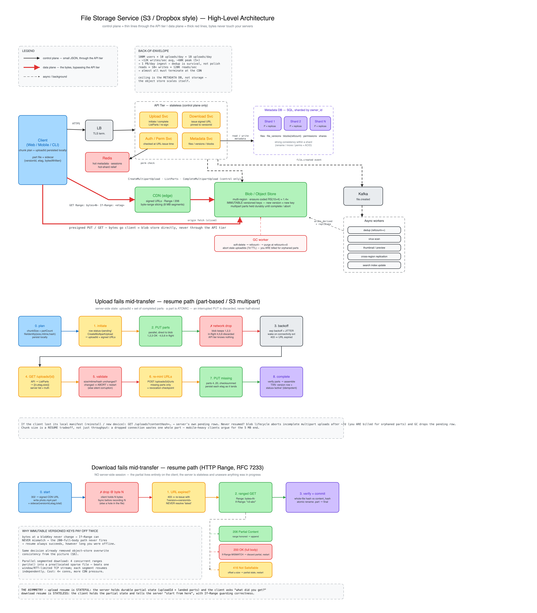

# 1. File Storage Service (S3 / Dropbox style)

**One-liner:** A metadata service (SQL) that tracks files, versions, and permissions, sitting in front of an object store (blob storage) that holds the actual bytes; large files are uploaded in chunks via presigned URLs straight to the blob store, with a CDN in front for reads and async workers for replication, dedup, and virus scan.

---

## 1. Clarify requirements

**Functional**
- Upload, download, delete files.
- Store/retrieve metadata (name, size, type, owner, timestamps).
- Directory/namespace organization.
- Sharing (per-user / link-based) with permissions.
- Versioning (optional but a common deep dive).
- Large files (multi-GB) with **resumable** uploads.

**Non-functional**
- High **durability** (this is the #1 property for storage — you must not lose bytes; target 11 nines conceptually via replication/erasure coding).
- High **availability** for reads.
- Low-latency download (global users → CDN/edge).
- Scales to billions of objects, PB-scale storage.
- Security: encryption at rest + in transit, access control.

**Clarifying questions to ask the interviewer:** file size distribution? read:write ratio (usually read-heavy)? do we need strong consistency on metadata or is eventual OK for sharing? global users? do we own the blob store or use S3/GCS?

## 2. Back-of-envelope

Assume 100M users, 10 uploads/user/day, avg 1 MB (skewed — most small, few huge).
- Writes: 100M × 10 = 1B uploads/day ≈ **~12K writes/sec** average, peak ~5×.
- Storage/day: 1B × 1 MB = **1 PB/day** ingest (before dedup/compression). Dedup matters.
- Reads typically 10× writes → **~120K reads/sec**; almost all should hit CDN/cache, not origin.

These numbers justify: object store (not a DB) for bytes, CDN for reads, dedup to cut storage, and horizontal metadata sharding.

## 3. API design

```
POST   /files/initiate        -> { uploadId, chunkSize, presignedUrls[] }   # start multipart
PUT    <presignedUrl>         # client uploads each chunk directly to blob store
POST   /files/complete        -> { fileId, version }                        # finalize, idempotent
GET    /files/{id}            -> metadata + presigned download URL (redirect to CDN)
GET    /files/{id}/download   -> 302 to CDN/blob URL (supports Range / 206)
DELETE /files/{id}
GET    /files?path=/foo       -> list (paginated: cursor + limit)
POST   /files/{id}/share      -> { shareLink | grants[] }
GET    /files/{id}/versions

# resume support
GET    /uploads/{uploadId}          -> { status, chunkSize, parts:[{n, etag, size}] }  # what landed?
POST   /uploads/{uploadId}/urls     -> { presignedUrls[], expiresAt }   # re-mint for missing parts
DELETE /uploads/{uploadId}                                              # abort, release parts
GET    /uploads?contentHash=...     -> [{ uploadId, ... }]              # client lost local state
```

Key choices:
- **Presigned URLs** so bytes flow **client → blob store directly**, never through your API tier. Your API only issues short-lived signed URLs and records metadata. This keeps the API tier stateless and cheap.
- `complete` is **idempotent** (keyed by `uploadId`) so retries after a timeout don't create duplicates.
- List is **cursor-paginated**, never offset (offset degrades on large dirs).
- The `/uploads/*` endpoints are **control plane only** (small JSON, no bytes) — safe to route through the API tier. They exist because the API tier is out of the data path and therefore *cannot* observe upload progress; the blob store is the authority on what landed.
- Downloads must advertise `Accept-Ranges: bytes` and honor `Range` + `If-Range` end to end (origin **and** CDN) — that's the entire download-resume mechanism.

## 4. Data model

**Blob store (object storage):** the bytes. Objects keyed by a content-addressed or UUID key. Object stores give you cheap, durable, near-infinite scale and handle replication/erasure coding for you. This is *not* a relational DB job.

**Metadata DB (SQL, sharded):**
```
files(file_id PK, owner_id, name, path, size, content_hash, current_version, created_at, status)
file_versions(file_id, version, blob_key, size, content_hash, created_at)
blocks(block_hash PK, blob_key, refcount)        # for chunk-level dedup
permissions(file_id, grantee_id, role)           # owner/editor/viewer
shares(share_token PK, file_id, expires_at, role)
```
- Metadata is small, relational, needs transactions (rename, move, permission change) → **SQL**, sharded by `owner_id` (keeps a user's files co-located; listing a user's dir hits one shard).
- `content_hash` enables **dedup**: identical content stored once, `refcount`ed.

## 5. High-level architecture

```
                 ┌────────── CDN (reads) ──────────┐
Client ──HTTPS──> LB ──> API tier (stateless) ──> Metadata Service ──> SQL (sharded, replicated)
   │                                   │
   │                                   └──> Auth/Permission Service ──> Redis (hot metadata / sessions)
   │
   └──presigned PUT/GET──────────────> Blob / Object Store (multi-region, erasure-coded)
                                              │
                          Async workers (Kafka): dedup, virus scan, thumbnail,
                          cross-region replication, index update
```

Request flow (upload):
1. Client calls `initiate` → API authorizes, creates a pending `file` row, returns presigned chunk URLs.
2. Client `PUT`s chunks **directly to blob store** (resumable — can retry individual chunks).
3. Client calls `complete` → API verifies all chunks present, computes/records `content_hash`, flips `status=active`, emits an event.
4. Workers pick up the event: dedup, scan, replicate, index.

## 6. Deep dives (where they'll push)

### Chunking / multipart / resumable uploads
- Split large files into fixed-size chunks (e.g. 5–8 MB). Upload in parallel; retry only failed chunks; resume after disconnect using the `uploadId` + list of completed part numbers. This is what makes multi-GB uploads survive flaky mobile networks.
- Each chunk can be content-hashed → enables **block-level dedup** (Dropbox's trick: unchanged blocks in a re-uploaded file aren't re-sent).

### Upload fails mid-transfer — how resume works

**Two resumable-upload models.** Know which one you're in, because "resume" means different things:

| | **Part-based** (S3 multipart — this design) | **Offset-based** (GCS resumable, tus.io) |
|---|---|---|
| Unit | Numbered parts `1..N` | A single byte offset |
| Server state | Set of `{partNumber, etag, size}` | One integer: bytes received |
| Parallelism | Yes — concurrent, out of order | No — strictly sequential stream |
| "Where was I?" | `ListParts(uploadId)` | `HEAD` → `Upload-Offset: 4194304` |
| Retry granularity | One part | Everything after the offset |

Part-based, because parallel chunk upload is what saturates client bandwidth.

**The property that makes it tractable: parts are atomic.** An interrupted `PUT` is *discarded entirely* by the blob store — there is no half-stored part. Server-side state is always a clean set of completed part numbers, never "part 7 is 60% there." The cost: an interrupted part is fully re-sent, so part size (5–8 MB) *is* your worst-case wasted work per failure.

**Phase 0 — plan before any bytes move.** Client computes and **persists locally** (IndexedDB / SQLite):
```
fileIdentity = { path, size, mtime, contentHash }
chunkPlan    = { chunkSize: 8MB, partCount: ceil(size / chunkSize) }
```
Part *n* always covers bytes `[(n-1)·chunkSize, n·chunkSize)`. Deterministic boundaries are non-negotiable — resuming with a different `chunkSize` means part 4 covers a different byte range than the part 4 already stored → silently corrupt file.

**Phase 1 — `initiate`.** Server authorizes, checks quota, inserts `files(status='pending')`, calls `CreateMultipartUpload` → `uploadId`, mints presigned `PUT` URLs (~1h TTL). Client **durably writes `uploadId` immediately** — it's the only handle that can recover the work if the app is killed a second later.

**Phase 2 — the network dies.** Say parts 1–3 got `200 OK`+ETag, 4–6 were in flight, 7–20 never started.
- **Blob store:** holds 1,2,3 under `uploadId`, durably, until abort or lifecycle reaps it. 4–6 discarded.
- **Client:** socket error on 4–6 → marks them `not-done` in the local manifest.
- **API tier:** knows nothing — it hasn't been called since `initiate`. *By design*: it's stateless and out of the data path, so it cannot track progress. The blob store is the authority.

**Phase 3 — detect and back off.**
- Exponential backoff **with jitter** (1s, 2s, 4s… ±rand). Without jitter, every client in a region that lost connectivity retries in lockstep and thundering-herds the blob store the moment it returns.
- Resume on OS connectivity events (`online` / `NWPathMonitor` / `ConnectivityManager`) rather than blind polling.
- Classify errors: `5xx`/timeout → retry; `403` → presigned URL expired, go re-mint; other `4xx` → don't retry, it's a bug.

**Phase 4 — resume.**
1. Recover `uploadId` from the local manifest.
2. If the manifest is gone (reinstall, cache clear, new device): `GET /uploads?contentHash=<hash>` → server queries its own `pending` rows. Without this, a reinstall restarts a 4 GB upload from zero.
3. `GET /uploads/{uploadId}` → API proxies `ListParts` → authoritative `[{n, etag, size}]`.
4. Reconcile: `missing = {1..20} − {1,2,3}`. **Trust the server, not the client manifest.** Re-uploading a part the client wrongly thinks failed is harmless (same part number just replaces it); the reverse is fatal — a part the client wrongly thinks succeeded means `complete` fails or assembles a truncated file.
5. **Validate the file didn't change** — compare `size`/`mtime`/hash to the stored `fileIdentity`. If the user edited during the outage, parts 1–3 are stale bytes from the old version; splicing them onto new parts 4–20 yields silent corruption, the worst outcome because nothing errors. If changed → `DELETE /uploads/{uploadId}` and start fresh.
6. `POST /uploads/{uploadId}/urls {parts:[4..20]}` — originals almost certainly expired. Only missing parts get re-signed. This is also the **revocation checkpoint**: no write access, no new URLs.

**Phase 5 — re-upload missing parts.** Parallel, bounded pool (4–8). Send a per-part checksum (`Content-MD5` / `x-amz-checksum-sha256`) so the store rejects in-transit corruption. Persist each ETag as it arrives, so a *second* interruption resumes from the new position.

**Phase 6 — `complete`.** Server, in order:
1. `ListParts` again — verify all N present, sizes correct (all `chunkSize` except the last).
2. `CompleteMultipartUpload` — stitches parts; a *metadata* op in the store, bytes aren't recopied.
3. Optionally verify the assembled whole-file hash against the client's declared `contentHash` (end-to-end integrity).
4. **In one transaction:** insert `file_versions`, set `files.current_version`, flip `status='active'`. ← **the commit point.** Before it the file doesn't exist to anyone; after it, it's fully visible. No observable intermediate state.
5. Emit the Kafka event.

**Phase 7 — `complete` itself fails.** Client retries; idempotent on `uploadId` (unique constraint) → returns the *same* `{fileId, version}`. The store's `CompleteMultipartUpload` is likewise idempotent for an already-completed upload.

**Phase 8 — uploads never resumed.** Two independent sweepers for two independent piles of garbage:
- **Blob store:** lifecycle rule aborts incomplete multipart uploads after ~7 days. **You are billed for parts of incomplete multipart uploads** — skipping this rule silently accumulates cost for bytes nobody can read.
- **Metadata DB:** GC deletes `pending` rows past the same TTL.

### Download fails mid-transfer — how resume works

A completely different mechanism: **no server-side session**. It's stateless, driven by HTTP Range requests (RFC 7233).

```
# server advertises
200 OK / Accept-Ranges: bytes / Content-Length: 1073741824 / ETag: "v3-abc123"

# client resumes
GET /blob/xyz
Range: bytes=524288000-
If-Range: "v3-abc123"

# server
206 Partial Content
Content-Range: bytes 524288000-1073741823/1073741824
```

That's the whole protocol — all the engineering is in the failure modes.

**Phase 0 — start.** `GET /files/{id}/download` → 302 to a signed CDN URL. Client persists a **sidecar** next to the partial:
```
photo.mp4.part        <- bytes so far
photo.mp4.part.meta   <- { fileId, versionId, blobKey, etag, totalSize, bytesWritten, urlExpiresAt }
```
Write to `.part` and **atomically rename** only after successful verification — a user must never find a truncated `photo.mp4` that looks complete. Record `etag` + `versionId` now; they're what make resume safe later.

**Phase 1 — connection drops.** The partial lives **entirely on the client**; the server holds no session and is unaware anything was in progress. (This is why download resume scales trivially while upload resume needs bookkeeping.) The client must know how many bytes it *durably* wrote — `fsync` and update `bytesWritten` periodically, or just `stat` the `.part` on resume. The trap: recording `bytesWritten` optimistically before data hits disk → resume from the wrong offset → a file with a hole in it.

**Phase 2 — resume with `Range` + `If-Range`.** Three responses, all of which the client must handle:

| Response | Meaning | Client action |
|---|---|---|
| `206 Partial Content` | Range honored, content unchanged | Append to `.part`, continue |
| `200 OK` (full body) | `If-Range` mismatched — object changed | **Discard partial**, restart from zero |
| `416 Range Not Satisfiable` | Offset ≥ object size | Partial is stale/corrupt; restart |

**`If-Range` is the entire safety mechanism.** Without it, resuming a changed file splices the first 500 MB of v3 onto the last 500 MB of v4 — corrupt, with no error anywhere. `If-Range` makes the server decide atomically: either the entity is unchanged and you get your range, or it changed and you get the whole body back so you're *forced* to restart.

**Why immutable versioned keys make this a non-issue.** Since every version gets a new blob key and is never overwritten, the bytes at `blobKey` are immutable forever → `If-Range` can never mismatch → **resume always succeeds**, however long the client was offline. The same decision that removed object-store overwrite consistency from the picture also eliminates an entire class of download-corruption bug.

**Phase 3 — the presigned URL expired during the outage** (very likely: URLs live minutes, outages don't). `403` → re-request from the API:
```
GET /files/{id}/download?version=<versionId>
```
**Pass the pinned `versionId`; never resolve "latest."** If the file changed while you were offline, "latest" hands you a URL to a *different object* whose bytes you'd append to a partial of the old one — the same corruption as an `If-Range` mismatch, arriving through the door you left open. The client pinned `versionId` in Phase 0 precisely for this. Re-issue is also the authorization checkpoint: revoked access → no URL → the download correctly fails.

**Phase 4 — verify before committing.** On reaching `totalSize`: hash the file, compare to `content_hash` from metadata; on match, atomically rename `.part` → final and drop the sidecar; on mismatch, restart (or, with per-block hashes, verify block-by-block and re-fetch only the bad blocks via targeted ranges). Skipping this check ships silent corruption from any off-by-one in offset accounting.

**Phase 5 — parallel segmented download (optimization).** Issue concurrent ranges, each worker `pwrite`-ing into its own region of a preallocated sparse file (no coordination needed):
```
Range: bytes=0-268435455          -> worker 1
Range: bytes=268435456-536870911  -> worker 2
Range: bytes=536870912-805306367  -> worker 3
Range: bytes=805306368-1073741823 -> worker 4
```
Upside: a single TCP stream is window/RTT-limited, so 4 connections often multiply throughput on high-latency links, and each segment is independently resumable. Downside: 4× connections per client, more CDN load, per-segment progress tracking instead of one integer. This is what download managers and `aws s3 cp` do.

**Phase 6 — CDN must be in on it.**
- Pass through `Accept-Ranges`, honor `Range` on both hit and miss.
- **Byte-range caching / slicing matters.** Without it, `Range: bytes=500MB-` on a cache miss makes the CDN pull the *entire* 1 GB object from origin to serve 500 MB. With slicing (CloudFront origin-slicing, Cloudflare range mode, Akamai object segmentation) the object is cached in aligned segments (e.g. 8 MB) and only the needed ones are fetched. For large files this is the difference between a CDN that helps and one that amplifies origin load.
- Signed-URL validation happens at the edge, so expiry is enforced without your API touching a byte — that property holds on the resume path too.

**When resume is impossible:** origin sends `Accept-Ranges: none`; the response is dynamically generated with `Transfer-Encoding: chunked` and no stable `Content-Length`/ETag; or the object is gone (deleted / version GC'd → `404`, restart against the current version).

**The asymmetry, in one line:** *upload resume is stateful* — the server holds durable partial state (`uploadId` + landed parts) and the client asks "what did you get?"; *download resume is stateless* — the client holds the partial state and tells the server "start from here," with `If-Range` guarding correctness.

### Deduplication
- Hash each block (e.g. SHA-256). Before storing, check `blocks` table. If present, just `refcount++` and point the version at the existing blob. Saves the ~1 PB/day problem massively for shared/duplicate content. Trade-off: hash computation cost + a hot `blocks` table (shard it by hash prefix).

### Durability & replication
- Object store replicates across ≥3 AZs, or uses **erasure coding** (e.g. Reed-Solomon 10+4) for the same durability at ~1.4× storage instead of 3×. Cross-region async replication for DR and locality.
- Metadata DB: primary + read replicas per shard; sync or semi-sync replication for the primary's durability.

### Consistency
- **Metadata:** strong within a shard (single-row/transaction ops like rename/permission are ACID). Sharing visibility can be eventually consistent.
- **Read-after-write:** after `complete`, the uploader must see the file immediately → read from primary or use write-through cache for that user's session.
- Object store writes are typically read-after-write consistent for new objects; overwrites may be eventually consistent → prefer **immutable versioned blob keys** (new version = new key) to sidestep overwrite consistency entirely.

### Downloads at scale
- Serve via **CDN** with signed URLs (short TTL). Hot objects cached at edge → origin/blob store sees a fraction of the 120K reads/sec. For private files, use signed CDN URLs so the CDN enforces expiry without hitting your API per byte.

### Security
- Encrypt in transit (TLS) and at rest (per-object keys wrapped by a KMS master key — envelope encryption). Permission checks happen at URL-issue time; presigned URLs are short-lived and scoped.

### Deletion & garbage collection
- Soft-delete metadata first (fast, reversible). A GC worker decrements `refcount`; blobs with `refcount == 0` are actually purged asynchronously. Never block the user delete on physical purge.

## 7. Bottlenecks & tradeoffs
- **Metadata DB is the scaling ceiling**, not storage (object store scales itself). Shard early by `owner_id`; watch for hot shards (a viral shared file → cache it in Redis).
- **Small-file overhead:** millions of tiny files = metadata pressure + poor object-store efficiency. Consider packing small blocks.
- **Dedup vs privacy/cost:** cross-user dedup saves storage but is a subtle info-leak/security consideration; often dedup only within a tenant.
- **Consistency vs latency:** strong metadata consistency costs cross-region latency; keep the primary regional and replicate async.
- **Chunk size is a resume tradeoff, not just a throughput one:** larger parts = fewer requests and less metadata, but a dropped connection wastes a whole part; smaller parts = cheap retries but per-request overhead and thousands of parts to track. 5–8 MB is the usual compromise; a mobile-heavy client base argues for the small end.
- **Resume state lives in different places for upload vs download** — server-side for upload (`uploadId` + landed parts, which you must GC and are billed for) and client-side for download (a `.part` + sidecar, which you don't pay for but also can't fix if the client loses it). Upload resume is the one that costs you money and operational attention.

**What I'd build next:** thumbnail/preview pipeline, delta-sync (Dropbox-style) so edits transfer only changed blocks, tiered storage (hot → cold/archive by access recency).

## 8. Diagram (Excalidraw)



**Source:** [`diagrams/01-file-storage-service.excalidraw`](diagrams/01-file-storage-service.excalidraw) — open at [excalidraw.com](https://excalidraw.com) via *Menu → Open*, or just drag the file onto the canvas. The `.svg` above is an export for inline viewing; **edit the `.excalidraw`, not the SVG.**

The scene has three frames, stacked top to bottom:

**Frame A — high-level architecture (§5).** The one thing to read off it is the **two-band split**:
- *Control plane* (thin black): Client → LB → API tier → Redis / sharded metadata DB, plus the dashed `CreateMultipartUpload` / `ListParts` / `CompleteMultipartUpload` calls into the blob store. All small JSON.
- *Data plane* (thick red): Client ↔ CDN ↔ blob store, and Client ↔ blob store direct via presigned URLs. **The bytes never enter the API tier** — that's why the API tier can stay stateless and small while ingest is 1 PB/day.
- Off to the right, the async chain (Kafka → dedup / virus scan / thumbnail / replication / index) and the GC worker hanging off the blob store.

**Frame B — upload failure & resume (§6).** Steps 0→8 left to right, wrapping: plan → initiate → PUT parts → ✗ drop → backoff → `GET /uploads/{id}` → validate → re-mint URLs → PUT missing → complete. The colour coding follows the failure: red boxes are where you lose data if you get it wrong (the drop itself, and the "did the file change?" validation).

**Frame C — download failure & resume (§6).** Steps 0→3 with the three-way response fan-out from the ranged GET (`206` append / `200` restart / `416` restart), plus the note on why immutable versioned keys make the `200` branch unreachable in this design.

Whiteboard order if you're drawing this live: Frame A's two bands first (that's the design), then Frame B or C only if the interviewer pushes on resumability.
