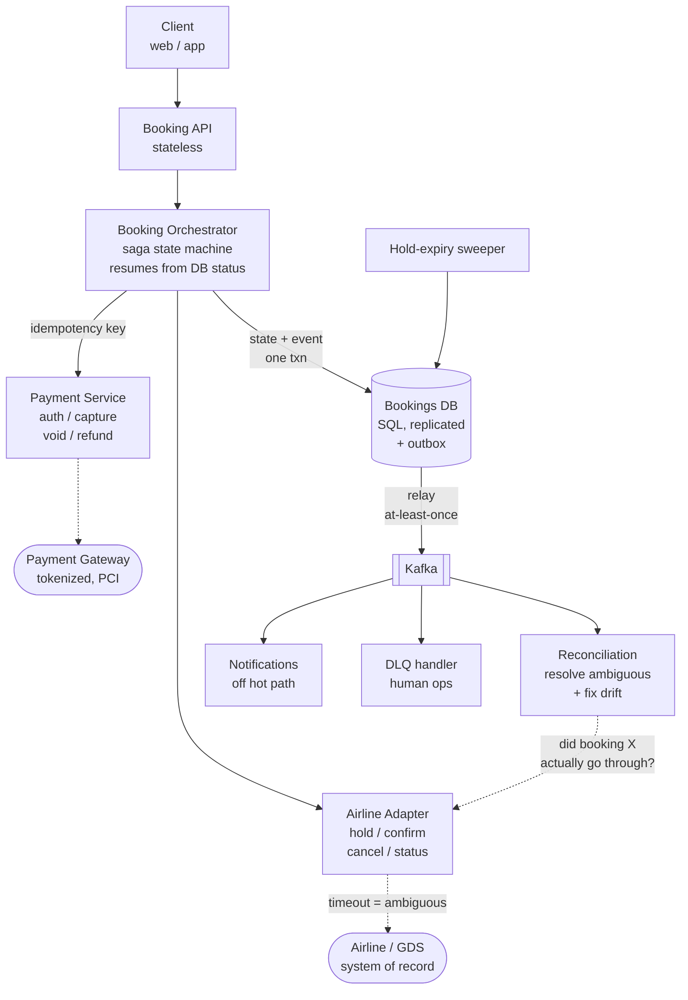
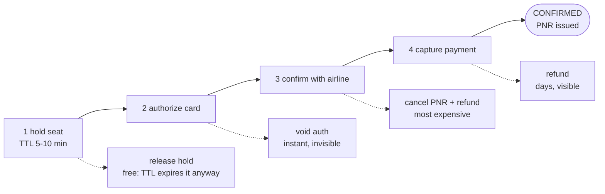
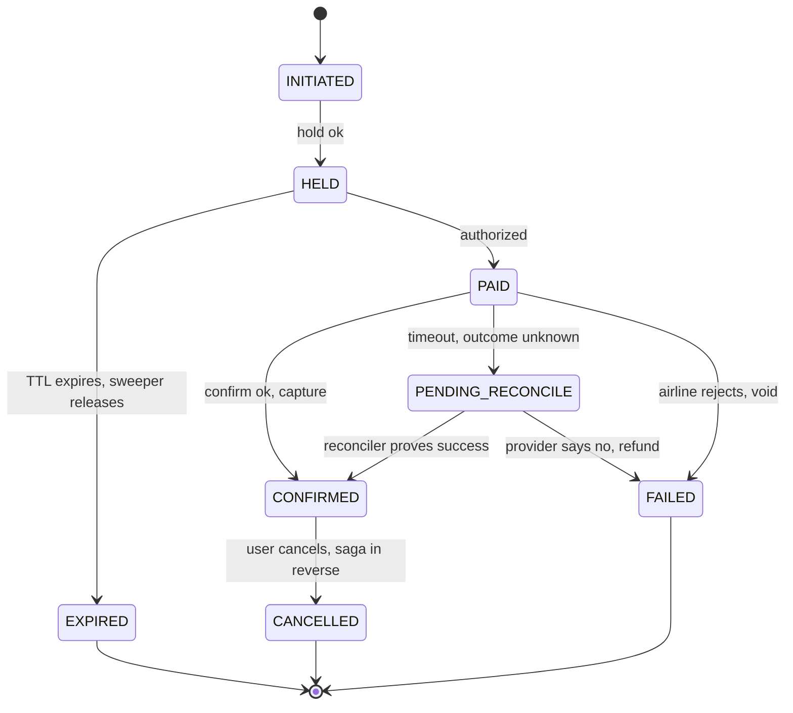

# 4. Flight Booking System

**One-liner:** A booking service that turns a search offer into a confirmed ticket via a **saga** — reserve seat with a short TTL hold, re-validate price/availability with the airline, charge payment idempotently, confirm with the airline, then persist the booking — with **compensating actions** (release + refund) on any failure and an async **reconciliation** loop to keep our state in sync with the airline of record.

The four deep dives they called out — **booking contention, payments, failure handling, aggregator sync** — are the meat. Structure your answer around them.

---

## 1. Clarify requirements

**Functional**
- Convert a selected flight offer into a booking (PNR).
- Handle passenger details, seat/fare selection, payment.
- Confirm with the airline/aggregator (they are the **source of truth** for inventory — we don't own the seat).
- Booking lifecycle: `INITIATED → HELD → PAID → CONFIRMED / FAILED / CANCELLED`.
- Cancellation/refund.

**Non-functional**
- **Correctness > raw latency** here (money + inventory). No double-charge, no double-book, no lost bookings.
- Strong consistency on a booking's state; durability of every booking record.
- Resilient to airline/payment provider slowness and failure.

### Why this is the opposite problem to search (§2 of the series)

Say this out loud in the first minute, because it inverts every default you just used on the aggregation question:

| | Search (Q2) | Booking (this) |
|---|---|---|
| Volume | ~600 rps peak | ~1–5 rps — **three orders of magnitude smaller** |
| Correctness bar | Approximate is fine (3-min-old price OK) | Exact. A wrong answer is a stranded charge or a passenger with no seat |
| Failure mode | Missing provider = degraded results | Missing provider = *ambiguous* — you don't know if money moved |
| Dominant lever | Caching, fan-out, deadlines | Idempotency, sagas, reconciliation |
| What you optimize | Latency | **Never losing or duplicating money or a seat** |

**Why the volume number matters:** it buys you permission to be expensive. You can afford synchronous SQL transactions, write-ahead audit logs, double-entry ledgers, and a reconciliation job that re-reads every booking — none of which would survive at 12,000 rps. Explicitly saying *"this path is low-volume, so I'm going to spend latency and I/O to buy correctness"* is the framing that makes the rest of the design read as deliberate rather than heavy-handed.

### Why the lifecycle has exactly these states

Each state exists because there's a **distinct failure recovery** attached to it. That's the test for whether a state earns its place:

| State | Means | Recovery if we crash here |
|---|---|---|
| `INITIATED` | Row written, nothing external called yet | Safe to abandon — nothing to undo |
| `HELD` | Airline holds the seat, TTL running | Let hold expire, or explicitly release |
| `PAID` | Money authorized/captured, seat not yet confirmed | **Retry confirm, or refund** — the dangerous state |
| `CONFIRMED` | PNR issued, ticketed | Terminal happy path |
| `PENDING_RECONCILE` | An external call timed out; outcome unknown | Query provider, resolve async (see §7) |
| `FAILED` / `CANCELLED` | Compensations completed | Terminal; refunds settled |

**Why `PAID` and `CONFIRMED` must be separate:** collapsing them would mean a crash between charging and confirming leaves you with no record that money moved. The whole point of the state machine is that **the money-moved fact is durable before the seat-secured fact is attempted.**

### The clarifying questions — and what each one changes

| Question | What it changes in the design |
|---|---|
| **Does the airline API support a real hold/TTL PNR?** | If yes → §5's hold-first flow works. If no, the only atomic operation is "book or fail", and you must switch to *authorize → book → capture-or-void*, because there's no way to reserve before charging. This single answer picks your saga ordering. |
| **Auth/capture supported, or capture-only?** | Auth/capture lets you avoid moving money until the seat is secure (the cleanest answer, §6). Capture-only forces you into refunds as the compensation, which are slow (days) and visible to the customer. |
| **Is the airline's `confirm` idempotent? Does it expose a status/lookup API?** | Determines how you resolve ambiguous timeouts. Idempotent confirm → just retry. No idempotency but a lookup-by-reference → query then decide. Neither → you're stuck with human ops in the loop, and you should say so. |
| **Can price/availability change between search and book?** | Almost always yes (the Q2 cache is deliberately stale). Forces a **re-validate step** before charging, plus a UX decision: auto-accept small increases, or re-prompt the user. |
| **One airline per booking, or multi-leg across carriers?** | Multi-carrier means N sub-bookings that must all succeed — a saga with N compensations and a genuine partial-failure problem (leg 1 confirmed, leg 2 rejected). |

**Key clarifying point:** unlike an event-ticket system where *we own inventory*, here the **airline owns the seat**. We can only *request* a booking and must **reconcile** with their answer.

**Why that reframes everything:** if you owned inventory, contention is a solved local problem — one row, one conditional `UPDATE ... WHERE available > 0`, done. Because you don't, there is no row you can lock that means anything. The seat is decided inside someone else's database, over a network that times out. So the problem stops being *"how do I make my write atomic"* and becomes:

> **"How do I coordinate a multi-step transaction across two external systems that can each fail, be slow, or return an answer I never receive — without losing money or a seat?"**

That is a **saga + idempotency + reconciliation** problem, and naming it that early is what makes §5–§8 land.

## 2. API design

```
POST /bookings            { offerId, pax[], contact }         -> { bookingId, status:HELD, holdExpiresAt }  (idempotent via Idempotency-Key)
POST /bookings/{id}/pay   { paymentToken, idempotencyKey }    -> { status: PAID|CONFIRMED|FAILED }
GET  /bookings/{id}                                            -> current state
POST /bookings/{id}/cancel                                     -> refund saga
```
Every mutating call carries an **idempotency key**; retries return the prior result, never re-execute.

### Why booking is split into two calls, not one

A single `POST /bookings-and-pay` would be simpler to describe and much worse to operate:

- The user needs **think-time** between selecting a flight and finishing payment — entering passport details, choosing seats, 3-D Secure redirects. That's 1–5 minutes of human latency you cannot hold a request open across.
- Splitting gives you a **durable checkpoint**: after `POST /bookings` there is a row in your DB saying "we asked the airline to hold seat X." If the user's browser dies during payment, that hold is tracked and will be released. With one call, a client disconnect leaves an orphaned hold nobody owns.
- It puts the **price re-validation** (§8) at a point where you can still tell the user "the fare moved to $412, continue?" *before* touching their card.

### Why `Idempotency-Key` is on the contract, not an implementation detail

The client will retry. Not maybe — mobile networks drop, users double-tap, load balancers retry on 504. The dangerous case is specifically:

> Request reaches the server → server charges the card → **the response is lost** → client retries.

The client cannot distinguish this from "never arrived." Only the server can, and only if the client sends a key that's **stable across retries of the same logical intent** (generated once, before the first attempt — not regenerated per retry).

**How it works mechanically:**

```
1. Client generates key K once (UUID), sends it on every retry of that action.
2. Server: INSERT INTO idempotency (key, request_hash, state='IN_PROGRESS') ...
     - success        → we own it, execute the work
     - unique violation → someone already did/is doing this
3. On existing row:
     state=DONE        → return the stored response verbatim (200, same body)
     state=IN_PROGRESS → return 409 "in flight, retry shortly" (do NOT execute)
     request_hash differs → 422 "key reused with a different body"
4. On completion: store status + response body, set state=DONE, in the SAME
   transaction that commits the booking state change.
```

**Why the stored response body matters:** returning a bare 200 on retry isn't enough — the client needs the `bookingId`, which it may never have received. Idempotency means *"same effect and same answer"*, not just "don't double-execute."

**Why the request-hash check:** without it, a client that reuses a key for a *different* booking would silently receive the first booking's response and think it succeeded. Fail loudly instead.

**Why `IN_PROGRESS` is a state and not just a lock:** two concurrent retries would otherwise both start executing. A DB-level unique constraint is the cheapest mutual exclusion available, and it survives process crashes in a way an in-memory lock doesn't (an orphaned `IN_PROGRESS` is reaped by TTL and resolved by the reconciler).

### Why the other endpoints look the way they do

- **`GET /bookings/{id}` is the single source of client truth.** Because writes are async sagas, the client's own response may be `PAID` while the airline confirm is still running. Polling this endpoint (or a webhook/SSE push) is how the client learns the terminal state without the API holding a connection open across an 8-second GDS call.
- **`POST /cancel` returns immediately with `CANCELLING`, not `REFUNDED`.** Refunds settle in days, and the airline cancel is its own network call. Pretending it's synchronous would either block the request or lie about the outcome.
- **Every mutating endpoint is a state-machine transition, and illegal transitions are rejected** (`pay` on a `CANCELLED` booking → 409). Enforcing the transition table in code — not just trusting the client's flow — is what stops a stale retry from resurrecting a dead booking.

## 3. Data model

```
bookings(booking_id PK, user_id, offer_id, airline_ref/PNR, status, price, currency,
         hold_expires_at, created_at, version)
booking_pax(booking_id, name, dob, ...)
payments(payment_id PK, booking_id, provider_ref, amount, status, idempotency_key UNIQUE)
booking_events(booking_id, event, payload, at)     # audit / saga log / outbox
```
- **SQL** — you need ACID transactions and a durable, auditable state machine per booking.
- `idempotency_key UNIQUE` on payments is a hard DB-level guard against double-charge.
- `booking_events` doubles as the **transactional outbox** (state change + event emitted atomically).

### Why SQL here when the search side was all Redis/NoSQL

The usual "SQL doesn't scale" objection doesn't apply, and you should say why explicitly:

- **Volume is tiny** (~1–5 writes/sec). A single Postgres primary handles this with room to spare for a decade. Scale is simply not the constraint.
- **You need multi-row atomicity**: booking status + payment row + outbox event must commit together or not at all. Doing this across separate stores reintroduces exactly the distributed-transaction problem you're trying to contain.
- **Constraints are correctness infrastructure, not decoration.** `UNIQUE(idempotency_key)` is a guarantee the database enforces even when your application logic has a race, a bug, or two pods processing the same message. Application-level "check then insert" is a TOCTOU race; a unique index is not.
- **Auditability**: money movement needs an immutable, queryable history for support, finance, and disputes.

### Why each field is there

| Field | Why |
|---|---|
| `airline_ref` / PNR | The **foreign key into the system of record**. Without it stored durably, an ambiguous timeout is unrecoverable — you can't ask "did booking X go through?" if you never learned X. Write it the instant you learn it. |
| `status` | The saga's resume point. A crashed orchestrator restarts by reading this, not by remembering anything in memory. |
| `hold_expires_at` | Lets the sweeper (§5) find abandoned holds with an indexed scan, and lets `pay` reject a request whose hold already died. |
| `version` | Optimistic concurrency. The sweeper, the reconciler, and the user's own `pay` call can all touch one booking concurrently; `UPDATE ... WHERE version = ?` guarantees only one wins. |
| `price`, `currency` | The amount you're authorized to charge. Frozen at hold time so a mid-flow price change can't silently charge more than the user agreed to. |
| `payments.provider_ref` | The gateway's ID for the charge — required to query status, capture, void, or refund later. |

**Why `payments` is a separate table rather than columns on `bookings`:** a booking can legitimately have several payment attempts (declined card, then a retry with another card), plus refunds. One row per money event gives you a ledger; columns give you a lossy last-write-wins field.

### Why the outbox pattern, and how it works

**The problem it solves — the dual-write:**

```
BEGIN; UPDATE bookings SET status='PAID'; COMMIT;
kafka.publish("booking.paid");     ← crash here: DB says PAID, no one downstream ever hears
```

or the reverse ordering, where the event is published and the commit then fails — now downstream acts on a booking that doesn't exist. **There is no ordering of these two operations that is safe**, because they're two systems without a shared transaction.

**How the outbox fixes it:**

```
BEGIN;
  UPDATE bookings SET status='PAID', version=version+1 WHERE booking_id=? AND version=?;
  INSERT INTO booking_events (booking_id, event, payload, at) VALUES (?, 'PAID', ?, now());
COMMIT;                                   ← one atomic commit, both facts or neither

-- separate relay process:
SELECT * FROM booking_events WHERE published=false ORDER BY id;  → publish to Kafka → mark published
```

The state change and the intent-to-publish are now in **one transaction in one database**, so they cannot diverge. The relay publishes **at-least-once** (it may crash after publishing, before marking) — which is fine, because every consumer is idempotent (§7). That combination, *at-least-once delivery + idempotent handlers*, is how you get an effectively-exactly-once system without needing distributed transactions.

**Why the same table serves as the audit log:** the event stream is already an append-only, ordered, timestamped record of every transition. Support asking "why did this booking fail at 03:14?" and the saga asking "where do I resume?" want the same data.

## 4. High-level architecture

```
Client → API (stateless) → Booking Orchestrator (saga state machine)
                                │
      ┌─────────────────────────┼───────────────────────────────┐
      ▼                         ▼                                ▼
 Inventory/Airline Adapter   Payment Service                Bookings DB (SQL, replicated)
 (hold, confirm, cancel)     (charge, refund, idempotent)   + outbox → Kafka
                                                                │
                                              Async workers: reconciliation, notifications,
                                              hold-expiry sweeper, DLQ handling
```

### Diagram

Three panels: the architecture above, the saga with its compensations (§7), and the booking lifecycle (§1). Rendered here as mermaid; the editable Excalidraw scene is at the bottom of this section.

**Architecture**



**The saga and its compensations** — cheapest-to-undo first, irreversible last



**Booking lifecycle** — every state exists because it has a distinct recovery



<details>
<summary><b>Excalidraw scene</b> — copy the JSON below, then in excalidraw.com use <i>Menu → Open</i>, or paste directly onto the canvas (⌘V) to get the editable diagram</summary>

```json
{"type":"excalidraw","version":2,"source":"https://excalidraw.com","elements":[{"id":"te1","type":"text","x":40,"y":-70,"width":554.4000000000001,"height":35.0,"angle":0,"strokeColor":"#1e1e1e","backgroundColor":"transparent","fillStyle":"solid","strokeWidth":2,"strokeStyle":"solid","roughness":1,"opacity":100,"groupIds":[],"frameId":null,"roundness":null,"seed":478163328,"version":1,"versionNonce":107420370,"isDeleted":false,"boundElements":[],"updated":1,"link":null,"locked":false,"text":"Flight Booking System \u2014 architecture","fontSize":28,"fontFamily":1,"textAlign":"left","verticalAlign":"top","containerId":null,"originalText":"Flight Booking System \u2014 architecture","lineHeight":1.25,"baseline":31.0,"autoResize":true},{"id":"te2","type":"text","x":40,"y":-32,"width":454.3,"height":17.5,"angle":0,"strokeColor":"#868e96","backgroundColor":"transparent","fillStyle":"solid","strokeWidth":2,"strokeStyle":"solid","roughness":1,"opacity":100,"groupIds":[],"frameId":null,"roundness":null,"seed":1181241944,"version":1,"versionNonce":1051802513,"isDeleted":false,"boundElements":[],"updated":1,"link":null,"locked":false,"text":"the airline owns the seat; our DB is a cache of their truth","fontSize":14,"fontFamily":2,"textAlign":"left","verticalAlign":"top","containerId":null,"originalText":"the airline owns the seat; our DB is a cache of their truth","lineHeight":1.25,"baseline":13.5,"autoResize":true},{"id":"re3","type":"rectangle","x":40,"y":40,"width":170,"height":70,"angle":0,"strokeColor":"#343a40","backgroundColor":"#e9ecef","fillStyle":"solid","strokeWidth":2,"strokeStyle":"solid","roughness":1,"opacity":100,"groupIds":[],"frameId":null,"roundness":{"type":3},"seed":958682847,"version":1,"versionNonce":599310826,"isDeleted":false,"boundElements":[{"type":"text","id":"te4"},{"type":"arrow","id":"ar29"}],"updated":1,"link":null,"locked":false},{"id":"te4","type":"text","x":48,"y":55.0,"width":154,"height":40.0,"angle":0,"strokeColor":"#343a40","backgroundColor":"transparent","fillStyle":"solid","strokeWidth":2,"strokeStyle":"solid","roughness":1,"opacity":100,"groupIds":[],"frameId":null,"roundness":null,"seed":440213416,"version":1,"versionNonce":373399427,"isDeleted":false,"boundElements":[],"updated":1,"link":null,"locked":false,"text":"Client\n(web / app)","fontSize":16,"fontFamily":1,"textAlign":"center","verticalAlign":"middle","containerId":"re3","originalText":"Client\n(web / app)","lineHeight":1.25,"baseline":36.0,"autoResize":true},{"id":"re5","type":"rectangle","x":280,"y":40,"width":210,"height":70,"angle":0,"strokeColor":"#1971c2","backgroundColor":"#a5d8ff","fillStyle":"solid","strokeWidth":2,"strokeStyle":"solid","roughness":1,"opacity":100,"groupIds":[],"frameId":null,"roundness":{"type":3},"seed":1812140442,"version":1,"versionNonce":136505588,"isDeleted":false,"boundElements":[{"type":"text","id":"te6"},{"type":"arrow","id":"ar29"},{"type":"arrow","id":"ar31"}],"updated":1,"link":null,"locked":false},{"id":"te6","type":"text","x":288,"y":55.0,"width":194,"height":40.0,"angle":0,"strokeColor":"#1971c2","backgroundColor":"transparent","fillStyle":"solid","strokeWidth":2,"strokeStyle":"solid","roughness":1,"opacity":100,"groupIds":[],"frameId":null,"roundness":null,"seed":127978095,"version":1,"versionNonce":402418011,"isDeleted":false,"boundElements":[],"updated":1,"link":null,"locked":false,"text":"Booking API\n(stateless)","fontSize":16,"fontFamily":1,"textAlign":"center","verticalAlign":"middle","containerId":"re5","originalText":"Booking API\n(stateless)","lineHeight":1.25,"baseline":36.0,"autoResize":true},{"id":"re7","type":"rectangle","x":560,"y":20,"width":280,"height":110,"angle":0,"strokeColor":"#6741d9","backgroundColor":"#d0bfff","fillStyle":"solid","strokeWidth":2,"strokeStyle":"solid","roughness":1,"opacity":100,"groupIds":[],"frameId":null,"roundness":{"type":3},"seed":939042956,"version":1,"versionNonce":999270937,"isDeleted":false,"boundElements":[{"type":"text","id":"te8"},{"type":"arrow","id":"ar31"},{"type":"arrow","id":"ar32"},{"type":"arrow","id":"ar34"},{"type":"arrow","id":"ar35"}],"updated":1,"link":null,"locked":false},{"id":"te8","type":"text","x":568,"y":45.0,"width":264,"height":60.0,"angle":0,"strokeColor":"#6741d9","backgroundColor":"transparent","fillStyle":"solid","strokeWidth":2,"strokeStyle":"solid","roughness":1,"opacity":100,"groupIds":[],"frameId":null,"roundness":null,"seed":113971124,"version":1,"versionNonce":854001194,"isDeleted":false,"boundElements":[],"updated":1,"link":null,"locked":false,"text":"Booking Orchestrator\nsaga state machine\nresumes from DB status","fontSize":16,"fontFamily":1,"textAlign":"center","verticalAlign":"middle","containerId":"re7","originalText":"Booking Orchestrator\nsaga state machine\nresumes from DB status","lineHeight":1.25,"baseline":56.0,"autoResize":true},{"id":"re9","type":"rectangle","x":300,"y":230,"width":230,"height":110,"angle":0,"strokeColor":"#2f9e44","backgroundColor":"#b2f2bb","fillStyle":"solid","strokeWidth":2,"strokeStyle":"solid","roughness":1,"opacity":100,"groupIds":[],"frameId":null,"roundness":{"type":3},"seed":1801823909,"version":1,"versionNonce":946785249,"isDeleted":false,"boundElements":[{"type":"text","id":"te10"},{"type":"arrow","id":"ar32"},{"type":"arrow","id":"ar40"},{"type":"arrow","id":"ar45"}],"updated":1,"link":null,"locked":false},{"id":"te10","type":"text","x":308,"y":255.0,"width":214,"height":60.0,"angle":0,"strokeColor":"#2f9e44","backgroundColor":"transparent","fillStyle":"solid","strokeWidth":2,"strokeStyle":"solid","roughness":1,"opacity":100,"groupIds":[],"frameId":null,"roundness":null,"seed":1929338155,"version":1,"versionNonce":1194819985,"isDeleted":false,"boundElements":[],"updated":1,"link":null,"locked":false,"text":"Bookings DB\nSQL, replicated\n+ outbox table","fontSize":16,"fontFamily":1,"textAlign":"center","verticalAlign":"middle","containerId":"re9","originalText":"Bookings DB\nSQL, replicated\n+ outbox table","lineHeight":1.25,"baseline":56.0,"autoResize":true},{"id":"re11","type":"rectangle","x":590,"y":230,"width":230,"height":110,"angle":0,"strokeColor":"#f08c00","backgroundColor":"#ffec99","fillStyle":"solid","strokeWidth":2,"strokeStyle":"solid","roughness":1,"opacity":100,"groupIds":[],"frameId":null,"roundness":{"type":3},"seed":27911968,"version":1,"versionNonce":685731525,"isDeleted":false,"boundElements":[{"type":"text","id":"te12"},{"type":"arrow","id":"ar34"},{"type":"arrow","id":"ar37"},{"type":"arrow","id":"ar46"}],"updated":1,"link":null,"locked":false},{"id":"te12","type":"text","x":598,"y":255.0,"width":214,"height":60.0,"angle":0,"strokeColor":"#f08c00","backgroundColor":"transparent","fillStyle":"solid","strokeWidth":2,"strokeStyle":"solid","roughness":1,"opacity":100,"groupIds":[],"frameId":null,"roundness":null,"seed":1815115026,"version":1,"versionNonce":1461364855,"isDeleted":false,"boundElements":[],"updated":1,"link":null,"locked":false,"text":"Airline Adapter\nhold / confirm\ncancel / status","fontSize":16,"fontFamily":1,"textAlign":"center","verticalAlign":"middle","containerId":"re11","originalText":"Airline Adapter\nhold / confirm\ncancel / status","lineHeight":1.25,"baseline":56.0,"autoResize":true},{"id":"re13","type":"rectangle","x":880,"y":230,"width":220,"height":110,"angle":0,"strokeColor":"#f08c00","backgroundColor":"#ffec99","fillStyle":"solid","strokeWidth":2,"strokeStyle":"solid","roughness":1,"opacity":100,"groupIds":[],"frameId":null,"roundness":{"type":3},"seed":1193448330,"version":1,"versionNonce":667779377,"isDeleted":false,"boundElements":[{"type":"text","id":"te14"},{"type":"arrow","id":"ar35"},{"type":"arrow","id":"ar39"}],"updated":1,"link":null,"locked":false},{"id":"te14","type":"text","x":888,"y":255.0,"width":204,"height":60.0,"angle":0,"strokeColor":"#f08c00","backgroundColor":"transparent","fillStyle":"solid","strokeWidth":2,"strokeStyle":"solid","roughness":1,"opacity":100,"groupIds":[],"frameId":null,"roundness":null,"seed":924765564,"version":1,"versionNonce":1445662586,"isDeleted":false,"boundElements":[],"updated":1,"link":null,"locked":false,"text":"Payment Service\nauth / capture\nvoid / refund","fontSize":16,"fontFamily":1,"textAlign":"center","verticalAlign":"middle","containerId":"re13","originalText":"Payment Service\nauth / capture\nvoid / refund","lineHeight":1.25,"baseline":56.0,"autoResize":true},{"id":"re15","type":"rectangle","x":590,"y":410,"width":230,"height":70,"angle":0,"strokeColor":"#e03131","backgroundColor":"#ffc9c9","fillStyle":"solid","strokeWidth":2,"strokeStyle":"dashed","roughness":1,"opacity":100,"groupIds":[],"frameId":null,"roundness":{"type":3},"seed":438989806,"version":1,"versionNonce":398340370,"isDeleted":false,"boundElements":[{"type":"text","id":"te16"},{"type":"arrow","id":"ar37"}],"updated":1,"link":null,"locked":false},{"id":"te16","type":"text","x":598,"y":425.0,"width":214,"height":40.0,"angle":0,"strokeColor":"#e03131","backgroundColor":"transparent","fillStyle":"solid","strokeWidth":2,"strokeStyle":"solid","roughness":1,"opacity":100,"groupIds":[],"frameId":null,"roundness":null,"seed":1631775358,"version":1,"versionNonce":415393688,"isDeleted":false,"boundElements":[],"updated":1,"link":null,"locked":false,"text":"Airline / GDS\nsystem of record","fontSize":16,"fontFamily":1,"textAlign":"center","verticalAlign":"middle","containerId":"re15","originalText":"Airline / GDS\nsystem of record","lineHeight":1.25,"baseline":36.0,"autoResize":true},{"id":"re17","type":"rectangle","x":880,"y":410,"width":220,"height":70,"angle":0,"strokeColor":"#e03131","backgroundColor":"#ffc9c9","fillStyle":"solid","strokeWidth":2,"strokeStyle":"dashed","roughness":1,"opacity":100,"groupIds":[],"frameId":null,"roundness":{"type":3},"seed":1541804687,"version":1,"versionNonce":1477278578,"isDeleted":false,"boundElements":[{"type":"text","id":"te18"},{"type":"arrow","id":"ar39"}],"updated":1,"link":null,"locked":false},{"id":"te18","type":"text","x":888,"y":425.0,"width":204,"height":40.0,"angle":0,"strokeColor":"#e03131","backgroundColor":"transparent","fillStyle":"solid","strokeWidth":2,"strokeStyle":"solid","roughness":1,"opacity":100,"groupIds":[],"frameId":null,"roundness":null,"seed":1136108455,"version":1,"versionNonce":186618212,"isDeleted":false,"boundElements":[],"updated":1,"link":null,"locked":false,"text":"Payment Gateway\n(tokenized, PCI)","fontSize":16,"fontFamily":1,"textAlign":"center","verticalAlign":"middle","containerId":"re17","originalText":"Payment Gateway\n(tokenized, PCI)","lineHeight":1.25,"baseline":36.0,"autoResize":true},{"id":"re19","type":"rectangle","x":300,"y":410,"width":230,"height":70,"angle":0,"strokeColor":"#2f9e44","backgroundColor":"#b2f2bb","fillStyle":"solid","strokeWidth":2,"strokeStyle":"solid","roughness":1,"opacity":100,"groupIds":[],"frameId":null,"roundness":{"type":3},"seed":1973214823,"version":1,"versionNonce":536124281,"isDeleted":false,"boundElements":[{"type":"text","id":"te20"},{"type":"arrow","id":"ar40"},{"type":"arrow","id":"ar42"},{"type":"arrow","id":"ar43"},{"type":"arrow","id":"ar44"}],"updated":1,"link":null,"locked":false},{"id":"te20","type":"text","x":308,"y":425.0,"width":214,"height":40.0,"angle":0,"strokeColor":"#2f9e44","backgroundColor":"transparent","fillStyle":"solid","strokeWidth":2,"strokeStyle":"solid","roughness":1,"opacity":100,"groupIds":[],"frameId":null,"roundness":null,"seed":1625792788,"version":1,"versionNonce":338444265,"isDeleted":false,"boundElements":[],"updated":1,"link":null,"locked":false,"text":"Kafka\n(outbox relay)","fontSize":16,"fontFamily":1,"textAlign":"center","verticalAlign":"middle","containerId":"re19","originalText":"Kafka\n(outbox relay)","lineHeight":1.25,"baseline":36.0,"autoResize":true},{"id":"re21","type":"rectangle","x":40,"y":560,"width":200,"height":90,"angle":0,"strokeColor":"#6741d9","backgroundColor":"#d0bfff","fillStyle":"solid","strokeWidth":2,"strokeStyle":"solid","roughness":1,"opacity":100,"groupIds":[],"frameId":null,"roundness":{"type":3},"seed":1259191106,"version":1,"versionNonce":1553210609,"isDeleted":false,"boundElements":[{"type":"text","id":"te22"},{"type":"arrow","id":"ar43"},{"type":"arrow","id":"ar46"}],"updated":1,"link":null,"locked":false},{"id":"te22","type":"text","x":48,"y":575.0,"width":184,"height":60.0,"angle":0,"strokeColor":"#6741d9","backgroundColor":"transparent","fillStyle":"solid","strokeWidth":2,"strokeStyle":"solid","roughness":1,"opacity":100,"groupIds":[],"frameId":null,"roundness":null,"seed":825873197,"version":1,"versionNonce":298737107,"isDeleted":false,"boundElements":[],"updated":1,"link":null,"locked":false,"text":"Reconciliation\nresolve ambiguous\n+ fix drift","fontSize":16,"fontFamily":1,"textAlign":"center","verticalAlign":"middle","containerId":"re21","originalText":"Reconciliation\nresolve ambiguous\n+ fix drift","lineHeight":1.25,"baseline":56.0,"autoResize":true},{"id":"re23","type":"rectangle","x":270,"y":560,"width":200,"height":90,"angle":0,"strokeColor":"#6741d9","backgroundColor":"#d0bfff","fillStyle":"solid","strokeWidth":2,"strokeStyle":"solid","roughness":1,"opacity":100,"groupIds":[],"frameId":null,"roundness":{"type":3},"seed":196814234,"version":1,"versionNonce":978815631,"isDeleted":false,"boundElements":[{"type":"text","id":"te24"},{"type":"arrow","id":"ar45"}],"updated":1,"link":null,"locked":false},{"id":"te24","type":"text","x":278,"y":575.0,"width":184,"height":60.0,"angle":0,"strokeColor":"#6741d9","backgroundColor":"transparent","fillStyle":"solid","strokeWidth":2,"strokeStyle":"solid","roughness":1,"opacity":100,"groupIds":[],"frameId":null,"roundness":null,"seed":1242911822,"version":1,"versionNonce":342703922,"isDeleted":false,"boundElements":[],"updated":1,"link":null,"locked":false,"text":"Hold-expiry\nsweeper\n(release TTL)","fontSize":16,"fontFamily":1,"textAlign":"center","verticalAlign":"middle","containerId":"re23","originalText":"Hold-expiry\nsweeper\n(release TTL)","lineHeight":1.25,"baseline":56.0,"autoResize":true},{"id":"re25","type":"rectangle","x":500,"y":560,"width":200,"height":90,"angle":0,"strokeColor":"#343a40","backgroundColor":"#e9ecef","fillStyle":"solid","strokeWidth":2,"strokeStyle":"solid","roughness":1,"opacity":100,"groupIds":[],"frameId":null,"roundness":{"type":3},"seed":999829241,"version":1,"versionNonce":433797841,"isDeleted":false,"boundElements":[{"type":"text","id":"te26"},{"type":"arrow","id":"ar42"}],"updated":1,"link":null,"locked":false},{"id":"te26","type":"text","x":508,"y":575.0,"width":184,"height":60.0,"angle":0,"strokeColor":"#343a40","backgroundColor":"transparent","fillStyle":"solid","strokeWidth":2,"strokeStyle":"solid","roughness":1,"opacity":100,"groupIds":[],"frameId":null,"roundness":null,"seed":1632629720,"version":1,"versionNonce":1193887546,"isDeleted":false,"boundElements":[],"updated":1,"link":null,"locked":false,"text":"Notifications\nemail / push\n(off hot path)","fontSize":16,"fontFamily":1,"textAlign":"center","verticalAlign":"middle","containerId":"re25","originalText":"Notifications\nemail / push\n(off hot path)","lineHeight":1.25,"baseline":56.0,"autoResize":true},{"id":"re27","type":"rectangle","x":730,"y":560,"width":200,"height":90,"angle":0,"strokeColor":"#e03131","backgroundColor":"#ffc9c9","fillStyle":"solid","strokeWidth":2,"strokeStyle":"solid","roughness":1,"opacity":100,"groupIds":[],"frameId":null,"roundness":{"type":3},"seed":1947382420,"version":1,"versionNonce":1566942274,"isDeleted":false,"boundElements":[{"type":"text","id":"te28"},{"type":"arrow","id":"ar44"}],"updated":1,"link":null,"locked":false},{"id":"te28","type":"text","x":738,"y":585.0,"width":184,"height":40.0,"angle":0,"strokeColor":"#e03131","backgroundColor":"transparent","fillStyle":"solid","strokeWidth":2,"strokeStyle":"solid","roughness":1,"opacity":100,"groupIds":[],"frameId":null,"roundness":null,"seed":698594026,"version":1,"versionNonce":1589915145,"isDeleted":false,"boundElements":[],"updated":1,"link":null,"locked":false,"text":"DLQ handler\n\u2192 human ops","fontSize":16,"fontFamily":1,"textAlign":"center","verticalAlign":"middle","containerId":"re27","originalText":"DLQ handler\n\u2192 human ops","lineHeight":1.25,"baseline":36.0,"autoResize":true},{"id":"ar29","type":"arrow","x":210,"y":75.0,"width":70,"height":0.0,"angle":0,"strokeColor":"#1e1e1e","backgroundColor":"transparent","fillStyle":"solid","strokeWidth":2,"strokeStyle":"solid","roughness":1,"opacity":100,"groupIds":[],"frameId":null,"roundness":{"type":2},"seed":1525876052,"version":1,"versionNonce":899825839,"isDeleted":false,"boundElements":[],"updated":1,"link":null,"locked":false,"points":[[0,0],[70,0.0]],"startBinding":{"elementId":"re3","focus":0,"gap":4},"endBinding":{"elementId":"re5","focus":0,"gap":4},"startArrowhead":null,"endArrowhead":"arrow","elbowed":false},{"id":"te30","type":"text","x":164.35999999999999,"y":53.0,"width":92.4,"height":30.0,"angle":0,"strokeColor":"#1e1e1e","backgroundColor":"transparent","fillStyle":"solid","strokeWidth":2,"strokeStyle":"solid","roughness":1,"opacity":100,"groupIds":[],"frameId":null,"roundness":null,"seed":1146660998,"version":1,"versionNonce":306671448,"isDeleted":false,"boundElements":[],"updated":1,"link":null,"locked":false,"text":"POST /bookings\nPOST /pay","fontSize":12,"fontFamily":2,"textAlign":"left","verticalAlign":"top","containerId":null,"originalText":"POST /bookings\nPOST /pay","lineHeight":1.25,"baseline":26.0,"autoResize":true},{"id":"ar31","type":"arrow","x":490,"y":75.0,"width":70,"height":0.0,"angle":0,"strokeColor":"#1e1e1e","backgroundColor":"transparent","fillStyle":"solid","strokeWidth":2,"strokeStyle":"solid","roughness":1,"opacity":100,"groupIds":[],"frameId":null,"roundness":{"type":2},"seed":735034882,"version":1,"versionNonce":1051454924,"isDeleted":false,"boundElements":[],"updated":1,"link":null,"locked":false,"points":[[0,0],[70,0.0]],"startBinding":{"elementId":"re5","focus":0,"gap":4},"endBinding":{"elementId":"re7","focus":0,"gap":4},"startArrowhead":null,"endArrowhead":"arrow","elbowed":false},{"id":"ar32","type":"arrow","x":700.0,"y":130,"width":285.0,"height":100,"angle":0,"strokeColor":"#2f9e44","backgroundColor":"transparent","fillStyle":"solid","strokeWidth":2,"strokeStyle":"solid","roughness":1,"opacity":100,"groupIds":[],"frameId":null,"roundness":{"type":2},"seed":701808368,"version":1,"versionNonce":1985392499,"isDeleted":false,"boundElements":[],"updated":1,"link":null,"locked":false,"points":[[0,0],[-285.0,100]],"startBinding":{"elementId":"re7","focus":0,"gap":4},"endBinding":{"elementId":"re9","focus":0,"gap":4},"startArrowhead":null,"endArrowhead":"arrow","elbowed":false},{"id":"te33","type":"text","x":450.22,"y":158.0,"width":85.80000000000001,"height":30.0,"angle":0,"strokeColor":"#2f9e44","backgroundColor":"transparent","fillStyle":"solid","strokeWidth":2,"strokeStyle":"solid","roughness":1,"opacity":100,"groupIds":[],"frameId":null,"roundness":null,"seed":1629748728,"version":1,"versionNonce":1159417076,"isDeleted":false,"boundElements":[],"updated":1,"link":null,"locked":false,"text":"state + event\n(one txn)","fontSize":12,"fontFamily":2,"textAlign":"left","verticalAlign":"top","containerId":null,"originalText":"state + event\n(one txn)","lineHeight":1.25,"baseline":26.0,"autoResize":true},{"id":"ar34","type":"arrow","x":700.0,"y":130,"width":5.0,"height":100,"angle":0,"strokeColor":"#f08c00","backgroundColor":"transparent","fillStyle":"solid","strokeWidth":2,"strokeStyle":"solid","roughness":1,"opacity":100,"groupIds":[],"frameId":null,"roundness":{"type":2},"seed":943239975,"version":1,"versionNonce":1392783744,"isDeleted":false,"boundElements":[],"updated":1,"link":null,"locked":false,"points":[[0,0],[5.0,100]],"startBinding":{"elementId":"re7","focus":0,"gap":4},"endBinding":{"elementId":"re11","focus":0,"gap":4},"startArrowhead":null,"endArrowhead":"arrow","elbowed":false},{"id":"ar35","type":"arrow","x":700.0,"y":130,"width":290.0,"height":100,"angle":0,"strokeColor":"#f08c00","backgroundColor":"transparent","fillStyle":"solid","strokeWidth":2,"strokeStyle":"solid","roughness":1,"opacity":100,"groupIds":[],"frameId":null,"roundness":{"type":2},"seed":240251662,"version":1,"versionNonce":983753978,"isDeleted":false,"boundElements":[],"updated":1,"link":null,"locked":false,"points":[[0,0],[290.0,100]],"startBinding":{"elementId":"re7","focus":0,"gap":4},"endBinding":{"elementId":"re13","focus":0,"gap":4},"startArrowhead":null,"endArrowhead":"arrow","elbowed":false},{"id":"te36","type":"text","x":834.6,"y":162.0,"width":99.00000000000001,"height":15.0,"angle":0,"strokeColor":"#f08c00","backgroundColor":"transparent","fillStyle":"solid","strokeWidth":2,"strokeStyle":"solid","roughness":1,"opacity":100,"groupIds":[],"frameId":null,"roundness":null,"seed":137869476,"version":1,"versionNonce":1354860541,"isDeleted":false,"boundElements":[],"updated":1,"link":null,"locked":false,"text":"idempotency key","fontSize":12,"fontFamily":2,"textAlign":"left","verticalAlign":"top","containerId":null,"originalText":"idempotency key","lineHeight":1.25,"baseline":11.0,"autoResize":true},{"id":"ar37","type":"arrow","x":705.0,"y":340,"width":0.0,"height":70,"angle":0,"strokeColor":"#e03131","backgroundColor":"transparent","fillStyle":"solid","strokeWidth":2,"strokeStyle":"dashed","roughness":1,"opacity":100,"groupIds":[],"frameId":null,"roundness":{"type":2},"seed":1722989660,"version":1,"versionNonce":1149938335,"isDeleted":false,"boundElements":[],"updated":1,"link":null,"locked":false,"points":[[0,0],[0.0,70]],"startBinding":{"elementId":"re11","focus":0,"gap":4},"endBinding":{"elementId":"re15","focus":0,"gap":4},"startArrowhead":null,"endArrowhead":"arrow","elbowed":false},{"id":"te38","type":"text","x":711.16,"y":355.0,"width":59.400000000000006,"height":30.0,"angle":0,"strokeColor":"#e03131","backgroundColor":"transparent","fillStyle":"solid","strokeWidth":2,"strokeStyle":"solid","roughness":1,"opacity":100,"groupIds":[],"frameId":null,"roundness":null,"seed":284277890,"version":1,"versionNonce":906164397,"isDeleted":false,"boundElements":[],"updated":1,"link":null,"locked":false,"text":"timeout =\nambiguous","fontSize":12,"fontFamily":2,"textAlign":"left","verticalAlign":"top","containerId":null,"originalText":"timeout =\nambiguous","lineHeight":1.25,"baseline":26.0,"autoResize":true},{"id":"ar39","type":"arrow","x":990.0,"y":340,"width":0.0,"height":70,"angle":0,"strokeColor":"#e03131","backgroundColor":"transparent","fillStyle":"solid","strokeWidth":2,"strokeStyle":"dashed","roughness":1,"opacity":100,"groupIds":[],"frameId":null,"roundness":{"type":2},"seed":1351531224,"version":1,"versionNonce":913224048,"isDeleted":false,"boundElements":[],"updated":1,"link":null,"locked":false,"points":[[0,0],[0.0,70]],"startBinding":{"elementId":"re13","focus":0,"gap":4},"endBinding":{"elementId":"re17","focus":0,"gap":4},"startArrowhead":null,"endArrowhead":"arrow","elbowed":false},{"id":"ar40","type":"arrow","x":415.0,"y":340,"width":0.0,"height":70,"angle":0,"strokeColor":"#2f9e44","backgroundColor":"transparent","fillStyle":"solid","strokeWidth":2,"strokeStyle":"solid","roughness":1,"opacity":100,"groupIds":[],"frameId":null,"roundness":{"type":2},"seed":2144181938,"version":1,"versionNonce":1699226065,"isDeleted":false,"boundElements":[],"updated":1,"link":null,"locked":false,"points":[[0,0],[0.0,70]],"startBinding":{"elementId":"re9","focus":0,"gap":4},"endBinding":{"elementId":"re19","focus":0,"gap":4},"startArrowhead":null,"endArrowhead":"arrow","elbowed":false},{"id":"te41","type":"text","x":284.44,"y":353.0,"width":99.00000000000001,"height":30.0,"angle":0,"strokeColor":"#2f9e44","backgroundColor":"transparent","fillStyle":"solid","strokeWidth":2,"strokeStyle":"solid","roughness":1,"opacity":100,"groupIds":[],"frameId":null,"roundness":null,"seed":1970753706,"version":1,"versionNonce":613628804,"isDeleted":false,"boundElements":[],"updated":1,"link":null,"locked":false,"text":"relay\n(at-least-once)","fontSize":12,"fontFamily":2,"textAlign":"left","verticalAlign":"top","containerId":null,"originalText":"relay\n(at-least-once)","lineHeight":1.25,"baseline":26.0,"autoResize":true},{"id":"ar42","type":"arrow","x":415.0,"y":480,"width":185.0,"height":80,"angle":0,"strokeColor":"#343a40","backgroundColor":"transparent","fillStyle":"solid","strokeWidth":2,"strokeStyle":"solid","roughness":1,"opacity":100,"groupIds":[],"frameId":null,"roundness":{"type":2},"seed":1137651679,"version":1,"versionNonce":599707678,"isDeleted":false,"boundElements":[],"updated":1,"link":null,"locked":false,"points":[[0,0],[185.0,80]],"startBinding":{"elementId":"re19","focus":0,"gap":4},"endBinding":{"elementId":"re25","focus":0,"gap":4},"startArrowhead":null,"endArrowhead":"arrow","elbowed":false},{"id":"ar43","type":"arrow","x":415.0,"y":480,"width":275.0,"height":80,"angle":0,"strokeColor":"#6741d9","backgroundColor":"transparent","fillStyle":"solid","strokeWidth":2,"strokeStyle":"solid","roughness":1,"opacity":100,"groupIds":[],"frameId":null,"roundness":{"type":2},"seed":1059257081,"version":1,"versionNonce":1128466621,"isDeleted":false,"boundElements":[],"updated":1,"link":null,"locked":false,"points":[[0,0],[0.0,40],[-275.0,40],[-275.0,80]],"startBinding":{"elementId":"re19","focus":0,"gap":4},"endBinding":{"elementId":"re21","focus":0,"gap":4},"startArrowhead":null,"endArrowhead":"arrow","elbowed":false},{"id":"ar44","type":"arrow","x":415.0,"y":480,"width":415.0,"height":80,"angle":0,"strokeColor":"#e03131","backgroundColor":"transparent","fillStyle":"solid","strokeWidth":2,"strokeStyle":"solid","roughness":1,"opacity":100,"groupIds":[],"frameId":null,"roundness":{"type":2},"seed":1840109256,"version":1,"versionNonce":1715412120,"isDeleted":false,"boundElements":[],"updated":1,"link":null,"locked":false,"points":[[0,0],[0.0,40],[415.0,40],[415.0,80]],"startBinding":{"elementId":"re19","focus":0,"gap":4},"endBinding":{"elementId":"re27","focus":0,"gap":4},"startArrowhead":null,"endArrowhead":"arrow","elbowed":false},{"id":"ar45","type":"arrow","x":370.0,"y":560,"width":45.0,"height":220,"angle":0,"strokeColor":"#6741d9","backgroundColor":"transparent","fillStyle":"solid","strokeWidth":2,"strokeStyle":"solid","roughness":1,"opacity":100,"groupIds":[],"frameId":null,"roundness":{"type":2},"seed":1554762904,"version":1,"versionNonce":941975481,"isDeleted":false,"boundElements":[],"updated":1,"link":null,"locked":false,"points":[[0,0],[45.0,-220]],"startBinding":{"elementId":"re23","focus":0,"gap":4},"endBinding":{"elementId":"re9","focus":0,"gap":4},"startArrowhead":null,"endArrowhead":"arrow","elbowed":false},{"id":"ar46","type":"arrow","x":40,"y":605.0,"width":550,"height":320.0,"angle":0,"strokeColor":"#6741d9","backgroundColor":"transparent","fillStyle":"solid","strokeWidth":2,"strokeStyle":"dashed","roughness":1,"opacity":100,"groupIds":[],"frameId":null,"roundness":{"type":2},"seed":594130309,"version":1,"versionNonce":2119634400,"isDeleted":false,"boundElements":[],"updated":1,"link":null,"locked":false,"points":[[0,0],[-40,0.0],[-40,95.0],[1140,95.0],[1140,-320.0],[550,-320.0]],"startBinding":{"elementId":"re21","focus":0,"gap":4},"endBinding":{"elementId":"re11","focus":0,"gap":4},"startArrowhead":null,"endArrowhead":"arrow","elbowed":false},{"id":"te47","type":"text","x":940,"y":706,"width":529.1,"height":16.25,"angle":0,"strokeColor":"#6741d9","backgroundColor":"transparent","fillStyle":"solid","strokeWidth":2,"strokeStyle":"solid","roughness":1,"opacity":100,"groupIds":[],"frameId":null,"roundness":null,"seed":390452953,"version":1,"versionNonce":202363286,"isDeleted":false,"boundElements":[],"updated":1,"link":null,"locked":false,"text":"reconciler asks the source of record: \"did booking X actually go through?\"","fontSize":13,"fontFamily":2,"textAlign":"left","verticalAlign":"top","containerId":null,"originalText":"reconciler asks the source of record: \"did booking X actually go through?\"","lineHeight":1.25,"baseline":12.25,"autoResize":true},{"id":"te48","type":"text","x":40,"y":770,"width":633.6,"height":30.0,"angle":0,"strokeColor":"#1e1e1e","backgroundColor":"transparent","fillStyle":"solid","strokeWidth":2,"strokeStyle":"solid","roughness":1,"opacity":100,"groupIds":[],"frameId":null,"roundness":null,"seed":470939446,"version":1,"versionNonce":656448480,"isDeleted":false,"boundElements":[],"updated":1,"link":null,"locked":false,"text":"The saga \u2014 forward steps and their compensations","fontSize":24,"fontFamily":1,"textAlign":"left","verticalAlign":"top","containerId":null,"originalText":"The saga \u2014 forward steps and their compensations","lineHeight":1.25,"baseline":26.0,"autoResize":true},{"id":"te49","type":"text","x":40,"y":804,"width":600.6,"height":17.5,"angle":0,"strokeColor":"#868e96","backgroundColor":"transparent","fillStyle":"solid","strokeWidth":2,"strokeStyle":"solid","roughness":1,"opacity":100,"groupIds":[],"frameId":null,"roundness":null,"seed":687117442,"version":1,"versionNonce":1813163241,"isDeleted":false,"boundElements":[],"updated":1,"link":null,"locked":false,"text":"order steps so the cheapest-to-undo runs first, the irreversible one runs last","fontSize":14,"fontFamily":2,"textAlign":"left","verticalAlign":"top","containerId":null,"originalText":"order steps so the cheapest-to-undo runs first, the irreversible one runs last","lineHeight":1.25,"baseline":13.5,"autoResize":true},{"id":"re50","type":"rectangle","x":40,"y":830,"width":190,"height":80,"angle":0,"strokeColor":"#1971c2","backgroundColor":"#a5d8ff","fillStyle":"solid","strokeWidth":2,"strokeStyle":"solid","roughness":1,"opacity":100,"groupIds":[],"frameId":null,"roundness":{"type":3},"seed":272849425,"version":1,"versionNonce":1652563014,"isDeleted":false,"boundElements":[{"type":"text","id":"te51"},{"type":"arrow","id":"ar60"},{"type":"arrow","id":"ar72"}],"updated":1,"link":null,"locked":false},{"id":"te51","type":"text","x":48,"y":850.0,"width":174,"height":40.0,"angle":0,"strokeColor":"#1971c2","backgroundColor":"transparent","fillStyle":"solid","strokeWidth":2,"strokeStyle":"solid","roughness":1,"opacity":100,"groupIds":[],"frameId":null,"roundness":null,"seed":1639042339,"version":1,"versionNonce":2010258947,"isDeleted":false,"boundElements":[],"updated":1,"link":null,"locked":false,"text":"1. hold seat\n(TTL 5\u201310 min)","fontSize":16,"fontFamily":1,"textAlign":"center","verticalAlign":"middle","containerId":"re50","originalText":"1. hold seat\n(TTL 5\u201310 min)","lineHeight":1.25,"baseline":36.0,"autoResize":true},{"id":"re52","type":"rectangle","x":290,"y":830,"width":190,"height":80,"angle":0,"strokeColor":"#1971c2","backgroundColor":"#a5d8ff","fillStyle":"solid","strokeWidth":2,"strokeStyle":"solid","roughness":1,"opacity":100,"groupIds":[],"frameId":null,"roundness":{"type":3},"seed":1079815405,"version":1,"versionNonce":49310609,"isDeleted":false,"boundElements":[{"type":"text","id":"te53"},{"type":"arrow","id":"ar60"},{"type":"arrow","id":"ar61"},{"type":"arrow","id":"ar73"}],"updated":1,"link":null,"locked":false},{"id":"te53","type":"text","x":298,"y":850.0,"width":174,"height":40.0,"angle":0,"strokeColor":"#1971c2","backgroundColor":"transparent","fillStyle":"solid","strokeWidth":2,"strokeStyle":"solid","roughness":1,"opacity":100,"groupIds":[],"frameId":null,"roundness":null,"seed":491995980,"version":1,"versionNonce":1146005449,"isDeleted":false,"boundElements":[],"updated":1,"link":null,"locked":false,"text":"2. authorize\ncard","fontSize":16,"fontFamily":1,"textAlign":"center","verticalAlign":"middle","containerId":"re52","originalText":"2. authorize\ncard","lineHeight":1.25,"baseline":36.0,"autoResize":true},{"id":"re54","type":"rectangle","x":540,"y":830,"width":190,"height":80,"angle":0,"strokeColor":"#1971c2","backgroundColor":"#a5d8ff","fillStyle":"solid","strokeWidth":2,"strokeStyle":"solid","roughness":1,"opacity":100,"groupIds":[],"frameId":null,"roundness":{"type":3},"seed":1461042544,"version":1,"versionNonce":479112938,"isDeleted":false,"boundElements":[{"type":"text","id":"te55"},{"type":"arrow","id":"ar61"},{"type":"arrow","id":"ar62"},{"type":"arrow","id":"ar74"}],"updated":1,"link":null,"locked":false},{"id":"te55","type":"text","x":548,"y":850.0,"width":174,"height":40.0,"angle":0,"strokeColor":"#1971c2","backgroundColor":"transparent","fillStyle":"solid","strokeWidth":2,"strokeStyle":"solid","roughness":1,"opacity":100,"groupIds":[],"frameId":null,"roundness":null,"seed":1260573449,"version":1,"versionNonce":1867302555,"isDeleted":false,"boundElements":[],"updated":1,"link":null,"locked":false,"text":"3. confirm\nwith airline","fontSize":16,"fontFamily":1,"textAlign":"center","verticalAlign":"middle","containerId":"re54","originalText":"3. confirm\nwith airline","lineHeight":1.25,"baseline":36.0,"autoResize":true},{"id":"re56","type":"rectangle","x":790,"y":830,"width":190,"height":80,"angle":0,"strokeColor":"#1971c2","backgroundColor":"#a5d8ff","fillStyle":"solid","strokeWidth":2,"strokeStyle":"solid","roughness":1,"opacity":100,"groupIds":[],"frameId":null,"roundness":{"type":3},"seed":679282379,"version":1,"versionNonce":1948728484,"isDeleted":false,"boundElements":[{"type":"text","id":"te57"},{"type":"arrow","id":"ar62"},{"type":"arrow","id":"ar63"},{"type":"arrow","id":"ar75"}],"updated":1,"link":null,"locked":false},{"id":"te57","type":"text","x":798,"y":850.0,"width":174,"height":40.0,"angle":0,"strokeColor":"#1971c2","backgroundColor":"transparent","fillStyle":"solid","strokeWidth":2,"strokeStyle":"solid","roughness":1,"opacity":100,"groupIds":[],"frameId":null,"roundness":null,"seed":13938522,"version":1,"versionNonce":1131247331,"isDeleted":false,"boundElements":[],"updated":1,"link":null,"locked":false,"text":"4. capture\npayment","fontSize":16,"fontFamily":1,"textAlign":"center","verticalAlign":"middle","containerId":"re56","originalText":"4. capture\npayment","lineHeight":1.25,"baseline":36.0,"autoResize":true},{"id":"re58","type":"rectangle","x":1040,"y":830,"width":190,"height":80,"angle":0,"strokeColor":"#2f9e44","backgroundColor":"#b2f2bb","fillStyle":"solid","strokeWidth":2,"strokeStyle":"solid","roughness":1,"opacity":100,"groupIds":[],"frameId":null,"roundness":{"type":3},"seed":767303989,"version":1,"versionNonce":457031005,"isDeleted":false,"boundElements":[{"type":"text","id":"te59"},{"type":"arrow","id":"ar63"}],"updated":1,"link":null,"locked":false},{"id":"te59","type":"text","x":1048,"y":850.0,"width":174,"height":40.0,"angle":0,"strokeColor":"#2f9e44","backgroundColor":"transparent","fillStyle":"solid","strokeWidth":2,"strokeStyle":"solid","roughness":1,"opacity":100,"groupIds":[],"frameId":null,"roundness":null,"seed":1281810601,"version":1,"versionNonce":854316682,"isDeleted":false,"boundElements":[],"updated":1,"link":null,"locked":false,"text":"CONFIRMED\nPNR issued","fontSize":16,"fontFamily":1,"textAlign":"center","verticalAlign":"middle","containerId":"re58","originalText":"CONFIRMED\nPNR issued","lineHeight":1.25,"baseline":36.0,"autoResize":true},{"id":"ar60","type":"arrow","x":230,"y":870.0,"width":60,"height":0.0,"angle":0,"strokeColor":"#1971c2","backgroundColor":"transparent","fillStyle":"solid","strokeWidth":2,"strokeStyle":"solid","roughness":1,"opacity":100,"groupIds":[],"frameId":null,"roundness":{"type":2},"seed":656439678,"version":1,"versionNonce":1605947757,"isDeleted":false,"boundElements":[],"updated":1,"link":null,"locked":false,"points":[[0,0],[60,0.0]],"startBinding":{"elementId":"re50","focus":0,"gap":4},"endBinding":{"elementId":"re52","focus":0,"gap":4},"startArrowhead":null,"endArrowhead":"arrow","elbowed":false},{"id":"ar61","type":"arrow","x":480,"y":870.0,"width":60,"height":0.0,"angle":0,"strokeColor":"#1971c2","backgroundColor":"transparent","fillStyle":"solid","strokeWidth":2,"strokeStyle":"solid","roughness":1,"opacity":100,"groupIds":[],"frameId":null,"roundness":{"type":2},"seed":693847830,"version":1,"versionNonce":2456274,"isDeleted":false,"boundElements":[],"updated":1,"link":null,"locked":false,"points":[[0,0],[60,0.0]],"startBinding":{"elementId":"re52","focus":0,"gap":4},"endBinding":{"elementId":"re54","focus":0,"gap":4},"startArrowhead":null,"endArrowhead":"arrow","elbowed":false},{"id":"ar62","type":"arrow","x":730,"y":870.0,"width":60,"height":0.0,"angle":0,"strokeColor":"#1971c2","backgroundColor":"transparent","fillStyle":"solid","strokeWidth":2,"strokeStyle":"solid","roughness":1,"opacity":100,"groupIds":[],"frameId":null,"roundness":{"type":2},"seed":1392239676,"version":1,"versionNonce":2098545542,"isDeleted":false,"boundElements":[],"updated":1,"link":null,"locked":false,"points":[[0,0],[60,0.0]],"startBinding":{"elementId":"re54","focus":0,"gap":4},"endBinding":{"elementId":"re56","focus":0,"gap":4},"startArrowhead":null,"endArrowhead":"arrow","elbowed":false},{"id":"ar63","type":"arrow","x":980,"y":870.0,"width":60,"height":0.0,"angle":0,"strokeColor":"#2f9e44","backgroundColor":"transparent","fillStyle":"solid","strokeWidth":2,"strokeStyle":"solid","roughness":1,"opacity":100,"groupIds":[],"frameId":null,"roundness":{"type":2},"seed":83651971,"version":1,"versionNonce":480468220,"isDeleted":false,"boundElements":[],"updated":1,"link":null,"locked":false,"points":[[0,0],[60,0.0]],"startBinding":{"elementId":"re56","focus":0,"gap":4},"endBinding":{"elementId":"re58","focus":0,"gap":4},"startArrowhead":null,"endArrowhead":"arrow","elbowed":false},{"id":"re64","type":"rectangle","x":40,"y":1020,"width":190,"height":80,"angle":0,"strokeColor":"#e03131","backgroundColor":"#ffc9c9","fillStyle":"solid","strokeWidth":2,"strokeStyle":"solid","roughness":1,"opacity":100,"groupIds":[],"frameId":null,"roundness":{"type":3},"seed":1558990518,"version":1,"versionNonce":1320763136,"isDeleted":false,"boundElements":[{"type":"text","id":"te65"},{"type":"arrow","id":"ar72"}],"updated":1,"link":null,"locked":false},{"id":"te65","type":"text","x":48,"y":1035.625,"width":174,"height":48.75,"angle":0,"strokeColor":"#e03131","backgroundColor":"transparent","fillStyle":"solid","strokeWidth":2,"strokeStyle":"solid","roughness":1,"opacity":100,"groupIds":[],"frameId":null,"roundness":null,"seed":1028439864,"version":1,"versionNonce":248786715,"isDeleted":false,"boundElements":[],"updated":1,"link":null,"locked":false,"text":"release hold\n(free: TTL also\nexpires it)","fontSize":13,"fontFamily":1,"textAlign":"center","verticalAlign":"middle","containerId":"re64","originalText":"release hold\n(free: TTL also\nexpires it)","lineHeight":1.25,"baseline":44.75,"autoResize":true},{"id":"re66","type":"rectangle","x":290,"y":1020,"width":190,"height":80,"angle":0,"strokeColor":"#e03131","backgroundColor":"#ffc9c9","fillStyle":"solid","strokeWidth":2,"strokeStyle":"solid","roughness":1,"opacity":100,"groupIds":[],"frameId":null,"roundness":{"type":3},"seed":1034535594,"version":1,"versionNonce":338258952,"isDeleted":false,"boundElements":[{"type":"text","id":"te67"},{"type":"arrow","id":"ar73"}],"updated":1,"link":null,"locked":false},{"id":"te67","type":"text","x":298,"y":1043.75,"width":174,"height":32.5,"angle":0,"strokeColor":"#e03131","backgroundColor":"transparent","fillStyle":"solid","strokeWidth":2,"strokeStyle":"solid","roughness":1,"opacity":100,"groupIds":[],"frameId":null,"roundness":null,"seed":367878762,"version":1,"versionNonce":2087313122,"isDeleted":false,"boundElements":[],"updated":1,"link":null,"locked":false,"text":"void auth\ninstant, invisible","fontSize":13,"fontFamily":1,"textAlign":"center","verticalAlign":"middle","containerId":"re66","originalText":"void auth\ninstant, invisible","lineHeight":1.25,"baseline":28.5,"autoResize":true},{"id":"re68","type":"rectangle","x":540,"y":1020,"width":190,"height":80,"angle":0,"strokeColor":"#e03131","backgroundColor":"#ffc9c9","fillStyle":"solid","strokeWidth":2,"strokeStyle":"solid","roughness":1,"opacity":100,"groupIds":[],"frameId":null,"roundness":{"type":3},"seed":297265481,"version":1,"versionNonce":540137297,"isDeleted":false,"boundElements":[{"type":"text","id":"te69"},{"type":"arrow","id":"ar74"},{"type":"arrow","id":"ar79"}],"updated":1,"link":null,"locked":false},{"id":"te69","type":"text","x":548,"y":1035.625,"width":174,"height":48.75,"angle":0,"strokeColor":"#e03131","backgroundColor":"transparent","fillStyle":"solid","strokeWidth":2,"strokeStyle":"solid","roughness":1,"opacity":100,"groupIds":[],"frameId":null,"roundness":null,"seed":551437150,"version":1,"versionNonce":2041322271,"isDeleted":false,"boundElements":[],"updated":1,"link":null,"locked":false,"text":"cancel PNR\n+ refund\n(most expensive)","fontSize":13,"fontFamily":1,"textAlign":"center","verticalAlign":"middle","containerId":"re68","originalText":"cancel PNR\n+ refund\n(most expensive)","lineHeight":1.25,"baseline":44.75,"autoResize":true},{"id":"re70","type":"rectangle","x":790,"y":1020,"width":190,"height":80,"angle":0,"strokeColor":"#e03131","backgroundColor":"#ffc9c9","fillStyle":"solid","strokeWidth":2,"strokeStyle":"solid","roughness":1,"opacity":100,"groupIds":[],"frameId":null,"roundness":{"type":3},"seed":709214892,"version":1,"versionNonce":1138409540,"isDeleted":false,"boundElements":[{"type":"text","id":"te71"},{"type":"arrow","id":"ar75"}],"updated":1,"link":null,"locked":false},{"id":"te71","type":"text","x":798,"y":1043.75,"width":174,"height":32.5,"angle":0,"strokeColor":"#e03131","backgroundColor":"transparent","fillStyle":"solid","strokeWidth":2,"strokeStyle":"solid","roughness":1,"opacity":100,"groupIds":[],"frameId":null,"roundness":null,"seed":1817363616,"version":1,"versionNonce":909666338,"isDeleted":false,"boundElements":[],"updated":1,"link":null,"locked":false,"text":"refund\n(days, visible)","fontSize":13,"fontFamily":1,"textAlign":"center","verticalAlign":"middle","containerId":"re70","originalText":"refund\n(days, visible)","lineHeight":1.25,"baseline":28.5,"autoResize":true},{"id":"ar72","type":"arrow","x":135.0,"y":910,"width":0.0,"height":110,"angle":0,"strokeColor":"#e03131","backgroundColor":"transparent","fillStyle":"solid","strokeWidth":2,"strokeStyle":"dashed","roughness":1,"opacity":100,"groupIds":[],"frameId":null,"roundness":{"type":2},"seed":863937248,"version":1,"versionNonce":1338811291,"isDeleted":false,"boundElements":[],"updated":1,"link":null,"locked":false,"points":[[0,0],[0.0,110]],"startBinding":{"elementId":"re50","focus":0,"gap":4},"endBinding":{"elementId":"re64","focus":0,"gap":4},"startArrowhead":null,"endArrowhead":"arrow","elbowed":false},{"id":"ar73","type":"arrow","x":385.0,"y":910,"width":0.0,"height":110,"angle":0,"strokeColor":"#e03131","backgroundColor":"transparent","fillStyle":"solid","strokeWidth":2,"strokeStyle":"dashed","roughness":1,"opacity":100,"groupIds":[],"frameId":null,"roundness":{"type":2},"seed":1713658875,"version":1,"versionNonce":1603828850,"isDeleted":false,"boundElements":[],"updated":1,"link":null,"locked":false,"points":[[0,0],[0.0,110]],"startBinding":{"elementId":"re52","focus":0,"gap":4},"endBinding":{"elementId":"re66","focus":0,"gap":4},"startArrowhead":null,"endArrowhead":"arrow","elbowed":false},{"id":"ar74","type":"arrow","x":635.0,"y":910,"width":0.0,"height":110,"angle":0,"strokeColor":"#e03131","backgroundColor":"transparent","fillStyle":"solid","strokeWidth":2,"strokeStyle":"dashed","roughness":1,"opacity":100,"groupIds":[],"frameId":null,"roundness":{"type":2},"seed":1881625506,"version":1,"versionNonce":1939118224,"isDeleted":false,"boundElements":[],"updated":1,"link":null,"locked":false,"points":[[0,0],[0.0,110]],"startBinding":{"elementId":"re54","focus":0,"gap":4},"endBinding":{"elementId":"re68","focus":0,"gap":4},"startArrowhead":null,"endArrowhead":"arrow","elbowed":false},{"id":"ar75","type":"arrow","x":885.0,"y":910,"width":0.0,"height":110,"angle":0,"strokeColor":"#e03131","backgroundColor":"transparent","fillStyle":"solid","strokeWidth":2,"strokeStyle":"dashed","roughness":1,"opacity":100,"groupIds":[],"frameId":null,"roundness":{"type":2},"seed":519709080,"version":1,"versionNonce":1064746526,"isDeleted":false,"boundElements":[],"updated":1,"link":null,"locked":false,"points":[[0,0],[0.0,110]],"startBinding":{"elementId":"re56","focus":0,"gap":4},"endBinding":{"elementId":"re70","focus":0,"gap":4},"startArrowhead":null,"endArrowhead":"arrow","elbowed":false},{"id":"te76","type":"text","x":1040,"y":1030,"width":185.9,"height":65.0,"angle":0,"strokeColor":"#e03131","backgroundColor":"transparent","fillStyle":"solid","strokeWidth":2,"strokeStyle":"solid","roughness":1,"opacity":100,"groupIds":[],"frameId":null,"roundness":null,"seed":965067728,"version":1,"versionNonce":274989149,"isDeleted":false,"boundElements":[],"updated":1,"link":null,"locked":false,"text":"compensations, not\nrollbacks: the net effect\nis correct, history is not\nerased","fontSize":13,"fontFamily":2,"textAlign":"left","verticalAlign":"top","containerId":null,"originalText":"compensations, not\nrollbacks: the net effect\nis correct, history is not\nerased","lineHeight":1.25,"baseline":61.0,"autoResize":true},{"id":"re77","type":"rectangle","x":540,"y":1160,"width":440,"height":80,"angle":0,"strokeColor":"#f08c00","backgroundColor":"#ffec99","fillStyle":"solid","strokeWidth":2,"strokeStyle":"solid","roughness":1,"opacity":100,"groupIds":[],"frameId":null,"roundness":{"type":3},"seed":1452066460,"version":1,"versionNonce":90341466,"isDeleted":false,"boundElements":[{"type":"text","id":"te78"},{"type":"arrow","id":"ar79"}],"updated":1,"link":null,"locked":false},{"id":"te78","type":"text","x":548,"y":1182.5,"width":424,"height":35.0,"angle":0,"strokeColor":"#f08c00","backgroundColor":"transparent","fillStyle":"solid","strokeWidth":2,"strokeStyle":"solid","roughness":1,"opacity":100,"groupIds":[],"frameId":null,"roundness":null,"seed":988335252,"version":1,"versionNonce":945826487,"isDeleted":false,"boundElements":[],"updated":1,"link":null,"locked":false,"text":"timeout \u21d2 PENDING_RECONCILE \u2014 never guess\nretry same key \u2192 query provider \u2192 reconcile","fontSize":14,"fontFamily":1,"textAlign":"center","verticalAlign":"middle","containerId":"re77","originalText":"timeout \u21d2 PENDING_RECONCILE \u2014 never guess\nretry same key \u2192 query provider \u2192 reconcile","lineHeight":1.25,"baseline":31.0,"autoResize":true},{"id":"ar79","type":"arrow","x":635.0,"y":1100,"width":125.0,"height":60,"angle":0,"strokeColor":"#f08c00","backgroundColor":"transparent","fillStyle":"solid","strokeWidth":2,"strokeStyle":"dashed","roughness":1,"opacity":100,"groupIds":[],"frameId":null,"roundness":{"type":2},"seed":30884439,"version":1,"versionNonce":304912983,"isDeleted":false,"boundElements":[],"updated":1,"link":null,"locked":false,"points":[[0,0],[125.0,60]],"startBinding":{"elementId":"re68","focus":0,"gap":4},"endBinding":{"elementId":"re77","focus":0,"gap":4},"startArrowhead":null,"endArrowhead":"arrow","elbowed":false},{"id":"te80","type":"text","x":40,"y":1290,"width":726.0000000000001,"height":30.0,"angle":0,"strokeColor":"#1e1e1e","backgroundColor":"transparent","fillStyle":"solid","strokeWidth":2,"strokeStyle":"solid","roughness":1,"opacity":100,"groupIds":[],"frameId":null,"roundness":null,"seed":252860897,"version":1,"versionNonce":983297493,"isDeleted":false,"boundElements":[],"updated":1,"link":null,"locked":false,"text":"Booking lifecycle \u2014 every state has a distinct recovery","fontSize":24,"fontFamily":1,"textAlign":"left","verticalAlign":"top","containerId":null,"originalText":"Booking lifecycle \u2014 every state has a distinct recovery","lineHeight":1.25,"baseline":26.0,"autoResize":true},{"id":"re81","type":"rectangle","x":40,"y":1350,"width":165,"height":70,"angle":0,"strokeColor":"#343a40","backgroundColor":"#e9ecef","fillStyle":"solid","strokeWidth":2,"strokeStyle":"solid","roughness":1,"opacity":100,"groupIds":[],"frameId":null,"roundness":{"type":3},"seed":289482183,"version":1,"versionNonce":134917628,"isDeleted":false,"boundElements":[{"type":"text","id":"te82"},{"type":"arrow","id":"ar97"}],"updated":1,"link":null,"locked":false},{"id":"te82","type":"text","x":48,"y":1375.625,"width":149,"height":18.75,"angle":0,"strokeColor":"#343a40","backgroundColor":"transparent","fillStyle":"solid","strokeWidth":2,"strokeStyle":"solid","roughness":1,"opacity":100,"groupIds":[],"frameId":null,"roundness":null,"seed":1419179581,"version":1,"versionNonce":304330004,"isDeleted":false,"boundElements":[],"updated":1,"link":null,"locked":false,"text":"INITIATED","fontSize":15,"fontFamily":1,"textAlign":"center","verticalAlign":"middle","containerId":"re81","originalText":"INITIATED","lineHeight":1.25,"baseline":14.75,"autoResize":true},{"id":"re83","type":"rectangle","x":255,"y":1350,"width":165,"height":70,"angle":0,"strokeColor":"#1971c2","backgroundColor":"#a5d8ff","fillStyle":"solid","strokeWidth":2,"strokeStyle":"solid","roughness":1,"opacity":100,"groupIds":[],"frameId":null,"roundness":{"type":3},"seed":1022222126,"version":1,"versionNonce":1196050748,"isDeleted":false,"boundElements":[{"type":"text","id":"te84"},{"type":"arrow","id":"ar97"},{"type":"arrow","id":"ar99"},{"type":"arrow","id":"ar110"}],"updated":1,"link":null,"locked":false},{"id":"te84","type":"text","x":263,"y":1375.625,"width":149,"height":18.75,"angle":0,"strokeColor":"#1971c2","backgroundColor":"transparent","fillStyle":"solid","strokeWidth":2,"strokeStyle":"solid","roughness":1,"opacity":100,"groupIds":[],"frameId":null,"roundness":null,"seed":2084839400,"version":1,"versionNonce":920140091,"isDeleted":false,"boundElements":[],"updated":1,"link":null,"locked":false,"text":"HELD","fontSize":15,"fontFamily":1,"textAlign":"center","verticalAlign":"middle","containerId":"re83","originalText":"HELD","lineHeight":1.25,"baseline":14.75,"autoResize":true},{"id":"re85","type":"rectangle","x":470,"y":1350,"width":165,"height":70,"angle":0,"strokeColor":"#f08c00","backgroundColor":"#ffec99","fillStyle":"solid","strokeWidth":2,"strokeStyle":"solid","roughness":1,"opacity":100,"groupIds":[],"frameId":null,"roundness":{"type":3},"seed":568275056,"version":1,"versionNonce":2030106618,"isDeleted":false,"boundElements":[{"type":"text","id":"te86"},{"type":"arrow","id":"ar99"},{"type":"arrow","id":"ar101"},{"type":"arrow","id":"ar105"},{"type":"arrow","id":"ar112"}],"updated":1,"link":null,"locked":false},{"id":"te86","type":"text","x":478,"y":1375.625,"width":149,"height":18.75,"angle":0,"strokeColor":"#f08c00","backgroundColor":"transparent","fillStyle":"solid","strokeWidth":2,"strokeStyle":"solid","roughness":1,"opacity":100,"groupIds":[],"frameId":null,"roundness":null,"seed":1043665193,"version":1,"versionNonce":2031403297,"isDeleted":false,"boundElements":[],"updated":1,"link":null,"locked":false,"text":"PAID","fontSize":15,"fontFamily":1,"textAlign":"center","verticalAlign":"middle","containerId":"re85","originalText":"PAID","lineHeight":1.25,"baseline":14.75,"autoResize":true},{"id":"re87","type":"rectangle","x":685,"y":1350,"width":175,"height":70,"angle":0,"strokeColor":"#2f9e44","backgroundColor":"#b2f2bb","fillStyle":"solid","strokeWidth":2,"strokeStyle":"solid","roughness":1,"opacity":100,"groupIds":[],"frameId":null,"roundness":{"type":3},"seed":1748309235,"version":1,"versionNonce":817804384,"isDeleted":false,"boundElements":[{"type":"text","id":"te88"},{"type":"arrow","id":"ar101"},{"type":"arrow","id":"ar103"},{"type":"arrow","id":"ar109"}],"updated":1,"link":null,"locked":false},{"id":"te88","type":"text","x":693,"y":1375.625,"width":159,"height":18.75,"angle":0,"strokeColor":"#2f9e44","backgroundColor":"transparent","fillStyle":"solid","strokeWidth":2,"strokeStyle":"solid","roughness":1,"opacity":100,"groupIds":[],"frameId":null,"roundness":null,"seed":405126229,"version":1,"versionNonce":416314668,"isDeleted":false,"boundElements":[],"updated":1,"link":null,"locked":false,"text":"CONFIRMED","fontSize":15,"fontFamily":1,"textAlign":"center","verticalAlign":"middle","containerId":"re87","originalText":"CONFIRMED","lineHeight":1.25,"baseline":14.75,"autoResize":true},{"id":"re89","type":"rectangle","x":915,"y":1350,"width":175,"height":70,"angle":0,"strokeColor":"#343a40","backgroundColor":"#e9ecef","fillStyle":"solid","strokeWidth":2,"strokeStyle":"solid","roughness":1,"opacity":100,"groupIds":[],"frameId":null,"roundness":{"type":3},"seed":1851350740,"version":1,"versionNonce":1521696480,"isDeleted":false,"boundElements":[{"type":"text","id":"te90"},{"type":"arrow","id":"ar103"}],"updated":1,"link":null,"locked":false},{"id":"te90","type":"text","x":923,"y":1375.625,"width":159,"height":18.75,"angle":0,"strokeColor":"#343a40","backgroundColor":"transparent","fillStyle":"solid","strokeWidth":2,"strokeStyle":"solid","roughness":1,"opacity":100,"groupIds":[],"frameId":null,"roundness":null,"seed":1819256338,"version":1,"versionNonce":1765670845,"isDeleted":false,"boundElements":[],"updated":1,"link":null,"locked":false,"text":"CANCELLED","fontSize":15,"fontFamily":1,"textAlign":"center","verticalAlign":"middle","containerId":"re89","originalText":"CANCELLED","lineHeight":1.25,"baseline":14.75,"autoResize":true},{"id":"re91","type":"rectangle","x":470,"y":1500,"width":190,"height":70,"angle":0,"strokeColor":"#6741d9","backgroundColor":"#d0bfff","fillStyle":"solid","strokeWidth":2,"strokeStyle":"solid","roughness":1,"opacity":100,"groupIds":[],"frameId":null,"roundness":{"type":3},"seed":2005855668,"version":1,"versionNonce":232663463,"isDeleted":false,"boundElements":[{"type":"text","id":"te92"},{"type":"arrow","id":"ar105"},{"type":"arrow","id":"ar107"},{"type":"arrow","id":"ar109"}],"updated":1,"link":null,"locked":false},{"id":"te92","type":"text","x":478,"y":1517.5,"width":174,"height":35.0,"angle":0,"strokeColor":"#6741d9","backgroundColor":"transparent","fillStyle":"solid","strokeWidth":2,"strokeStyle":"solid","roughness":1,"opacity":100,"groupIds":[],"frameId":null,"roundness":null,"seed":422701551,"version":1,"versionNonce":260329456,"isDeleted":false,"boundElements":[],"updated":1,"link":null,"locked":false,"text":"PENDING_\nRECONCILE","fontSize":14,"fontFamily":1,"textAlign":"center","verticalAlign":"middle","containerId":"re91","originalText":"PENDING_\nRECONCILE","lineHeight":1.25,"baseline":31.0,"autoResize":true},{"id":"re93","type":"rectangle","x":255,"y":1500,"width":165,"height":70,"angle":0,"strokeColor":"#e03131","backgroundColor":"#ffc9c9","fillStyle":"solid","strokeWidth":2,"strokeStyle":"solid","roughness":1,"opacity":100,"groupIds":[],"frameId":null,"roundness":{"type":3},"seed":1729245243,"version":1,"versionNonce":1457293576,"isDeleted":false,"boundElements":[{"type":"text","id":"te94"},{"type":"arrow","id":"ar107"},{"type":"arrow","id":"ar112"}],"updated":1,"link":null,"locked":false},{"id":"te94","type":"text","x":263,"y":1525.625,"width":149,"height":18.75,"angle":0,"strokeColor":"#e03131","backgroundColor":"transparent","fillStyle":"solid","strokeWidth":2,"strokeStyle":"solid","roughness":1,"opacity":100,"groupIds":[],"frameId":null,"roundness":null,"seed":469306920,"version":1,"versionNonce":1067970821,"isDeleted":false,"boundElements":[],"updated":1,"link":null,"locked":false,"text":"FAILED","fontSize":15,"fontFamily":1,"textAlign":"center","verticalAlign":"middle","containerId":"re93","originalText":"FAILED","lineHeight":1.25,"baseline":14.75,"autoResize":true},{"id":"re95","type":"rectangle","x":40,"y":1500,"width":165,"height":70,"angle":0,"strokeColor":"#e03131","backgroundColor":"#ffc9c9","fillStyle":"solid","strokeWidth":2,"strokeStyle":"solid","roughness":1,"opacity":100,"groupIds":[],"frameId":null,"roundness":{"type":3},"seed":822873089,"version":1,"versionNonce":816941040,"isDeleted":false,"boundElements":[{"type":"text","id":"te96"},{"type":"arrow","id":"ar110"}],"updated":1,"link":null,"locked":false},{"id":"te96","type":"text","x":48,"y":1525.625,"width":149,"height":18.75,"angle":0,"strokeColor":"#e03131","backgroundColor":"transparent","fillStyle":"solid","strokeWidth":2,"strokeStyle":"solid","roughness":1,"opacity":100,"groupIds":[],"frameId":null,"roundness":null,"seed":1926780542,"version":1,"versionNonce":602078389,"isDeleted":false,"boundElements":[],"updated":1,"link":null,"locked":false,"text":"EXPIRED","fontSize":15,"fontFamily":1,"textAlign":"center","verticalAlign":"middle","containerId":"re95","originalText":"EXPIRED","lineHeight":1.25,"baseline":14.75,"autoResize":true},{"id":"ar97","type":"arrow","x":205,"y":1385.0,"width":50,"height":0.0,"angle":0,"strokeColor":"#1e1e1e","backgroundColor":"transparent","fillStyle":"solid","strokeWidth":2,"strokeStyle":"solid","roughness":1,"opacity":100,"groupIds":[],"frameId":null,"roundness":{"type":2},"seed":1811967842,"version":1,"versionNonce":788075127,"isDeleted":false,"boundElements":[],"updated":1,"link":null,"locked":false,"points":[[0,0],[50,0.0]],"startBinding":{"elementId":"re81","focus":0,"gap":4},"endBinding":{"elementId":"re83","focus":0,"gap":4},"startArrowhead":null,"endArrowhead":"arrow","elbowed":false},{"id":"te98","type":"text","x":206.48,"y":1363.0,"width":46.2,"height":15.0,"angle":0,"strokeColor":"#1e1e1e","backgroundColor":"transparent","fillStyle":"solid","strokeWidth":2,"strokeStyle":"solid","roughness":1,"opacity":100,"groupIds":[],"frameId":null,"roundness":null,"seed":1196342298,"version":1,"versionNonce":1986972438,"isDeleted":false,"boundElements":[],"updated":1,"link":null,"locked":false,"text":"hold ok","fontSize":12,"fontFamily":2,"textAlign":"left","verticalAlign":"top","containerId":null,"originalText":"hold ok","lineHeight":1.25,"baseline":11.0,"autoResize":true},{"id":"ar99","type":"arrow","x":420,"y":1385.0,"width":50,"height":0.0,"angle":0,"strokeColor":"#1e1e1e","backgroundColor":"transparent","fillStyle":"solid","strokeWidth":2,"strokeStyle":"solid","roughness":1,"opacity":100,"groupIds":[],"frameId":null,"roundness":{"type":2},"seed":1072910528,"version":1,"versionNonce":323775635,"isDeleted":false,"boundElements":[],"updated":1,"link":null,"locked":false,"points":[[0,0],[50,0.0]],"startBinding":{"elementId":"re83","focus":0,"gap":4},"endBinding":{"elementId":"re85","focus":0,"gap":4},"startArrowhead":null,"endArrowhead":"arrow","elbowed":false},{"id":"te100","type":"text","x":411.4,"y":1363.0,"width":66.0,"height":15.0,"angle":0,"strokeColor":"#1e1e1e","backgroundColor":"transparent","fillStyle":"solid","strokeWidth":2,"strokeStyle":"solid","roughness":1,"opacity":100,"groupIds":[],"frameId":null,"roundness":null,"seed":1903232053,"version":1,"versionNonce":420514790,"isDeleted":false,"boundElements":[],"updated":1,"link":null,"locked":false,"text":"authorized","fontSize":12,"fontFamily":2,"textAlign":"left","verticalAlign":"top","containerId":null,"originalText":"authorized","lineHeight":1.25,"baseline":11.0,"autoResize":true},{"id":"ar101","type":"arrow","x":635,"y":1385.0,"width":50,"height":0.0,"angle":0,"strokeColor":"#2f9e44","backgroundColor":"transparent","fillStyle":"solid","strokeWidth":2,"strokeStyle":"solid","roughness":1,"opacity":100,"groupIds":[],"frameId":null,"roundness":{"type":2},"seed":217275225,"version":1,"versionNonce":63384489,"isDeleted":false,"boundElements":[],"updated":1,"link":null,"locked":false,"points":[[0,0],[50,0.0]],"startBinding":{"elementId":"re85","focus":0,"gap":4},"endBinding":{"elementId":"re87","focus":0,"gap":4},"startArrowhead":null,"endArrowhead":"arrow","elbowed":false},{"id":"te102","type":"text","x":626.4,"y":1363.0,"width":66.0,"height":15.0,"angle":0,"strokeColor":"#2f9e44","backgroundColor":"transparent","fillStyle":"solid","strokeWidth":2,"strokeStyle":"solid","roughness":1,"opacity":100,"groupIds":[],"frameId":null,"roundness":null,"seed":400560568,"version":1,"versionNonce":1015242177,"isDeleted":false,"boundElements":[],"updated":1,"link":null,"locked":false,"text":"confirm ok","fontSize":12,"fontFamily":2,"textAlign":"left","verticalAlign":"top","containerId":null,"originalText":"confirm ok","lineHeight":1.25,"baseline":11.0,"autoResize":true},{"id":"ar103","type":"arrow","x":860,"y":1385.0,"width":55,"height":0.0,"angle":0,"strokeColor":"#343a40","backgroundColor":"transparent","fillStyle":"solid","strokeWidth":2,"strokeStyle":"solid","roughness":1,"opacity":100,"groupIds":[],"frameId":null,"roundness":{"type":2},"seed":714300771,"version":1,"versionNonce":1745535099,"isDeleted":false,"boundElements":[],"updated":1,"link":null,"locked":false,"points":[[0,0],[55,0.0]],"startBinding":{"elementId":"re87","focus":0,"gap":4},"endBinding":{"elementId":"re89","focus":0,"gap":4},"startArrowhead":null,"endArrowhead":"arrow","elbowed":false},{"id":"te104","type":"text","x":786.7,"y":1355.0,"width":112.2,"height":30.0,"angle":0,"strokeColor":"#343a40","backgroundColor":"transparent","fillStyle":"solid","strokeWidth":2,"strokeStyle":"solid","roughness":1,"opacity":100,"groupIds":[],"frameId":null,"roundness":null,"seed":2085812760,"version":1,"versionNonce":2067418687,"isDeleted":false,"boundElements":[],"updated":1,"link":null,"locked":false,"text":"user cancels\n(saga in reverse)","fontSize":12,"fontFamily":2,"textAlign":"left","verticalAlign":"top","containerId":null,"originalText":"user cancels\n(saga in reverse)","lineHeight":1.25,"baseline":26.0,"autoResize":true},{"id":"ar105","type":"arrow","x":552.5,"y":1420,"width":12.5,"height":80,"angle":0,"strokeColor":"#6741d9","backgroundColor":"transparent","fillStyle":"solid","strokeWidth":2,"strokeStyle":"solid","roughness":1,"opacity":100,"groupIds":[],"frameId":null,"roundness":{"type":2},"seed":918037634,"version":1,"versionNonce":1722454918,"isDeleted":false,"boundElements":[],"updated":1,"link":null,"locked":false,"points":[[0,0],[12.5,80]],"startBinding":{"elementId":"re85","focus":0,"gap":4},"endBinding":{"elementId":"re91","focus":0,"gap":4},"startArrowhead":null,"endArrowhead":"arrow","elbowed":false},{"id":"te106","type":"text","x":569.23,"y":1444.0,"width":46.2,"height":15.0,"angle":0,"strokeColor":"#6741d9","backgroundColor":"transparent","fillStyle":"solid","strokeWidth":2,"strokeStyle":"solid","roughness":1,"opacity":100,"groupIds":[],"frameId":null,"roundness":null,"seed":251837137,"version":1,"versionNonce":707111049,"isDeleted":false,"boundElements":[],"updated":1,"link":null,"locked":false,"text":"timeout","fontSize":12,"fontFamily":2,"textAlign":"left","verticalAlign":"top","containerId":null,"originalText":"timeout","lineHeight":1.25,"baseline":11.0,"autoResize":true},{"id":"ar107","type":"arrow","x":470,"y":1535.0,"width":50,"height":0.0,"angle":0,"strokeColor":"#e03131","backgroundColor":"transparent","fillStyle":"solid","strokeWidth":2,"strokeStyle":"solid","roughness":1,"opacity":100,"groupIds":[],"frameId":null,"roundness":{"type":2},"seed":1627677156,"version":1,"versionNonce":9257256,"isDeleted":false,"boundElements":[],"updated":1,"link":null,"locked":false,"points":[[0,0],[-50,0.0]],"startBinding":{"elementId":"re91","focus":0,"gap":4},"endBinding":{"elementId":"re93","focus":0,"gap":4},"startArrowhead":null,"endArrowhead":"arrow","elbowed":false},{"id":"te108","type":"text","x":391.24,"y":1517.0,"width":105.60000000000001,"height":15.0,"angle":0,"strokeColor":"#e03131","backgroundColor":"transparent","fillStyle":"solid","strokeWidth":2,"strokeStyle":"solid","roughness":1,"opacity":100,"groupIds":[],"frameId":null,"roundness":null,"seed":1676848677,"version":1,"versionNonce":1139038461,"isDeleted":false,"boundElements":[],"updated":1,"link":null,"locked":false,"text":"provider says no","fontSize":12,"fontFamily":2,"textAlign":"left","verticalAlign":"top","containerId":null,"originalText":"provider says no","lineHeight":1.25,"baseline":11.0,"autoResize":true},{"id":"ar109","type":"arrow","x":565.0,"y":1500,"width":207.5,"height":80,"angle":0,"strokeColor":"#2f9e44","backgroundColor":"transparent","fillStyle":"solid","strokeWidth":2,"strokeStyle":"dashed","roughness":1,"opacity":100,"groupIds":[],"frameId":null,"roundness":{"type":2},"seed":1954246075,"version":1,"versionNonce":1225136115,"isDeleted":false,"boundElements":[],"updated":1,"link":null,"locked":false,"points":[[0,0],[135.0,35],[207.5,-80]],"startBinding":{"elementId":"re91","focus":0,"gap":4},"endBinding":{"elementId":"re87","focus":0,"gap":4},"startArrowhead":null,"endArrowhead":"arrow","elbowed":false},{"id":"ar110","type":"arrow","x":337.5,"y":1420,"width":215.0,"height":80,"angle":0,"strokeColor":"#e03131","backgroundColor":"transparent","fillStyle":"solid","strokeWidth":2,"strokeStyle":"dashed","roughness":1,"opacity":100,"groupIds":[],"frameId":null,"roundness":{"type":2},"seed":1816803307,"version":1,"versionNonce":2090237818,"isDeleted":false,"boundElements":[],"updated":1,"link":null,"locked":false,"points":[[0,0],[-215.0,80]],"startBinding":{"elementId":"re83","focus":0,"gap":4},"endBinding":{"elementId":"re95","focus":0,"gap":4},"startArrowhead":null,"endArrowhead":"arrow","elbowed":false},{"id":"te111","type":"text","x":143.04,"y":1438.0,"width":72.60000000000001,"height":15.0,"angle":0,"strokeColor":"#e03131","backgroundColor":"transparent","fillStyle":"solid","strokeWidth":2,"strokeStyle":"solid","roughness":1,"opacity":100,"groupIds":[],"frameId":null,"roundness":null,"seed":664847320,"version":1,"versionNonce":815605133,"isDeleted":false,"boundElements":[],"updated":1,"link":null,"locked":false,"text":"TTL expires","fontSize":12,"fontFamily":2,"textAlign":"left","verticalAlign":"top","containerId":null,"originalText":"TTL expires","lineHeight":1.25,"baseline":11.0,"autoResize":true},{"id":"ar112","type":"arrow","x":552.5,"y":1420,"width":215.0,"height":80,"angle":0,"strokeColor":"#e03131","backgroundColor":"transparent","fillStyle":"solid","strokeWidth":2,"strokeStyle":"dashed","roughness":1,"opacity":100,"groupIds":[],"frameId":null,"roundness":{"type":2},"seed":1274350419,"version":1,"versionNonce":935018221,"isDeleted":false,"boundElements":[],"updated":1,"link":null,"locked":false,"points":[[0,0],[-0.5,50],[-215.5,50],[-215.0,80]],"startBinding":{"elementId":"re85","focus":0,"gap":4},"endBinding":{"elementId":"re93","focus":0,"gap":4},"startArrowhead":null,"endArrowhead":"arrow","elbowed":false},{"id":"te113","type":"text","x":680,"y":1525,"width":143.0,"height":32.5,"angle":0,"strokeColor":"#2f9e44","backgroundColor":"transparent","fillStyle":"solid","strokeWidth":2,"strokeStyle":"solid","roughness":1,"opacity":100,"groupIds":[],"frameId":null,"roundness":null,"seed":251183831,"version":1,"versionNonce":261810764,"isDeleted":false,"boundElements":[],"updated":1,"link":null,"locked":false,"text":"reconciler proves it\nsucceeded \u2192 confirm","fontSize":13,"fontFamily":2,"textAlign":"left","verticalAlign":"top","containerId":null,"originalText":"reconciler proves it\nsucceeded \u2192 confirm","lineHeight":1.25,"baseline":28.5,"autoResize":true}],"appState":{"gridSize":null,"viewBackgroundColor":"#ffffff"},"files":{}}
```

</details>

### Why an orchestrator, and why it's a state machine

**Why a dedicated orchestrator instead of putting the logic in the API handler:** the booking flow spans minutes and survives process restarts. A request handler's lifetime is one HTTP request. The orchestrator's "memory" is the `bookings.status` row plus the event log, so **any instance can pick up any booking at any time** — which is what makes the whole thing crash-safe and horizontally scalable.

**Why orchestration rather than choreography** (services reacting to each other's events with no coordinator): with money, you need one place that can answer *"what step is this booking on, and what is the compensation if it dies here?"* Choreography scatters that across N services and makes the compensation logic emergent — you can only find out what happens on failure by reading every consumer. For payment flows, explicit and boring wins. (Choreography is the better answer for the notification/analytics fan-out *after* confirmation, and it's worth saying you'd use both.)

**Why the API tier is stateless:** it does auth, validation, idempotency-key resolution, and a DB write — then returns. No saga state in memory means any pod can serve the follow-up `GET`, and a deploy mid-booking loses nothing.

### Why the adapter layer exists

The Airline/Inventory Adapter is the same normalization boundary as in the aggregation design, but load-bearing for a different reason. Each carrier/GDS differs in ways that matter to correctness, not just formatting:

- some support hold-with-TTL, some only book-immediately;
- some make `confirm` idempotent, some issue a second PNR if you retry;
- some expose a lookup-by-reference, some don't;
- error semantics differ wildly — one returns HTTP 200 with a failure code in the body.

**Why isolate this:** the orchestrator must speak one uniform vocabulary (`hold / confirm / cancel / status`) with declared **capability flags** per provider, so the saga can branch on *capabilities* rather than on carrier names sprinkled through the business logic. Each adapter also owns that provider's **circuit breaker, timeout, retry policy and connection pool** — a bulkhead, so a hung GDS exhausts only its own pool instead of every thread in the orchestrator.

### How a booking actually flows

```
1. POST /bookings ─ idempotency check ─ INSERT booking(INITIATED)      [txn]
2. Re-validate offer with airline (price/availability still real?)
3. Request hold → store airline_ref + hold_expires_at, status=HELD     [txn + outbox]
4. → return 200 to client with holdExpiresAt   (user now enters payment details)
5. POST /pay ─ verify hold alive & price unchanged ─ authorize card    [external]
6. status=PAID (payment row + booking row + event)                     [txn + outbox]
7. confirm with airline → PNR issued
8. capture payment, status=CONFIRMED                                   [txn + outbox]
9. outbox → Kafka → notifications, itinerary email, analytics
```

**Why every external call sits *between* transactions, never inside one:** an open DB transaction holding row locks across an 8-second GDS call would serialize unrelated work and pin connections. The pattern is always: commit intent → call outside the transaction → commit outcome. The window between those two commits is precisely the ambiguity §7 has to resolve.

### Why the async workers are part of the architecture, not an afterthought

| Worker | Why it must exist |
|---|---|
| **Hold-expiry sweeper** | Users abandon checkout constantly. Without it, held seats leak — you lose inventory you can sell and irritate the airline's look-to-book ratio. |
| **Reconciliation** | The *only* mechanism that resolves ambiguous outcomes. Nothing in the synchronous path can. |
| **Notifications** | Pushed off the hot path so a mail-provider outage can never fail a paid booking. |
| **DLQ handler** | Some failures are genuinely unresolvable by retry (airline says the fare no longer exists). These need a human, and they need to be *visible* rather than silently retried forever. |

**Why the Bookings DB is replicated:** durability is the hard non-functional requirement here. Losing a booking row means a customer paid for a flight you have no record of — synchronous replication to at least one replica, plus PITR backups, is the price of that guarantee.

## 5. Deep dive — Booking contention

**The race:** two users try to book the last available seat / the same fare simultaneously.

- **Short-lived hold (reservation with TTL):** on `POST /bookings`, create a `HELD` booking and request a hold from the airline (many GDS/airline APIs support a temporary PNR/price hold). The hold has an **expiry** (e.g. 5–10 min) covering the human payment time. A **sweeper** (or lazy expiry) releases abandoned holds. → *Never hold a DB lock or the seat itself across the user's think-time.*
- **Atomic guard on our side** for anything we count locally: conditional update (`... WHERE available > 0`) or optimistic version check so only one request wins; the loser gets a clean "no longer available."
- **Airline is the arbiter:** because they own inventory, the *authoritative* contention resolution happens at their `confirm` step. Our job is to (a) not oversell optimistically, (b) surface their rejection cleanly, (c) not leave a charge stranded if they reject after we charged (→ failure handling below).
- Don't use long-held pessimistic locks (`SELECT FOR UPDATE`) across external calls — you'd serialize and risk deadlocks while waiting on a slow airline API. Prefer hold+TTL + idempotency + saga.

### Why the naive answer fails, with numbers

The instinctive answer is "lock the seat row until payment completes." Work out what that costs:

- User think-time at checkout is **60–300 seconds**.
- A `SELECT ... FOR UPDATE` held that long pins a DB connection and blocks every other request for that seat/route for the full duration.
- At even 5 concurrent checkouts on a popular route, you've serialized them into a 25-minute queue, and your connection pool is gone.
- Worse: the lock is on **your** row, which doesn't actually own the seat. You can hold your row perfectly and still be rejected by the airline. **The lock protects nothing that matters.**

That's the argument for TTL holds: a hold is a *lease*, not a lock. It expires on its own if the holder dies, requires no open connection, no open transaction, and — crucially — it's held **in the system that actually owns the inventory.**

### How the hold and its expiry actually work

```
POST /bookings → adapter.hold(offer)  → airline returns { pnr, expiresAt }
                 store hold_expires_at = min(airlineExpiry, now + our_ttl) - safety_margin
```

**Why our TTL is shorter than theirs:** you want to release (and tell the user) *before* the airline silently drops it, so you never present a hold you no longer have.

Two complementary expiry mechanisms, and you need both:

1. **Lazy expiry (correctness).** Every read/write checks `hold_expires_at > now()`. This is authoritative — even if the sweeper is dead, an expired hold can never be paid against. Never trust a background job for correctness.
2. **Sweeper (hygiene).** A worker polls `WHERE status='HELD' AND hold_expires_at < now()` on an index, calls `adapter.release()`, sets `EXPIRED`. This is what actually returns the seat to inventory and keeps your look-to-book ratio healthy.

```sql
UPDATE bookings SET status='EXPIRED', version = version + 1
WHERE booking_id = ? AND status = 'HELD' AND version = ?
```

**Why the status + version guard matters:** the sweeper and a user's `POST /pay` can fire in the same millisecond. Making the transition conditional means exactly one of them wins, and the loser sees zero rows affected and backs off. Without it: a payment against a booking that was concurrently expired and released — charged, no seat.

**Why the release must be idempotent:** the sweeper may crash after calling the airline but before committing, and will retry. Releasing an already-released hold has to be a no-op, not an error.

### Why "the airline is the arbiter" changes what you're allowed to promise

Two users can both hold, both pay, and one still loses at `confirm` — because the true contention resolution happens inside the carrier's inventory system, which you cannot see. So:

- **Never promise a seat before `confirm` returns success.** UI language should be "reserved, holding for 8:42" not "booked."
- **Structure the ordering so the loser's money isn't stuck** — this is exactly the argument for auth/capture in §6. The loser at `confirm` gets a void (instant, invisible) rather than a refund (days, and a support ticket).
- **Surface rejection cleanly and immediately**: mark `FAILED`, void the auth, and re-run search so the user sees live alternatives rather than a dead end.

### What still needs a local atomic guard

Anything you count yourself — an ancillary you own (a bundled seat upgrade, a promo code with 100 uses, loyalty points) — is a genuine local inventory problem. There, a single conditional statement is the whole answer:

```sql
UPDATE promo SET used = used + 1 WHERE code = ? AND used < max_uses;   -- 0 rows = you lost
```

**Why this form and not read-then-write:** the check and the mutation are one atomic statement under the row lock the database takes anyway. `SELECT` then `UPDATE` in application code is a race no amount of care in the app tier closes.

## 6. Deep dive — Payments

- **Idempotency is non-negotiable:** payment submit carries an idempotency key; the gateway + our `payments.idempotency_key UNIQUE` ensure a retried request (after a timeout where we don't know if it succeeded) never double-charges. On retry we **query** the prior result rather than re-charging.
- **Ordering (avoid charging for a seat you can't get):** two options, state the tradeoff:
  1. **Hold → confirm-with-airline → charge:** you only take money once the seat is secured. Safest against "charged but no seat," but risks the hold expiring during a slow confirm.
  2. **Hold → charge → confirm:** faster UX/commitment, but if `confirm` fails you must **refund** (compensating action). Common in practice with robust refund handling.
- **Auth then capture:** authorize the amount at booking, **capture** only on airline confirmation → money isn't actually taken if the seat falls through; auto-void on failure. This is often the cleanest answer.
- **PCI:** never store raw card data; tokenize via the gateway.
- Handle **payment provider failure/timeout** as an ambiguous outcome (see below) — a timeout ≠ failure.

### Why idempotency is harder than "check if we already charged"

The tempting implementation is `if (!alreadyCharged(bookingId)) charge()`. It's wrong, and the reason is worth stating: **the failure you're guarding against is a timeout, which means your record of "did we charge" may be exactly the write that got lost.** You cannot reliably learn what happened from your own database, because your database is on the near side of the failure.

Two mechanisms, layered:

1. **Gateway-side idempotency key** (Stripe et al. support this natively). The same key replays the *original* charge's result rather than creating a second one. This is authoritative because it lives on the far side of the network gap — the side that actually knows.
2. **`payments.idempotency_key UNIQUE` on your side.** Prevents two of your own workers from ever issuing two distinct charge attempts for one intent, even under a race or a message redelivery.

**Why the key must be derived, not random:** generate it from something stable — `hash(bookingId, amount, attemptNumber)` — so a retry after a crash, in a *different process with no memory of the first attempt*, reconstructs the same key. A fresh UUID per attempt is a double-charge bug wearing a safety vest.

### Why ordering is the real design decision

| Order | Pro | Con | When |
|---|---|---|---|
| **Hold → confirm → charge** | Never charge for a seat you didn't get | Hold can expire during a slow confirm; you can confirm a ticket and then fail to collect money — worse for the business | When confirm is fast and reliable |
| **Hold → charge → confirm** | User commitment locked in, better conversion | Confirm failure ⇒ **refund** — days of settlement, customer anxiety, support cost | Common in practice, with strong refund tooling |
| **Hold → authorize → confirm → capture** | Money is *reserved but not moved*; failure ⇒ **void**, which is instant and near-invisible to the customer | Auths expire (typically ~7 days, sometimes less); some methods don't support auth/capture | **Default answer** |

**Why auth/capture is the cleanest:** it makes the payment step itself two-phase, so it can be aligned with the seat step. The auth is your "reservation" of the money, mirroring the hold's reservation of the seat, and both are released cheaply on failure. You are effectively running a **two-phase commit where both prepares are reversible** — which is the closest thing to a distributed transaction you can get with parties who won't join yours.

**Why you should name the exception:** if the airline can only "book immediately," there's no confirm step to align with, and you must authorize first and void on failure. Say which lever the design loses when a provider lacks a capability — that's the answer that shows you've built one.

### Why a timeout is not a failure

If `charge()` times out, exactly three worlds are possible:

1. request never arrived → no charge;
2. charged, response lost → **charged**;
3. still processing → about to be charged.

Treating a timeout as failure and re-charging picks world 1 and double-charges in worlds 2 and 3. Treating it as success and confirming the flight gives away a free ticket in world 1. **The only correct move is: don't decide.** Write `PENDING_RECONCILE` with the payment intent and its key, return "we're processing," and let the resolver (§7) *ask the gateway* — retry with the same key, or query by key/reference. The provider is the only party who knows, so go ask them.

### The supporting details worth one line each

- **PCI/tokenization:** the card never touches your servers — the client posts to the gateway's SDK and you receive a token. **Why:** it drops you from PCI-DSS Level 1 scope to SAQ-A, and a breach of your DB leaks nothing chargeable.
- **3-D Secure / SCA:** authentication can require a redirect and return asynchronously via webhook. **Why it matters here:** it adds another minutes-long human step *inside* the payment phase — another reason the flow must be resumable state rather than one long request, and a real threat to your hold TTL.
- **Currency & amount integrity:** store minor units as integers, freeze the amount at hold time, and authorize exactly that. **Why:** float rounding and mid-flow re-pricing are both routes to charging an amount the user never agreed to.
- **Refunds are a saga too** — asynchronous, retryable, and reconciled against the provider's settlement report rather than assumed successful.

## 7. Deep dive — Failure handling (the saga)

Model booking as a **saga** — a sequence of local steps each with a **compensation**:

```
reserve(hold)   ── compensate → release hold
authorize/charge ── compensate → void/refund
confirm(airline) ── compensate → cancel PNR + refund
persist/notify
```

- **Orchestrated saga** (explicit state machine in the Booking Orchestrator) is easiest to reason about for money flows; drive transitions off the DB state + outbox events.
- **Ambiguous outcomes (the hard part):** a timeout on `charge` or `confirm` means *you don't know* whether it succeeded. Never assume failure. Resolve by:
  - **Idempotent retry** with the same key (safe to repeat), and/or
  - **Status query** against the provider/airline ("did booking X / payment Y actually go through?"), and/or
  - Park the booking in a `PENDING_RECONCILE` state and let the reconciliation worker resolve it.
- **Retries** with exponential backoff + jitter; a **dead-letter queue** for messages that keep failing → human/ops review.
- **Circuit breakers + timeouts + bulkheads** around airline and payment calls so their slowness doesn't cascade.
- **Every state transition is durable and idempotent** (outbox pattern: DB write + event emit atomic), so a crash mid-saga resumes correctly from the last committed state — no lost or double bookings.
- **Exactly-once effect** is achieved not by magic but by **at-least-once delivery + idempotent handlers**.

### Why a saga and not a distributed transaction

2PC (two-phase commit) is the textbook answer and is unavailable here, for reasons worth stating plainly:

- **You cannot enlist third parties.** Stripe and Amadeus will not join your transaction coordinator. This alone ends the discussion.
- **2PC blocks.** A coordinator crash after `prepare` leaves participants holding locks indefinitely — across an external API, that's unbounded.
- **The steps aren't lock-compatible.** "Charge a card" isn't a lock you hold; it's an effect that happens.

So you give up atomicity and buy back **eventual correctness**: run the steps as independent local transactions, and for each one define an operation that semantically undoes it. You never get "as if it never happened" — a refunded charge leaves two rows on the customer's statement — you get "the net effect is correct," which is what actually matters for money.

### Why each compensation is shaped the way it is

| Forward step | Compensation | Why this compensation |
|---|---|---|
| `hold` | release hold | Cheap and safe. And it has a **free fallback**: if release fails, the TTL expires it anyway. Design compensations so failure degrades to a safe default. |
| `authorize` | void | Instant, and the customer often never sees it. This is *why* §6 prefers auth/capture — it makes this compensation nearly free. |
| `capture` | refund | Slow (days), visible, support-generating. Which is exactly why capture is placed **last**, after the seat is secured. |
| `confirm` | cancel PNR + refund | The most expensive compensation — cancellation may carry a fee. Which is why confirm is the **last irreversible step**. |

**The design principle underneath the table:** order saga steps so the **cheapest-to-undo happen first and the hardest-to-undo happen last**. Every step you place before an irreversible one is a step you can still back out of for free.

### How a crashed saga resumes

The orchestrator holds **no state in memory**. Recovery is:

```
on startup / on timer:
  SELECT * FROM bookings
   WHERE status IN ('INITIATED','HELD','PAID','PENDING_RECONCILE')
     AND updated_at < now() - interval '30 seconds'
  → for each: re-dispatch the handler for that status
```

**Why this works:** `status` *is* the program counter. Because each step is idempotent, re-running one that already completed is harmless — the airline returns the existing PNR, the gateway replays the original charge. **Idempotency is what makes crash recovery a re-run instead of a forensic investigation.**

**Why the `updated_at` guard:** without it, the recovery scan fights with sagas that are actively running normally.

### Why ambiguous outcomes are the hard part

Every other failure mode is easy: a clean 4xx is a definite "no", a clean 2xx is a definite "yes". Timeouts are the only case where **your state and reality can silently diverge**, and they're the case interviewers are actually probing. The resolution ladder, in order of preference:

1. **Idempotent retry** with the original key — if the provider supports it, this collapses the ambiguity entirely: same key, same outcome, and now you know it.
2. **Status query** by your reference (`GET /pnr/{ref}`, `GET /charges?idempotency_key=K`) — ask the only party who knows. Requires that you **wrote the reference down before making the call**, which is why §3 stores `airline_ref` eagerly.
3. **Park in `PENDING_RECONCILE`** and let the reconciler resolve it over minutes — with a bounded escalation to human ops if it can't.

**Why you must never guess:** guessing "it failed" and re-charging is a double-charge; guessing "it succeeded" and confirming is an unpaid ticket. The correct behavior is to *stay ambiguous in your own state* until you have evidence. A state machine that can represent "I don't know" is the whole trick.

### Why the resilience machinery is there

- **Exponential backoff + jitter.** Backoff stops you from hammering an already-struggling provider; **jitter** stops N retrying workers from re-synchronizing into a thundering herd on every wave. Without jitter, retries turn one blip into a self-sustaining outage.
- **Bounded retries + DLQ.** Retrying a *permanent* failure (fare withdrawn, card blocked) forever is a hot loop that never succeeds. The DLQ converts "silently stuck forever" into "visible and actionable," which for a paid booking is the difference between a support ticket and a lawsuit.
- **Circuit breakers.** After a threshold of failures, fail fast instead of queuing requests behind a dead provider. **Why it matters more here than in search:** in search a hung provider costs you results; in booking, requests piling up behind a hung provider consume the same workers that need to run *compensations* for bookings already in flight.
- **Timeouts on every call, always.** An unbounded call is an unbounded hold on a worker and a guaranteed hold-expiry. Timeouts turn "hung forever" into "ambiguous, and I have a procedure for ambiguous."
- **Bulkheads.** Separate pools per provider so Sabre's outage can't starve the workers that talk to Stripe.

**Why "exactly-once" is a lie you should correct out loud:** exactly-once *delivery* is impossible across a network. What's achievable is **at-least-once delivery + idempotent handlers = exactly-once effect.** Every mechanism above — idempotency keys, unique constraints, conditional updates, the outbox — exists to make handlers idempotent so that the cheap, achievable delivery guarantee is sufficient.

## 8. Deep dive — Syncing back with aggregators / airlines

The airline/aggregator is the **system of record**; our DB is a cache of their truth. Keep them consistent:

- **Reconciliation loop:** a periodic/event-driven worker compares our `PENDING/CONFIRMED` bookings against the airline's actual PNR status and fixes drift — confirm ones that actually succeeded, refund/cancel ones the airline dropped, resolve the ambiguous-timeout cases.
- **Webhooks/notifications:** subscribe to airline schedule-change / cancellation / status events; update our booking + notify the user (flight time changed, cancelled, etc.).
- **Idempotent sync:** all sync operations keyed so replays don't double-apply.
- **Inventory freshness:** the search-time price/availability (Q2) is indicative; **re-validate at booking** against live airline data, because the cached offer may be stale. If the price moved, surface it before charging.
- **Cancellations/refunds** flow the same saga in reverse and must reconcile both our ledger and theirs.

## 9. Bottlenecks & tradeoffs
- **External dependencies dominate reliability** — airline/GDS + payment gateway are slow and occasionally lie (timeouts). Design assumes they fail; reconciliation is the safety net.
- **Hold expiry vs slow confirm** — tune TTL; extend hold if confirm is in-flight.
- **Consistency vs latency** — you accept more latency (auth/capture, confirm-before-charge) to guarantee no double-charge/oversell. State this deliberately.
- **Money correctness > throughput** — the whole design biases toward *never losing or duplicating a booking or a charge*, even at some latency cost.

**Next steps:** ledger/double-entry accounting for auditability, automated refund SLAs, per-airline adapter health SLOs, and a booking-status timeline exposed to support.
