# Okta System Design Prep — Speakable Crib Sheet

> How to use this: each section opens with a **one-liner you can say out loud**, then bullets for depth. Skim the one-liners first to build the spine, then drill the bullets. The interviewer wants to see you *drive*, ask about constraints, and reason about tradeoffs — not recite.

---

## 0. How to run the round (read this first)

**One-liner:** Clarify → sketch the happy path → name the bottleneck → scale it → discuss failure & security.

- Spend the first 3–5 min on **requirements & constraints**: functional (what it does), non-functional (latency, availability, consistency, scale numbers).
- Ask for **scale numbers** and do napkin math: DAU, QPS = DAU × actions/day ÷ 86,400, read:write ratio, data size/day.
- State assumptions out loud and move — don't wait for permission.
- Draw the **happy path end to end first**, then attack it: "where does this fall over at 10×?"
- Always close each component with **failure modes + security** — at Okta, security is a first-class axis, not an afterthought.
- Rough availability targets: 99.9% ≈ 8.8h/yr down, 99.99% ≈ 52 min/yr. SSO is on the critical path for *every* app a customer runs, so they care about four-nines+.

---

## 1. Request end-to-end ("type a URL, hit enter")

**One-liner:** URL → DNS → TCP → TLS → HTTP request → server/CDN → response → browser render — with caches at every layer.

### High-level diagram

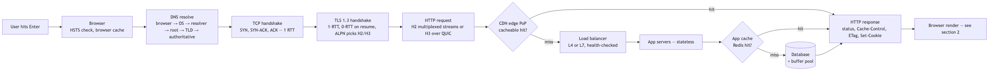

- **URL parse**: scheme, host, port, path, query. Browser checks HSTS list (forces HTTPS).
- **DNS resolution**: browser cache → OS cache → resolver (ISP/8.8.8.8) → root → TLD → authoritative. Returns IP. Anycast + low TTLs for failover. ~geo-routing here for CDN edge selection.
- **TCP handshake**: SYN → SYN-ACK → ACK (1 RTT). Reused via connection pooling / keep-alive.
- **TLS handshake**: TLS 1.3 = 1-RTT (0-RTT on resume). Cert validation, cipher negotiation, session keys. ALPN negotiates HTTP/2 or HTTP/3.
- **HTTP request**: method, headers (Cookie, Auth, Accept), body. HTTP/2 multiplexes streams over one connection; HTTP/3 runs over QUIC/UDP (no head-of-line blocking).
- **Server side**: hits **load balancer → app server → cache → DB**. CDN may serve directly from edge if cacheable.
- **Response**: status, headers (Cache-Control, ETag, Set-Cookie), body. Browser caches per directives.
- **Render**: see §2.
- **Caches you pass through**: browser cache, DNS cache, CDN edge, reverse-proxy, app-level (Redis), DB buffer pool. Name them — interviewers love this.

---

## 2. How the browser works end-to-end

**One-liner:** Parse HTML→DOM, CSS→CSSOM, combine into render tree, layout, paint, composite — JS can block all of it.

### High-level diagram

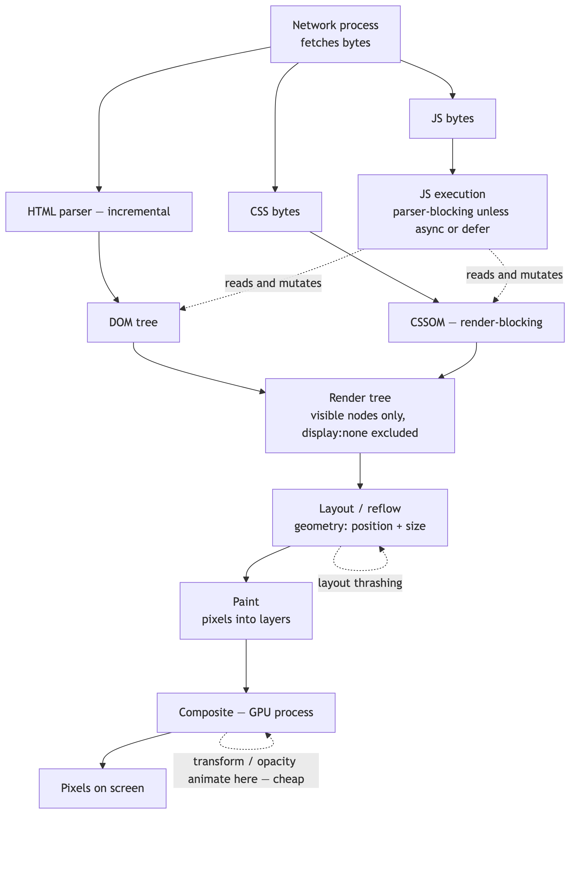

- **HTML parse → DOM tree** (incremental; parser can stream).
- **CSS parse → CSSOM**. CSS is **render-blocking**; browser won't paint until CSSOM is ready.
- **JS**: `<script>` is **parser-blocking** unless `async` (runs when ready, unordered) or `defer` (runs after parse, ordered). JS can read/mutate DOM+CSSOM → why it blocks.
- **Render tree** = DOM + CSSOM (visible nodes only; `display:none` excluded).
- **Layout/Reflow**: compute geometry (position, size). Expensive; triggered by DOM/style changes.
- **Paint**: fill pixels (text, colors, images) into layers.
- **Composite**: GPU combines layers. `transform`/`opacity` animate here → cheap; animating `width`/`top` forces layout → expensive.
- **Critical Rendering Path optimization**: minimize render-blocking CSS/JS, inline critical CSS, defer the rest, reduce reflows (batch DOM writes, avoid layout thrashing).
- **Processes**: modern browsers are multi-process (browser process, renderer per site/tab, GPU, network) — site isolation for security.

---

## 3. Web performance

**One-liner:** Reduce bytes, reduce round trips, cache aggressively, push work to the edge, measure with Core Web Vitals.

### High-level diagram

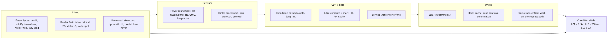

- **Core Web Vitals**: **LCP** (largest content paint, ≤2.5s), **INP** (interaction responsiveness, ≤200ms; replaced FID), **CLS** (layout shift, ≤0.1).
- **Fewer bytes**: gzip/brotli compression, minify, tree-shake, image formats (WebP/AVIF), responsive images, lazy-load.
- **Fewer round trips**: HTTP/2 multiplexing, HTTP/3, connection reuse, bundling (less relevant with H2), preconnect/dns-prefetch/preload hints.
- **Cache**: browser cache (Cache-Control, ETag, immutable assets with content hashes), CDN, service workers for offline.
- **Render fast**: critical CSS inline, defer JS, SSR/streaming SSR for fast first paint, code-splitting.
- **Backend latency**: read replicas, caching layer, denormalization, async/queue for non-critical work.
- **Perceived perf**: skeletons, optimistic UI, prefetch on hover/intent.

---

## 4. CDN, Load Balancing, Caching

**One-liner:** CDN caches static content near users; LB spreads traffic across healthy servers; caches cut latency and DB load at every tier.

### High-level diagram

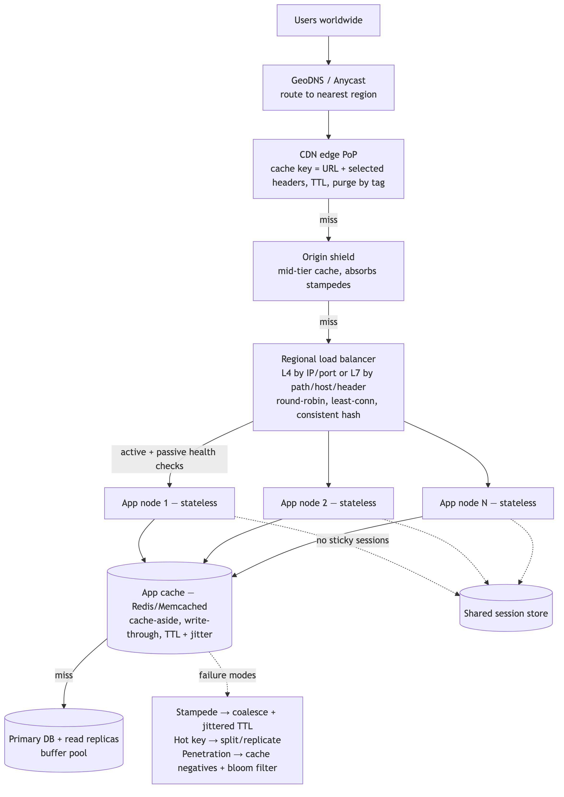

### CDN
- Edge PoPs serve static/cacheable content close to users (low latency, offloads origin).
- **Cache key** = URL + select headers/query. **TTL** via Cache-Control/Expires. **Purge/invalidation** by tag or path.
- **Origin shield**: mid-tier cache to protect origin from cache-miss stampedes.
- **Dynamic content**: edge compute (Workers/Lambda@Edge), or CDN for API caching with short TTLs.
- **Push vs pull**: pull (lazy, on first miss) is common; push for predictable large assets.

### Load Balancing
- **L4 (transport)**: routes by IP/port, fast, connection-level (e.g., NLB). **L7 (application)**: routes by HTTP path/host/header/cookie, richer (e.g., ALB, Envoy, NGINX).
- **Algorithms**: round-robin, least-connections, weighted, consistent hashing (sticky-ish, good for cache locality), IP-hash.
- **Health checks**: active (probe) + passive (eject on errors). Remove unhealthy nodes.
- **Session affinity ("sticky")**: needed when server holds session state — but prefer **stateless + shared session store** (see §7) so any node can serve any user. This is a *key SSO scaling point*.
- **Global**: GeoDNS / anycast to route to nearest region; then regional LBs.

### Caching (general principles)
- **Where**: client → CDN → reverse proxy → app (Redis/Memcached) → DB buffer pool.
- **Patterns**: **cache-aside** (app reads cache, on miss loads DB + populates — most common), **read-through**, **write-through** (write cache+DB sync), **write-back** (write cache, async to DB — fast but risky), **write-around**.
- **Invalidation** (the hard problem): TTL expiry, explicit purge on write, versioned keys.
- **Failure modes to name**:
  - **Cache stampede/thundering herd**: many misses hit DB at once. Fix: request coalescing, locks, early recompute, jittered TTL.
  - **Hot key**: one key overwhelms a node. Fix: replicate/split the key, local caches.
  - **Cache penetration**: queries for nonexistent keys bypass cache. Fix: cache negative results, bloom filter.

---

## 5. Distributed caching

**One-liner:** Spread cache across many nodes via consistent hashing, replicate hot data, accept eventual consistency, plan for node loss.

### High-level diagram

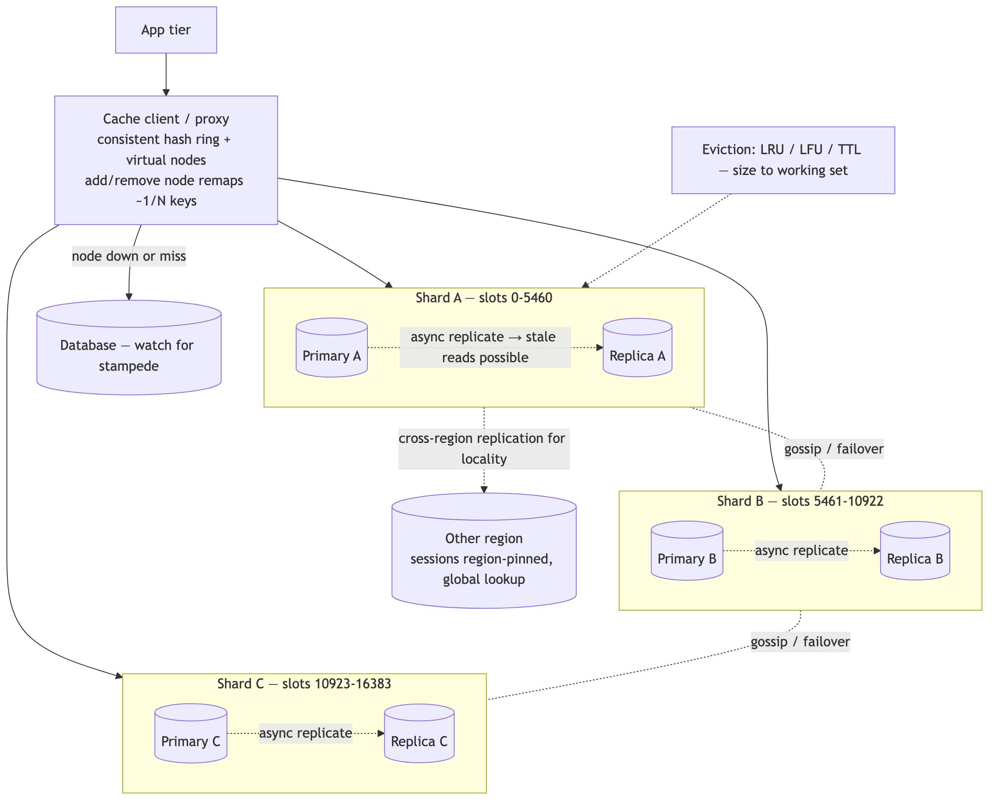

- **Why distributed**: single cache node can't hold the dataset or the QPS; need horizontal scale.
- **Sharding**: **consistent hashing** (hash ring) so adding/removing a node only remaps ~1/N keys, not everything. **Virtual nodes** smooth out hot spots.
- **Redis Cluster** (16384 hash slots, gossip, primary+replica per shard) vs **Memcached** (simpler, client-side sharding, multithreaded, no persistence).
- **Replication**: primary-replica for read scaling + failover. Async replication → possible stale reads.
- **Consistency**: caches are typically **eventually consistent**; you trade freshness for speed. Use short TTLs or write-through where correctness matters (e.g., **session revocation** — critical at Okta).
- **Eviction**: LRU / LFU / TTL. Size the cache to your working set.
- **Failure**: node down → keys unavailable → fall back to DB (watch for stampede). Persistence (AOF/RDB) or warm standbys reduce cold-cache pain.
- **Multi-region**: replicate for locality; beware cross-region write conflicts. Session data often pinned to region with global lookup.

---

## 6. Performance & scale (patterns to name)

**One-liner:** Scale reads with caches+replicas, scale writes with sharding+queues, stay stateless, degrade gracefully.

### High-level diagram

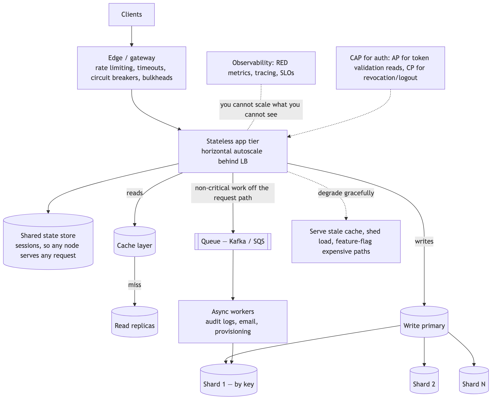

- **Vertical vs horizontal**: prefer horizontal (stateless app tier behind LB).
- **Stateless services** + shared state store → any node serves any request, trivial autoscaling. (Directly relevant to session design.)
- **DB scaling**: read replicas (read-heavy), **sharding/partitioning** by key (write-heavy), CQRS (split read/write models), denormalization.
- **Async**: message queues (Kafka/SQS) to smooth spikes, decouple, and absorb bursts. Do non-critical work (audit logs, email, provisioning) off the request path.
- **Backpressure & resilience**: rate limiting, circuit breakers, timeouts, retries with jittered exponential backoff, bulkheads.
- **Graceful degradation**: serve stale cache, shed load, feature-flag off expensive paths.
- **Observability**: metrics (RED: rate/errors/duration), tracing, SLOs. You can't scale what you can't see.
- **CAP framing**: for auth, favor **availability + partition tolerance** for reads (validate tokens locally), but **strong consistency** for revocation/logout. Name the tension.

---

## 7. Cross-Domain SSO — the main event

**One-liner:** SSO works because the **IdP holds one authenticated session**; each app (on its own domain) redirects the browser to the IdP, which — seeing its own session cookie — issues a signed token/assertion without re-prompting.

### High-level diagram (architecture)

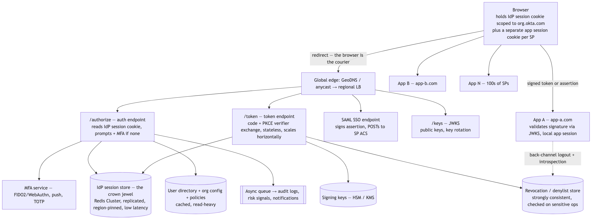

### High-level diagram (SSO across two domains)

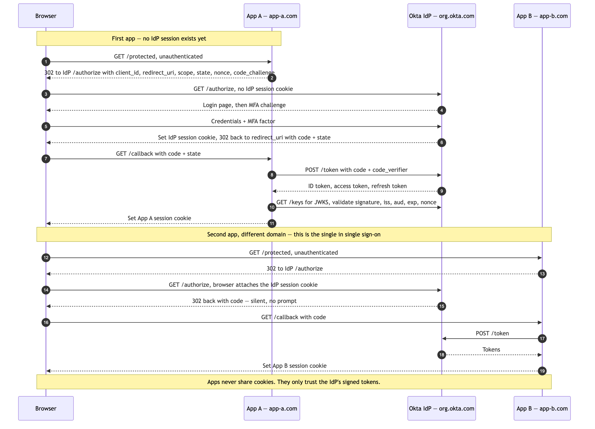

### The core mental model
- Three roles: **User (browser)**, **IdP / Authorization Server** (Okta), **SP / RP / client app** (the thing you're logging into).
- The **shared state** that makes SSO "single" is the **IdP session cookie**, scoped to Okta's domain (e.g., `yourorg.okta.com`).
- Apps live on **different domains** → they can't read Okta's cookie → so they **redirect the browser to Okta** and let Okta read its own cookie. The browser is the courier; **redirects cross the domain boundary**, cookies never do.

### SAML 2.0 (enterprise/web SSO)
**SP-initiated flow:**
1. User hits SP resource unauthenticated.
2. SP builds a **SAML AuthnRequest**, redirects browser to IdP (Okta).
3. IdP checks its **session cookie**. If valid → skip login. If not → authenticate (password + MFA).
4. IdP returns a **signed SAML Assertion** (XML) — POSTed by the browser to the SP's **ACS (Assertion Consumer Service)** URL.
5. SP **validates the signature** (IdP's public cert), checks conditions (audience, NotBefore/NotOnOrAfter), creates a **local app session**.
- **IdP-initiated**: user starts on the Okta dashboard, clicks an app tile, Okta pushes an assertion to the SP's ACS.
- Assertion carries **NameID** (user identifier) + attributes/claims. Signed (integrity), optionally encrypted (confidentiality).

### OIDC / OAuth2 (modern apps, APIs, SPAs, mobile)
**Authorization Code flow + PKCE (the answer to "how would you build it today"):**
1. App redirects browser to Okta **`/authorize`** with `client_id`, `redirect_uri`, `scope` (`openid ...`), `state` (CSRF), `nonce`, `code_challenge` (PKCE).
2. Okta authenticates via its session cookie (or prompts + MFA).
3. Okta redirects back to `redirect_uri` with an **authorization code** + `state`.
4. App exchanges code at **`/token`** (sending `code_verifier` for PKCE) → gets **ID token** (who the user is, JWT), **access token** (what they can do), **refresh token** (get new tokens).
5. App **validates the ID token**: signature via **JWKS** endpoint, `iss`, `aud`, `exp`, `nonce`.
- **ID token** = authentication (OIDC). **Access token** = authorization (OAuth2). Don't conflate them — a classic interview gotcha.
- **PKCE** kills the auth-code-interception attack; mandatory for public clients (SPAs, mobile), now recommended for all.
- **Tokens: JWT (self-contained, stateless validation, can't be revoked mid-life) vs opaque (introspection endpoint, revocable, extra round trip).** Tradeoff = scale vs revocability. Mitigate JWT's weakness with **short expiry + refresh tokens + a revocation list check on sensitive ops**.

### Why it's "single" across domains (say this explicitly)
- First app: no IdP session → user logs in → **IdP sets its session cookie**.
- Second app (different domain): redirects to Okta → **Okta sees its own cookie** → issues token **silently, no prompt**. That's the "single sign-on."
- The apps never share cookies or sessions with each other — **they only ever trust the IdP's signed tokens.**

### Session management & scale (tie back to §4–6)
- **App sessions**: keep app tier **stateless**; store sessions in a **shared distributed store** (Redis) or use **signed cookies/JWTs** so any LB-routed node can validate. Avoids sticky sessions.
- **IdP session** is the crown jewel — must be **highly available, replicated, low-latency**, and **fast to revoke**.
- **Token validation at scale**: JWT lets each service validate locally (no IdP round trip) → scales beautifully. Price = revocation delay. Handle with short TTLs + refresh rotation.

### Single Logout (SLO) — the genuinely hard part
- **One-liner:** Logging out of one app should ideally end the session everywhere — but it's hard because the IdP must reach every SP.
- **SAML SLO**: IdP sends LogoutRequests to each SP the user has a session with (front-channel via browser redirects, or back-channel server-to-server). Fragile: any SP down or browser closed → partial logout.
- **OIDC**: front-channel logout (iframes hit each app's logout URL), back-channel logout (IdP calls apps directly), RP-initiated logout.
- **Pragmatic answer**: kill the IdP session + rely on **short access-token TTL** so app sessions expire fast; use back-channel + a revocation list for high-security apps.

### Security threats (Okta *will* probe these)
- **CSRF** → `state` param (OIDC), RelayState validation (SAML), SameSite cookies.
- **Token/assertion theft** → HTTPS only, short-lived tokens, **DPoP / mTLS sender-constrained tokens**, HttpOnly+Secure cookies.
- **Replay** → `nonce`, assertion IDs, tight NotOnOrAfter windows.
- **XSS stealing tokens** → prefer **not** storing tokens in localStorage; use HttpOnly cookies or the BFF (Backend-For-Frontend) pattern for SPAs.
- **Open redirect** → strict `redirect_uri` allow-listing (exact match).
- **Signature validation** → always verify assertion/JWT signature against IdP keys; support **key rotation** via JWKS.
- **Phishing-resistant MFA** → FIDO2/WebAuthn, not SMS.

### Third-party-cookie deprecation (a sharp, current talking point)
- Browsers blocking 3p cookies breaks **silent iframe auth** (`prompt=none` in a hidden iframe reading the IdP cookie).
- **Fix**: move to **redirect-based** silent auth, **refresh tokens** (rotating) for token renewal, and **BFF** patterns. Mention this to show you're current — it's a real pain point for identity providers right now.

### Multi-region / availability for an IdP
- SSO is on the critical path for *every* customer app → target **four-nines+**.
- Replicate session + config globally; route users to nearest region; **strong consistency for revocation, eventual for reads**.
- Graceful degradation: if the revocation store is unreachable, decide the policy (fail-open vs fail-closed) and **say which and why** — for auth, sensitive ops fail-closed.

---

## 8. Likely questions & 30-second answers

### High-level diagram (the answer spine)

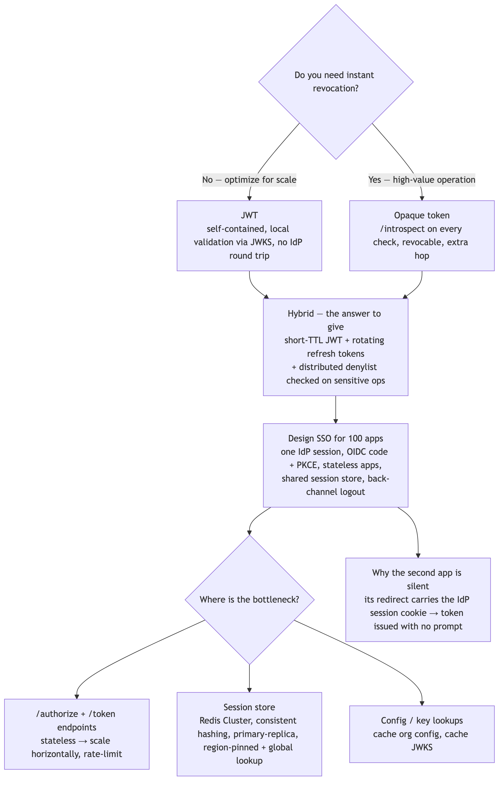

- **"Design SSO for a company with 100 apps."** → IdP holds one session; apps trust signed tokens (OIDC code+PKCE); stateless apps + shared session store; short-lived access tokens + rotating refresh tokens; JWKS for validation; back-channel logout + revocation list.
- **"JWT or opaque tokens?"** → JWT for scale (local validation), opaque for revocability; hybrid = short JWT + refresh + revocation check on sensitive actions.
- **"How do you revoke a token immediately?"** → opaque + introspection, or JWT + short TTL + a distributed denylist checked on high-value ops.
- **"How does the second app not ask me to log in?"** → its redirect to the IdP carries the IdP's session cookie; IdP issues a token silently.
- **"Scale the session store."** → Redis Cluster, consistent hashing, primary-replica, region-pinned sessions with global lookup, short TTLs.
- **"Where's the bottleneck?"** → the IdP's auth + token endpoints and session store; cache config/keys, scale token issuance horizontally (stateless), protect with rate limits.

---

## 9. Phrases that score points

### High-level diagram (when to drop each line)

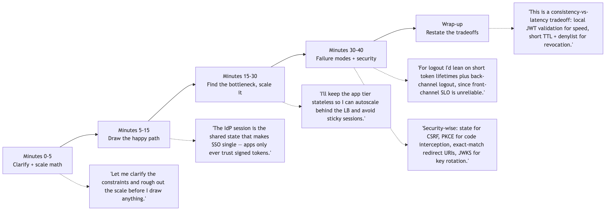

- "Let me clarify the constraints and rough out the scale before I draw anything."
- "I'll keep the app tier stateless so I can autoscale behind the LB and avoid sticky sessions."
- "The IdP session is the shared state that makes SSO single — apps only ever trust signed tokens."
- "This is a consistency-vs-latency tradeoff: local JWT validation for speed, short TTL + denylist for revocation."
- "For logout, I'd lean on short token lifetimes plus back-channel logout, since front-channel SLO is unreliable."
- "Security-wise: state for CSRF, PKCE for code interception, exact-match redirect URIs, JWKS for key rotation."

---

## 10. Design a backup & recovery system

**One-liner:** Start from **RPO/RTO**, take **consistent** backups (full + incremental + continuous log shipping), store them **3-2-1 with immutable offsite copies**, and **test restores on a schedule** — an untested backup isn't a backup.

### High-level diagram

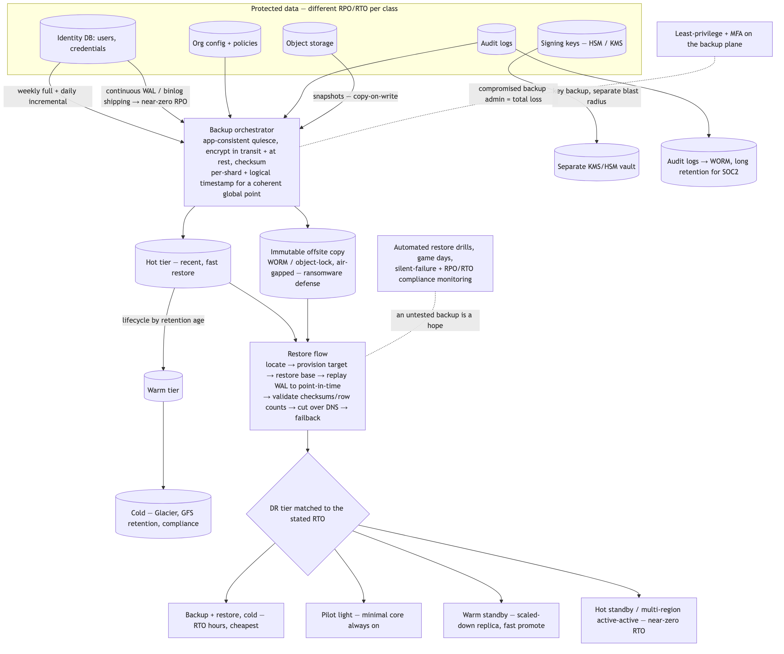

### Requirements first (drive the whole design)
- **RPO (Recovery Point Objective)** = max acceptable data loss → sets **backup frequency**. Near-zero RPO ⇒ continuous log/WAL shipping.
- **RTO (Recovery Time Objective)** = max acceptable downtime → sets **recovery architecture** (cold restore vs hot standby).
- **What are we protecting?** DBs, object storage, config, **secrets/signing keys**, audit logs. Different data → different RPO/RTO.
- **Scale**: total volume, growth rate, change rate (churn) — drives storage & incremental strategy.

### Backup types (know the tradeoffs)
- **Full**: complete copy. Simple restore, slow + storage-heavy.
- **Incremental**: changes since the *last backup*. Fast/small, but restore replays a **chain** (full + every increment) → longer, more fragile.
- **Differential**: changes since the *last full*. Middle ground — one full + one diff to restore.
- **Snapshot**: point-in-time, copy-on-write (EBS/LVM/filesystem). Very fast to take.
- **Continuous / CDP (log shipping)**: stream the DB **WAL/binlog** → **point-in-time recovery**, near-zero RPO. This is the answer when they push on "minimize data loss."
- Common real-world combo: **weekly full + daily incremental + continuous WAL** shipping.

### Consistency (the subtle part they probe)
- **Crash-consistent** (snapshot of disk as-is) vs **application-consistent** (DB quiesced/flushed so the backup is a valid state).
- Use DB-native tools for app-consistency: `pg_basebackup` + WAL, Percona **XtraBackup**, snapshot with a **write freeze/quiesce**.
- **Distributed systems**: back up per-shard + capture a logical timestamp/marker so you can restore to a coherent global point; or coordinate snapshots.

### Storage strategy
- **3-2-1 rule**: **3** copies, **2** media/locations, **1** offsite. Say this by name.
- **Immutability / WORM / object-lock** → ransomware & malicious-delete protection. At least one **air-gapped/offline** copy for the paranoid tier.
- **Tiered lifecycle** for cost: hot → warm → cold (e.g., S3 → Glacier), driven by retention age.
- **Encryption** at rest + in transit; **manage the decryption keys separately** — losing the key that decrypts your backups is the same as having no backup.
- **Retention policy**: GFS (grandfather-father-son) — keep dailies for N days, weeklies for weeks, monthlies/yearlies for compliance.

### Recovery & DR (map cost → RTO)
- **Restore flow**: locate backup → provision target → restore base → **replay logs to point-in-time** → validate (checksums/row counts) → cut over (DNS/traffic switch) → **failback** plan.
- **DR tiers**, cheapest/slowest → priciest/fastest:
  - **Backup & restore** (cold): cheapest, RTO hours.
  - **Pilot light**: core minimal stack always on, scale up on disaster.
  - **Warm standby**: scaled-down live replica, fast promote.
  - **Hot standby / multi-region active-active**: near-zero RTO, highest cost.
- Pick the tier that **matches the stated RTO** — don't over- or under-build.

### Testing & operations (where real systems fail)
- **Test restores regularly** — automated restore drills, checksum verification, "game day" DR exercises. *A backup you've never restored is a hope, not a backup.*
- **Monitor**: backup success/failure alerts, RPO/RTO compliance, storage growth, **silent-failure detection** (the #1 real-world trap: backups quietly failing for months).
- **Runbooks** for DR so recovery isn't improvised at 3am.

### Security & failure modes (name these unprompted)
- **Ransomware / malicious delete** → immutable + air-gapped copies, MFA + least-privilege on backup infra (a compromised backup admin = total loss).
- **Corruption / bit-rot** → checksums, multiple copies, periodic verification.
- **Key loss** → separate KMS/HSM, key backup + rotation, distinct blast radius from data.
- **Backups meeting RPO but not RTO** → the restore is too slow; pre-provision (warm standby) or parallelize restore.

### Okta / identity angle (weave this in)
- Identity is **on the critical path for everything** — data loss locks customers out of every downstream app → tight RPO/RTO, multi-region DR, tested failover.
- Back up carefully: **user/identity records, org config & policies, signing keys (HSM/KMS — extra care), and audit logs**.
- **Audit logs need immutable, long-retention storage** for compliance (SOC2/regulatory) — WORM buckets.
- Trade off: **strong consistency for identity/credential data; eventual is fine for less critical telemetry.**

### 30-second spoken answer
> "First I'd pin down **RPO and RTO** per data class. I'd run **weekly fulls + daily incrementals + continuous WAL shipping** for point-in-time recovery. Store **3-2-1 with an immutable, encrypted offsite copy**, keys in a separate KMS. Match a **DR tier to the RTO** — warm standby if recovery must be fast. Then the part everyone skips: **automated restore testing and silent-failure monitoring**, because an untested backup isn't real. For identity data I'd tighten RPO, keep audit logs immutable for compliance, and guard the backup plane with least-privilege + MFA against ransomware."

---

## 11. Design a scalable, multi-tenant notification service

**One-liner:** An **async pipeline** — ingest via API → **enqueue** → route by channel + user preference → worker pool calls **channel-provider adapters** → track delivery — with **per-tenant isolation & rate limits**, retries + DLQ, and **priority lanes so MFA codes never queue behind bulk email**.

### High-level diagram

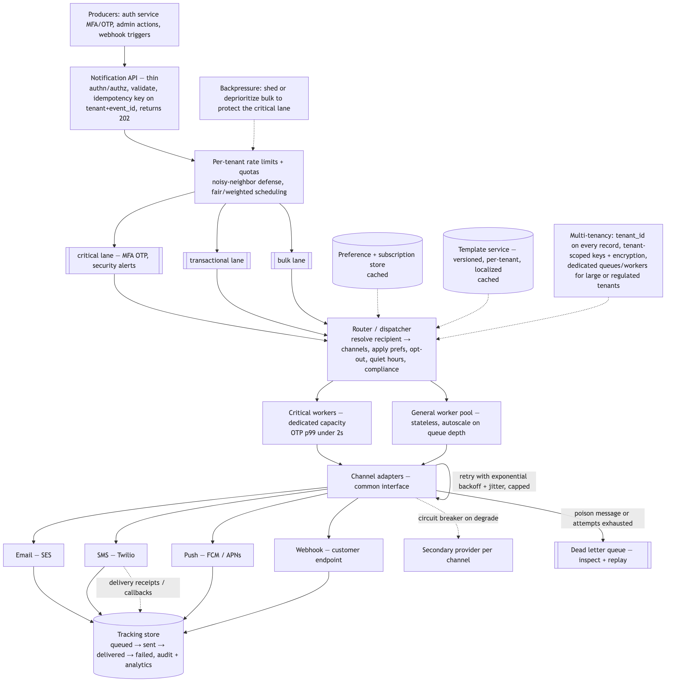

### Frame it right (the Okta insight)
- At Okta this is **transactional, auth-critical** delivery — MFA OTPs (SMS/push/email), "new device sign-in" alerts, security notifications, webhooks to customer systems. **Not** marketing.
- ⇒ **Latency and reliability dominate**: a delayed OTP = a failed login. Say this early; it reframes every design choice.

### Requirements
- **Functional**: multi-channel (email, SMS, push, in-app, **webhook**), templating, user preferences/opt-out, delivery tracking, scheduling.
- **Non-functional**: **low latency for critical messages**, high throughput for bulk, at-least-once delivery, multi-tenant isolation, high availability.
- **Scale math**: tenants × users × events/day → QPS. Ask read:write, peak:average (auth spikes at business-day start), fan-out factor.

### High-level flow
```
Producer (auth service, admin action, webhook trigger)
      → Notification API (validate, auth, dedup key)
      → Priority queues (critical / transactional / bulk)
      → Dispatcher/Router (resolve channel + preferences + template)
      → Worker pool (per-channel adapters)
      → Provider (Twilio/SES/FCM/APNs/webhook endpoint)
      → Status tracking + retries/DLQ + analytics
```

### Core components
- **Ingestion API**: authenticated, validated, assigns an **idempotency key** (dedup), enqueues fast, returns 202. Keep it thin — do work async.
- **Message queue** (Kafka/SQS/RabbitMQ): decouples producers from delivery, absorbs spikes. Partition by tenant or priority.
- **Router/Dispatcher**: resolves recipient → channel(s) via **preferences**, applies **quiet hours / opt-out / compliance**, picks template.
- **Template service**: versioned, per-tenant templates + localization; render with variables.
- **Channel adapters**: pluggable per provider (SES, Twilio, FCM/APNs, webhook). Isolate provider quirks + failures behind a common interface.
- **Preference & subscription store**: per-user channel prefs, opt-outs, quiet hours.
- **Tracking/status store**: queued → sent → delivered → failed; provider receipts/callbacks; analytics.

### Multi-tenancy (they will push here)
- **Isolation**: logical (tenant_id on every record + row-level scoping) vs physical (dedicated queues/workers for big/regulated tenants). Usually logical + noisy-neighbor controls.
- **Noisy-neighbor defense**: **per-tenant rate limits & quotas**, fair scheduling / weighted queues so one tenant's bulk blast can't starve another's OTPs.
- **Per-tenant config**: own templates, providers/sender IDs, branding, rate limits.
- **Data isolation**: tenant-scoped keys, encryption; never leak cross-tenant.

### Prioritization (the standout point)
- **Separate priority lanes/queues**: `critical` (MFA/OTP, security) → `transactional` → `bulk`. Critical lane gets dedicated workers + provider capacity so it **never blocks behind marketing**.
- Optionally a **latency SLO per class** (e.g., OTP p99 < 2s).

### Delivery guarantees & idempotency
- **At-least-once** is standard; combine with an **idempotency key** so retries don't double-send (dedup on `(tenant, event_id)`).
- **Exactly-once is a myth end-to-end** (providers can double-deliver) → design consumers/recipients to tolerate dupes.
- Track state transitions; reconcile with provider **delivery receipts/webhooks**.

### Scale & performance
- **Stateless workers**, horizontally scaled, pull from queues → autoscale on queue depth.
- **Partition** queues by tenant/priority for parallelism + isolation.
- **Fan-out**: one event → many recipients handled by fan-out workers; batch where providers allow.
- **Cache** templates + preferences to avoid per-message DB hits.

### Reliability & failure modes
- **Retries** with exponential backoff + jitter; cap attempts → **Dead Letter Queue** for inspection/replay.
- **Provider failover**: secondary provider per channel (e.g., backup SMS gateway) via **circuit breaker** when the primary degrades.
- **Idempotency** prevents retry-storm duplicates.
- **Backpressure**: shed/deprioritize bulk when the system is saturated to protect critical lane.
- **Poison messages** → DLQ, don't block the queue.

### Compliance & correctness
- Opt-out / unsubscribe enforcement, **quiet hours**, per-region rules (TCPA/GDPR). Suppression lists.
- **Auditability**: who sent what, when, delivery status — matters at Okta (security notifications are evidence).

### 30-second spoken answer
> "It's an **async, queue-based pipeline**: a thin API validates + assigns an idempotency key and enqueues; workers pull from **priority-separated queues** and deliver via pluggable channel adapters. The Okta-specific move is **priority lanes** — MFA OTPs and security alerts ride a critical lane with dedicated capacity so they never queue behind bulk email. For **multi-tenancy** I'd scope everything by tenant with **per-tenant rate limits and fair scheduling** to kill noisy-neighbor. **At-least-once + idempotency keys** for dedup, **retries → DLQ**, and **provider failover via circuit breakers**. Stateless workers autoscale on queue depth; templates and preferences are cached. Preferences, opt-outs, and delivery tracking round it out."

---

**Final tip:** Drive the conversation, narrate your tradeoffs, and every time you add a component ask "what breaks at 10×, and what's the security implication?" That framing — scale + security on every box — is exactly what an Okta panel is listening for. Good luck.
