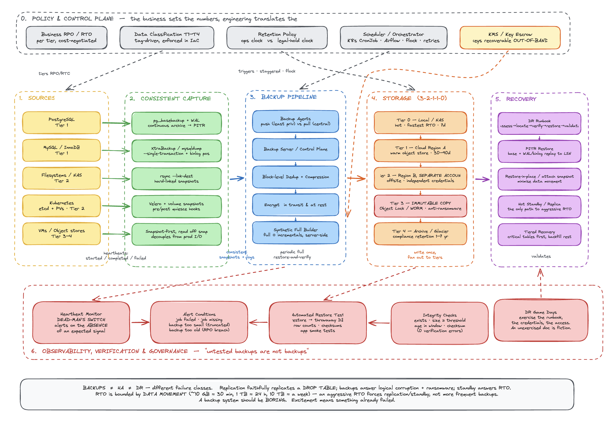

# Backup And Recovery System Design

**One-liner: at Staff level, interviewers don't test whether you know what a backup is — they test whether you can reason about consistency, failure modes, cost/scale tradeoffs, and recovery guarantees under pressure. Below is each stage with the mechanics plus the follow-ups they'll actually push on.**

---

Here's the whiteboard:

Things the diagram is deliberately making visible, because they're the points interviewers push on:

- **Capture sits between source and pipeline as its own layer** — a naive file copy of a running DB is corrupt; consistency is established *before* anything reaches the pipeline (§6).
- **The immutable tier is a distinct box in a separate account**, not just "offsite" — that's the ransomware/insider answer (§2).
- **KMS is wired in from outside the pipeline** — if the key only lives in the system you're recovering from, you're locked out (§11).
- **Monitoring arrows point *into* the monitor from the pipeline**, and the monitor alerts on absence — dead-man's switch, not exit codes (§10).
- **The restore-test loop closes back on storage** — untested backups aren't backups (§11).

---

**1. RPO & RPO — and how you *derive* them**

Mechanics: RPO = max acceptable data loss (drives backup *frequency*). RTO = max acceptable downtime (drives restore *architecture*). Disaster sits on a timeline: distance back to last good backup = RPO exposure; distance forward to "systems up" = RTO.

What a Staff interviewer probes:
- "Who sets these numbers?" → Not engineering. The *business* sets them; you translate them into architecture. Push back if someone says "RPO zero, RTO zero" — that means synchronous replication + hot standby + infinite budget. Force the cost conversation.
- "RPO vs replication lag?" → Backups protect against logical corruption and ransomware; replication protects against hardware/AZ failure. A replica faithfully replicates a `DROP TABLE`. They solve different problems — you need both.
- "How do you *enforce* an RPO?" → Monitor backup recency, not just backup success. A job that succeeds every 6 hours silently violates a 1-hour RPO. Alert on age-of-last-good-backup.

---

**2. The 3-2-1 rule — and where it breaks**

Mechanics: 3 copies, 2 media types, 1 offsite. Redundancy across independent failure domains.

Probes:
- "Why 2 media types?" → Correlated failure. Two copies on the same SAN share a controller, firmware bug, and blast radius. Different media = independent failure modes.
- "Modern variant?" → 3-2-1-1-0: add 1 immutable/offline copy and 0 verification errors. The immutable copy is the ransomware answer — object-lock / WORM storage that even a compromised admin credential can't delete.
- "Is offsite enough?" → Different *region*, not just different building. And check the offsite isn't silently in the same cloud account — a compromised root account deletes both. Separate account, separate credentials.

---

**3. Data classification / tiering**

Mechanics: tier data by criticality → assign RPO/RTO/frequency/retention per tier. Tier 1 (prod DB, financial): 15 min / 1 hr / 90 days. Tier 4 (archives): 1 week / 1 week / 1 year.

Probes:
- "Why tier at all?" → Cost. Uniform Tier-1 protection on logs and caches burns money protecting regenerable data. Tiering is how you spend the backup budget where the business bleeds.
- "How do you classify at scale?" → Tag-driven, enforced in IaC. Don't rely on humans remembering. Untagged resources default to a sane tier and trigger a review.
- "Retention drivers?" → Two forces: operational recovery (short) and compliance/legal hold (long, e.g. HIPAA/SOX/GDPR). They're different clocks — model them separately.

---

**4. Backup types — the restore-chain tradeoff**

Mechanics: Full = everything. Incremental = delta since *last backup of any type*. Differential = delta since last *full*.

Probes (this is a favorite):
- "Full weekly + incremental daily — what's the restore cost?" → You restore the full, then replay *every* incremental in order up to your target. Restore time and failure risk grow with chain length. One corrupt link breaks the chain.
- "Differential tradeoff?" → Each differential is self-sufficient relative to the last full — restore = full + one differential. Simpler restore, but differentials grow larger each day until the next full.
- "Which do you pick?" → Depends on whether you optimize backup window or restore window. Tight RTO → fewer links → lean toward differential or more frequent fulls. Also mention synthetic fulls: merge a full + incrementals server-side so you get full-restore simplicity without re-reading source.

---

**5. Backup architecture (the pipeline)**

Mechanics: sources (DB / FS / VM / K8s) → agents → backup server → dedup engine → tiered storage (local / NAS / cloud) → monitoring → alerts.

Probes:
- "Why dedup?" → Block-level dedup + compression is what makes keeping 90 days of daily backups economically viable. Cross-backup dedup means unchanged blocks are stored once.
- "Push vs pull agents?" → Pull (backup server initiates) centralizes credentials and scheduling but the server needs broad access — big blast radius if compromised. Push limits per-host credentials. Trade central control vs least privilege.
- "Bottleneck at scale?" → Usually not compute — it's network egress and the backup window. Backups compete with production I/O. Stagger jobs, throttle, or snapshot-then-back-up-off-the-snapshot to decouple from the live system.

---

**6. Database backups — consistency is the whole game**

This is where Staff interviews spend the most time. The core issue: **a naive file copy of a running database is corrupt** because it's not a consistent point-in-time snapshot.

*Postgres:*
- Logical: `pg_dump -Fc` → portable, restore individual objects, but slow on large DBs and takes a point-in-time snapshot at dump start.
- Physical + PITR: `pg_basebackup` (base) + continuous WAL archiving. You replay WAL up to any target — "restore to 14:32:07, one second before the bad migration."

Probes:
- "How does PITR actually work?" → The base backup is a floor; the WAL is an ordered redo log. Recovery = restore base, then replay WAL to your target LSN/timestamp. RPO shrinks to your WAL-archive interval (near-zero with streaming).
- "`pg_dump` on a 5 TB DB?" → Too slow / long snapshot. Switch to physical base backups + WAL, or storage-level snapshots. Logical dumps don't scale to Tier-1 large.
- "Consistency mechanism?" → `pg_dump` uses a repeatable-read transaction (MVCC snapshot). It's consistent but holds a long transaction — watch bloat/vacuum interaction on busy systems.

*MySQL:*
- `--single-transaction` → consistent snapshot for InnoDB via a transaction (does NOT help MyISAM — non-transactional).
- `--source-data=2` → records binlog file+position as a comment → the coordinate PITR replays *from*.

Probes:
- "Mixed InnoDB/MyISAM?" → `--single-transaction` won't give you a consistent MyISAM snapshot; you'd need locking (`--lock-tables`), which blocks writes. Real answer: don't run MyISAM for anything you care about.
- "Better than mysqldump for large?" → Physical tools (Percona XtraBackup) for hot physical backups without long locks.

---

**7. Filesystem backups**

Mechanics: `rsync --link-dest` hard-links unchanged files against the previous backup → every snapshot dir looks complete but only changed files consume new space (poor man's dedup at file granularity).

Probes:
- "Limitation of file-level hard-linking?" → Granularity. Change one byte in a 10 GB file → the whole file is re-copied (no block dedup). Fine for many small files, wasteful for large mutable ones.
- "`--delete` risk?" → Mirrors deletions into the new backup — correct for a point-in-time mirror, but combined with a bug upstream it can propagate loss. The hard-linked history is your safety net; retention must be enforced.
- "Excludes matter why?" → Excluding `/proc`, `/sys`, `/dev`, caches, container layers isn't just size — backing up `/proc` can hang or capture garbage. Correctness, not just speed.

---

**8. Kubernetes**

Mechanics: two orthogonal things to capture — cluster *state* (API objects) and application *data* (PVs). Velero does both (resources + volume snapshots, scheduled, TTL retention). For self-managed clusters, snapshot `etcd` — the actual source of truth.

Probes:
- "Why etcd separately if you have Velero?" → etcd *is* the cluster's brain. On managed K8s (EKS/GKE) the provider owns it; on self-managed, losing etcd = losing the entire cluster definition. Velero backs up the API view; etcd is ground truth including things Velero may miss.
- "PV snapshot consistency?" → Volume snapshots are crash-consistent, not application-consistent. For a database on a PV, you still need app-level quiescing/hooks (Velero pre/post hooks to flush) or you're snapshotting mid-write.
- "Restore ordering?" → Namespaces, CRDs, then workloads. Dependencies matter — restoring a Deployment before its CRD fails.

---

**9. Automation & scheduling**

Mechanics: cron, staggered to avoid contention. Wrapper script standardizes logging + heartbeats so every job reports uniformly.

Probes:
- "What's wrong with plain cron at scale?" → No dependency handling, no retry, no visibility, silent failures, host-local. Fine for a few hosts; at fleet scale you want a scheduler/orchestrator (K8s CronJobs, Airflow, or the backup tool's own scheduler) with retries and centralized state.
- "Idempotency / overlap?" → What if a job runs long and the next fires? Need locking (flock) so you don't get two backups clobbering each other or doubling load.

---

**10. Monitoring — the heartbeat pattern (emphasize this)**

Mechanics: each job POSTs started/completed/failed to a monitor. **Crucially, it's a *dead-man's switch*: the monitor alerts when the expected heartbeat DOESN'T arrive within a window.**

Probes:
- "Why heartbeat vs checking exit code?" → A crashed host, dead cron daemon, or network partition produces *no* signal at all — an exit-code check never runs. Absence-of-signal is the failure mode you must catch. Push-based heartbeats with a server-side timeout catch "the whole box is gone."
- "What do you actually alert on?" → Not just failure. Alert on: job failed, job missing (no heartbeat), backup too small (truncated), backup too old (RPO breach), restore-test failed. Success-only monitoring is a trap.
- "Alert fatigue?" → Route by severity, dedupe, escalate. A noisy backup alert that everyone mutes is worse than none.

---

**11. Testing & verification — "untested backups are not backups"**

Mechanics: automated restore into a throwaway DB, then validate (table counts, row counts). Plus file-level checks: exists, size ≥ threshold (catches truncation), age within window (catches staleness), checksum (integrity).

Probes (Staff interviewers love this):
- "How do you know a backup is restorable *without* restoring?" → You mostly can't — that's the point. `pg_restore -l` validates structure/readability cheaply, but only a real restore proves recoverability. Schedule periodic full restore-and-verify.
- "What does 'verify' mean beyond 'it restored'?" → Data correctness: row counts, checksums on critical tables, application-level smoke tests. A restore that produces a technically-valid-but-empty DB passed the wrong test.
- "Backup encryption + key management?" → Backups hold PII and secrets → encrypt at rest and in transit. But now: where's the key? If the key lives only in the system you're recovering *from*, you're locked out. Keys must be recoverable independently (separate KMS, escrow). This is a classic gotcha.

---

**12. Disaster recovery — runbook + honest RTO math**

Mechanics: pre-written runbook (assess → locate → download → verify → stop traffic → restore → validate → post-mortem) and an RTO estimation table (10 GB ≈ 30 min; 1 TB ≈ 24 hrs).

Probes:
- "Why is the RTO table sobering?" → Because restore time is dominated by data movement. A 10 TB restore is ~a week end-to-end — if your RTO is 4 hours, backups alone can't meet it. You need hot standby / replication / snapshots. This is the moment you prove you understand RPO/RTO drive *architecture*, not just backup frequency.
- "How do you hit aggressive RTO then?" → Reduce restore volume (snapshots you attach vs data you copy), pre-provisioned standby, restore-in-place, or tiered recovery (bring critical tables up first, backfill the rest). Backups are the floor, not the fast path.
- "Runbook staleness?" → A runbook not exercised is fiction. Game-day / DR drills validate that the doc, the credentials, and the access still work. The runbook and the restore test are the same discipline.

---

**The meta-answer that signals Staff level**

If they ask "walk me through designing this," lead with the reasoning chain, not the tools:

- Start from business requirements → RPO/RTO per tier.
- Recognize backups ≠ HA ≠ DR — they solve different failure classes (hardware, logical corruption, ransomware, site loss).
- Everything must be automated, monitored via dead-man's-switch, and *proven by restore testing*.
- Immutability and independent credentials are the ransomware/insider-threat answer.
- RTO is bounded by data movement, so aggressive RTO forces replication/standby, not just more frequent backups.
- Close with the philosophy: a backup system should be boring; excitement means something already failed.