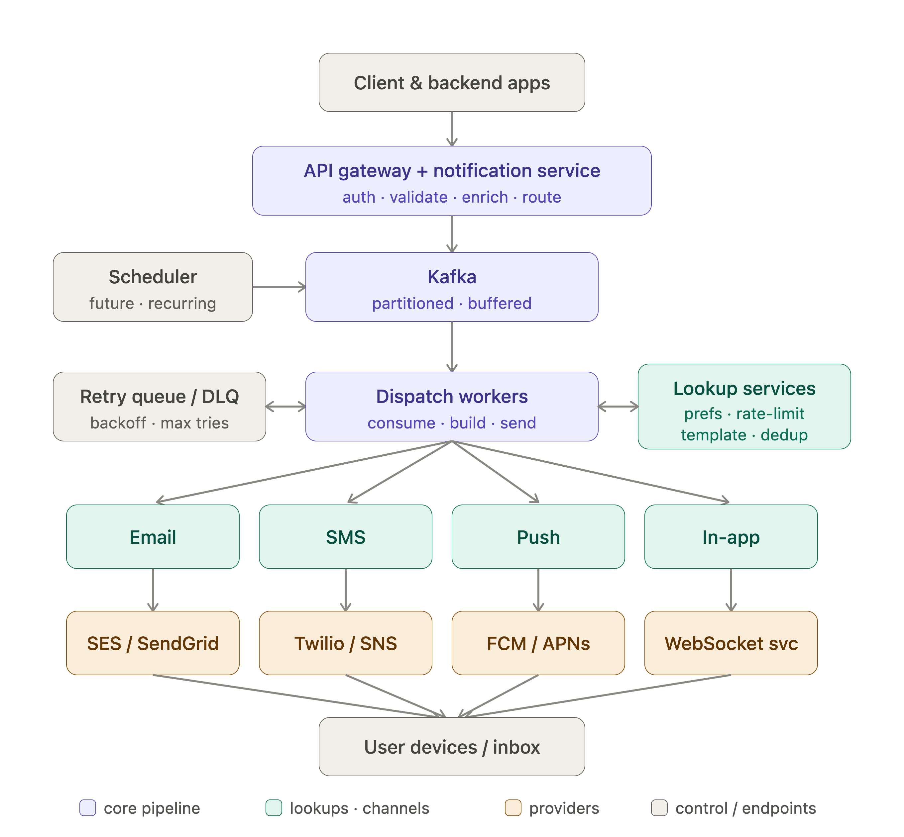
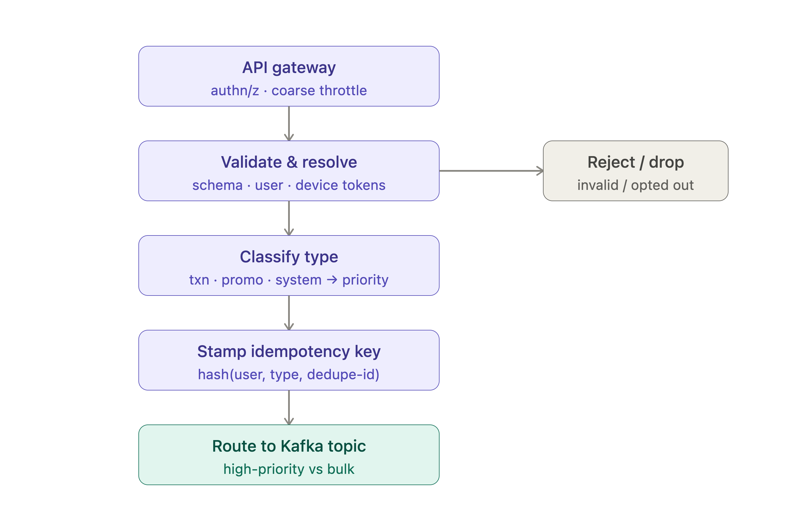
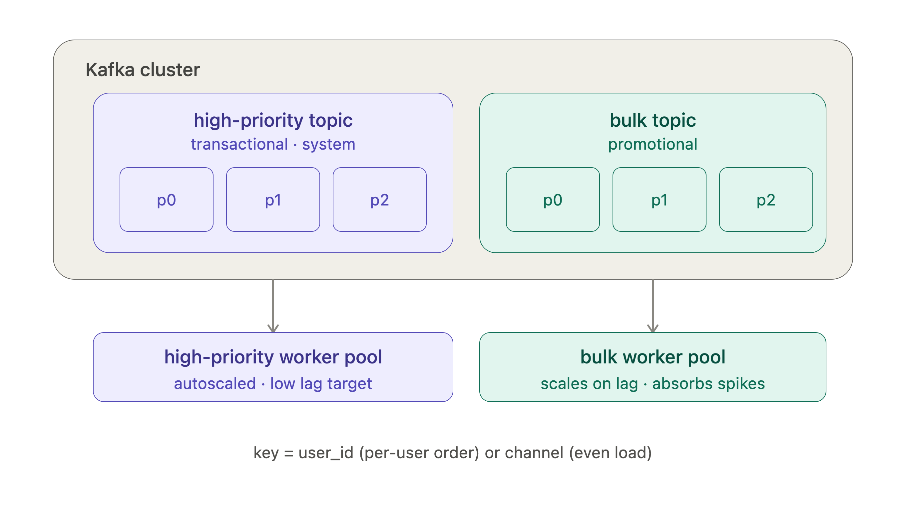
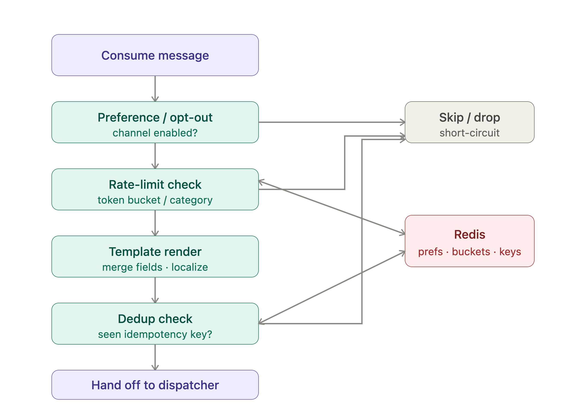
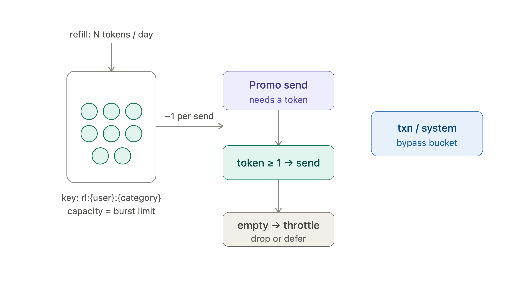
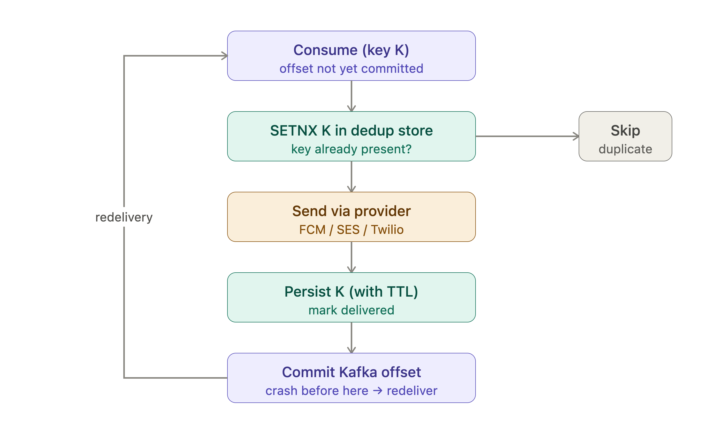
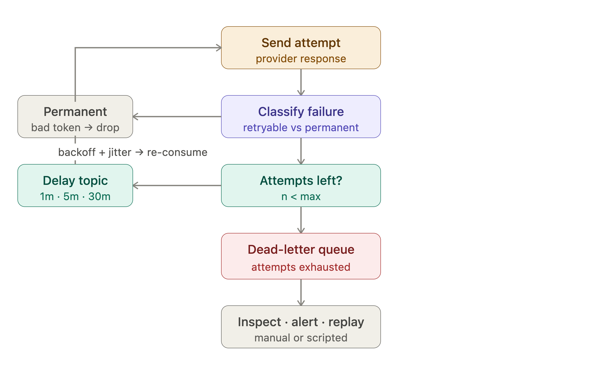

One-liner: ingest everything into a partitioned Kafka spine, fan out to channel-specific dispatchers behind provider abstractions, and keep rate-limiting, scheduling, dedup, and retries as separate concerns off to the side.

Here's the whiteboard:**Capacity (back-of-envelope)**

- Volume: 50M × 5 = 250M notifications/day → ~2.9K/s average, ~16.7K/s at peak (1M/min). Peak is ~6× average, so provision for burst, not steady state.
- Storage: notification metadata + status logs at ~1KB each → ~250GB/day of write-heavy, short-TTL data. Keep hot status in a fast store (Cassandra/DynamoDB), age the rest to cold storage.
- The queue is the shock absorber. Producers never block on delivery; the flash-sale spike lands in Kafka and drains at whatever rate downstream can sustain.

**Request path, component by component**
- Ingestion (gateway + notification service): authenticates the caller, validates payload, resolves user + device tokens, stamps a notification type (transactional / promotional / system) and an idempotency key. Type drives priority — transactional and system alerts go to a high-priority topic, promotional to a bulk topic so a promo flood never starves an OTP.
- Kafka: partition by user_id (ordering per user) or by channel (isolation). Separate topics per priority class. Retention gives you replay for free.
- Scheduler: future/recurring requests persist to a DB; a time-wheel or a partitioned "due" scan enqueues them into Kafka when the fire time arrives. Keeps scheduling logic out of the hot path.
- Dispatch workers: stateless consumers, autoscaled on consumer lag. They enrich against the lookup services, render the template, then hand off to the right channel dispatcher.
- Lookup services (the policy layer): user preferences/opt-outs, rate limiter, template store, dedup. All are cache-first (Redis) so per-message lookups stay sub-millisecond.
- Channel dispatchers + providers: thin adapters that normalize to each provider's API and own provider-specific retry/circuit-breaking. Provider abstraction lets you multi-home (e.g. failover SendGrid→SES) without touching workers.

**How each requirement maps**
- Multi-channel: dispatcher-per-channel behind a common interface; adding WhatsApp is a new adapter, not a pipeline change.
- Notification types: priority topics + separate consumer pools so bulk promos can't delay transactional.
- Scheduled delivery: dedicated scheduler service feeding Kafka; no polling in workers.
- Rate limiting: token-bucket per (user, category) in Redis, checked in the lookup layer — promotional capped daily, transactional exempt.
- Retry: dispatcher classifies failures (retryable vs permanent), re-enqueues retryables to a delay/retry topic with exponential backoff + jitter; exhausted messages land in the DLQ for inspection/replay.

**Non-functional levers**
- Scalability: everything between gateway and providers is stateless and horizontally scaled; Kafka partitions are the scaling unit. Peak is absorbed by lag, not by dropping.
- Availability: no single choke point — multi-AZ Kafka, replicated stores, provider failover. A dead provider degrades one channel, not the system.
- Reliability: Kafka + consumer offset commits after successful hand-off = at-least-once. For exactly-once *effect*, dedup on idempotency_key at ingestion and again pre-send (a Redis SETNX / Bloom filter over a TTL window) — you get at-least-once transport with idempotent delivery, which is the realistic target. True exactly-once transport is expensive; reserve it for cases that genuinely need it.
- Latency: transactional path skips the bulk queue and rate limiter; keep lookups in-cache; treat delivery as async from the caller's perspective.

**Two things worth deciding explicitly in an interview**
- Partition key: user_id (ordering, but hot-user skew) vs channel (even load, no per-user ordering). State the tradeoff.
- Dedup window: exactly-once "feel" is really "at-least-once + idempotency over a bounded TTL." Be honest that it's not true EOS, and size the window to your retry horizon.

# Detailed Explanation

Good — I'll go stage by stage down the pipeline. Each section has a focused diagram plus the mechanism, the key decisions, and the line you'd actually say in an interview.

## 1. Ingestion — turning a request into a routed, deduplicated message

One-liner: the ingestion layer's job is to make the message *safe to process* — authenticated, valid, classified, and stamped — before it ever touches the queue.- Gateway vs service split: the gateway does cheap, stateless rejection (bad tokens, coarse per-caller quotas) so garbage never reaches your business logic. The notification service does the expensive, stateful work. Keep them separate so a misbehaving client is stopped at the door.
- Resolve is where opt-outs and device-token lookups happen. A user with no valid device token for `push` shouldn't generate a push message — resolve to the channels that are actually deliverable, or fall back (push → email).
- Classification is load-bearing: `type` decides the topic, the priority, and whether rate limiting even applies. Get it wrong and a promo can ride the transactional lane.
- The idempotency key is stamped *here, once*, by hashing a caller-supplied `dedupe-id` (or business key like `order_id + event`) with `user` and `type`. This is the anchor for exactly-once *effect* later — if you don't create it at ingestion, you can't dedup downstream.
- Interview line: "Ingestion is synchronous and fast; it validates, classifies, stamps an idempotency key, and hands off to Kafka. Everything after is async."

## 2. Kafka topology — priority isolation and partitioning

One-liner: separate topics per priority class give you isolation; partitioning gives you scale and ordering — and the two choices trade off against each other.- Why separate topics, not just separate partitions: consumer groups bind to topics. Two topics = two independent consumer pools you can scale, deploy, and fail independently. During a flash sale the bulk pool's lag balloons; the high-priority pool doesn't even notice because it's a different topic with its own consumers. One topic with a "priority field" can't give you that isolation — a slow promo batch sits in the same partitions as your OTPs.
- Partition count = your max consumer parallelism. One partition is consumed by exactly one consumer in a group, so if you have 3 partitions you can't usefully run 10 consumers. Size partitions for *peak* throughput (16.7K/s ÷ per-consumer rate), then add headroom — repartitioning later is painful.
- The partition-key decision is the classic tradeoff:
  - `user_id`: all of a user's notifications land on one partition → strict per-user ordering (welcome before order-confirm before shipping). Risk: a celebrity/hot user creates a hot partition.
  - `channel` or random: even load, no hot partitions, but you lose per-user ordering.
  - Practical answer: key by `user_id` for correctness, and mitigate skew with a hashed composite key or by splitting known hot users. Say the tradeoff out loud — interviewers are listening for exactly this.
- Retention buys you replay: if a downstream bug corrupts sends, you reset offsets and reprocess. Set retention to at least your worst-case incident-recovery window.

## 3. Dispatch workers + the policy layer

One-liner: workers are stateless consumers that run each message through an ordered gauntlet of cache-first checks, and any check can short-circuit the send.- Order matters and it's deliberate: cheap, high-rejection checks go first so you don't waste work. Opt-out and rate-limit reject a lot and cost almost nothing — do them before the more expensive template render. Dedup goes last, right before the send, so it catches duplicates introduced by *redelivery* (not just at ingestion).
- Stateless is the whole point: workers hold no session state, so you scale them purely on Kafka consumer lag and kill/restart them freely. All state lives in Redis and the datastores.
- Cache-first or you die at peak: at 16.7K/s every message does 3–4 lookups → ~50–65K lookups/s. That has to be Redis-speed. Preferences and templates are read-heavy and rarely change → cache with generous TTLs and invalidate on write.
- Template render belongs here, not at ingestion: it's per-recipient (name, locale, currency) and you want the freshest data at send time, not stale data captured minutes earlier when it was enqueued.
- Interview line: "The worker is a stateless consumer running an ordered policy gauntlet — prefs, rate limit, render, dedup — all Redis-backed, each able to short-circuit. Cheapest and most-rejecting checks first."

## 4. Rate limiter — the token bucket data model

One-liner: a per-(user, category) token bucket in Redis caps promotional volume while letting transactional traffic through untouched.- Why token bucket over a fixed counter: a bucket allows controlled bursts (a user can get 3 promos in a burst but only N/day total) and refills continuously, avoiding the "midnight thundering herd" you get when a daily counter resets for everyone at once.
- The key design is the interview meat: `rl:{user_id}:{category}` with two fields — `tokens` and `last_refill_ts`. On each check you lazily refill: `tokens = min(capacity, tokens + elapsed * refill_rate)`, then try to decrement. Lazy refill means no background job sweeping millions of buckets — you only compute refill when a message actually arrives.
- Make it atomic: the read-refill-decrement must be a single Redis Lua script (or `INCR`-based algorithm), or two workers racing will both spend the last token. This is the classic concurrency bug they'll probe.
- Category scoping is what enforces "promos capped, OTPs never blocked": transactional and system skip the bucket entirely. You can also layer a global per-tenant limit above the per-user one to protect providers.
- Set a TTL on the key equal to the window so idle users' buckets self-evict — keeps Redis memory bounded across 50M users.
- Interview line: "Per-user, per-category token bucket in Redis with lazy refill, mutated atomically via Lua. Transactional bypasses it. TTL-evict idle keys to bound memory."

## 5. Delivery semantics — at-least-once transport, exactly-once effect

One-liner: you can't cheaply guarantee exactly-once *delivery*, so you guarantee at-least-once transport and make the send *idempotent* — the dedup check turns "maybe twice" into "exactly once as the user sees it."- The ordering is the whole trick: send *before* committing the offset. If the worker crashes after sending but before committing, Kafka redelivers the message — the dedup check sees `K` already present and skips. You never lose a message (at-least-once) and the user never sees a duplicate (idempotent effect).
- Why not exactly-once transport: true EOS across Kafka *and* an external provider (FCM, Twilio) is impossible — the provider isn't in your transaction. The provider might deliver but time out on the ack, and you genuinely can't tell "sent" from "not sent." So you accept at-least-once and dedup.
- The dedup store is a bounded-TTL set, not a permanent log: `SETNX K` with a TTL covering your maximum retry horizon (e.g. 24–48h). After that the key expires — you only need to catch duplicates within the redelivery window, not remember every notification forever. For 50M×5/day this keeps the working set manageable; a Bloom filter or Redis with eviction handles the volume.
- Edge case worth naming: the send succeeds but persisting `K` fails. Then a redelivery re-sends. Mitigate by making the `SETNX` *before* the send claim the key (reserve), and finalize after — the reserve-then-confirm pattern narrows the window. Be honest that it's "at-least-once with a small duplicate probability," not a mathematical guarantee.
- Reserve exactly-once effort for messages that need it (payment receipts, OTPs). Marketing pushes can tolerate a rare dupe and don't justify the extra store writes.
- Interview line: "At-least-once from Kafka by committing offsets only after a successful send, made idempotent by a TTL-bounded dedup key checked before the provider call. Exactly-once *transport* to a third-party provider is impossible, so I target exactly-once *effect*."

## 6. Retry and DLQ topology

One-liner: failures are classified, retryable ones flow through tiered delay topics with exponential backoff, and anything that exhausts its attempts lands in a dead-letter queue for humans.- Classify before you retry, always: retrying a permanent failure (invalid device token, unsubscribed number, malformed payload) is pure waste and can look like abuse to the provider. Bad tokens should be dropped *and* fed back to prune the user's token list. Only transient failures (5xx, timeout, rate-limited-by-provider) are retryable.
- Don't retry in-process — use delay topics. Blocking a worker thread with `sleep(30m)` holds the Kafka partition and stalls everything behind it. Instead publish to a delay topic keyed by tier (retry-1m, retry-5m, retry-30m); a delayed consumer or the topic's visibility timeout releases the message when it's due, and it re-enters the normal flow. The worker stays free.
- Exponential backoff **with jitter** is non-negotiable: if a provider blips and 100K messages all fail at once, retrying them all at exactly +1m recreates the same thundering herd. Jitter spreads them. Pair this with a circuit breaker per provider — if failures spike, stop hammering and shed to the retry tier or a backup provider.
- The DLQ is an operational tool, not a graveyard: it should alert (a full DLQ means something is systemically broken), preserve the full message + failure reason for debugging, and support replay once the root cause is fixed. Retention long enough to actually investigate.
- Idempotency ties it together: because retries re-run the whole worker path, the dedup check from section 5 is what stops a retry from double-sending a message that actually *did* go out but whose ack was lost.
- Interview line: "Classify first — only transient failures retry. Retries go through tiered delay topics with exponential backoff plus jitter and a per-provider circuit breaker, never an in-process sleep. Exhausted messages hit a DLQ that alerts and supports replay."

---

That's the full pipeline end to end. The five drill-downs an interviewer is most likely to push on — partition key skew, atomic token-bucket updates, exactly-once effect vs transport, in-process-sleep vs delay-topic retries, and the send-then-commit ordering — are each called out in the "interview line" for that section, so those are the ones worth having crisp.

---

# Follow-ups

Four themes the interviewer will almost certainly push into after the main design. Section 6 already covered the *retry mechanism*; §7 below is the broader failure taxonomy — what breaks, and what the system does when each dependency dies.

## 7. Handling failures and retries — a taxonomy, not a retry loop

**One-liner:** every dependency in the pipeline has a defined failure mode and a pre-decided answer — retry, degrade, shed, or fail-closed — and the guiding principle is that a failure should degrade *one channel or one tenant*, never the pipeline.

### 7.1 Classify the failure first

The single most common mistake is treating all errors as retryable. Three buckets, and the bucket decides the action:

| Class | Examples | Action |
|---|---|---|
| **Transient** | provider 5xx, timeout, connection reset, provider 429 | retry with backoff + jitter through the delay topics (§6) |
| **Permanent** | invalid/expired device token (FCM `UNREGISTERED`), unsubscribed number, malformed payload, template not found | **do not retry** — drop, emit a status event, and feed back (prune the token, mark the contact bad) |
| **Ambiguous** | timeout *after* the request was accepted; connection dropped mid-send | treat as transient (retry) and rely on the dedup key from §5 to prevent the double-send |

The ambiguous bucket is the one worth naming out loud: a timeout doesn't tell you whether the provider delivered. You retry because losing an OTP is worse than sending it twice — and idempotency is what makes that choice safe.

### 7.2 Failure per dependency

- **Provider down (FCM / APNs / Twilio / SendGrid):** per-provider **circuit breaker** on the dispatcher. Closed → open after an error-rate threshold (say >50% over a 30s rolling window), half-open probes after a cooldown. While open, stop calling entirely — hammering a dead provider burns worker capacity and looks like abuse. Route to a **backup provider** if the channel is multi-homed (SendGrid → SES); if not, shed to the retry tier and let messages accumulate in Kafka. Kafka retention is your buffer: a 2-hour SMS outage at peak is ~120M messages of lag, which is exactly what retention is for.
- **Provider partially degraded / rate-limiting you:** this is the case for an **outbound token bucket per provider**, sized just under their published quota. Better to self-throttle and keep lag than to get your account throttled or banned. A provider 429 should also *shrink* your outbound bucket adaptively (AIMD-style) rather than just retrying at the same rate.
- **Redis down (prefs / rate limit / dedup):** the fail-open vs fail-closed decision, and it differs per lookup — this is a great answer to have ready:
  - **Preferences / opt-out → fail closed** for promotional (don't send if you can't prove the user consented; a promo to an opted-out user is a compliance problem), **fail open** for transactional (an OTP must go out).
  - **Rate limiter → fail open.** A downed limiter shouldn't block OTPs. Cap the blast radius with a coarse local in-process limiter as a backstop so "fail open" doesn't mean "unlimited."
  - **Dedup → fail open.** You degrade to at-least-once with visible duplicates, which is strictly better than not delivering. Log it loudly so you know the window happened.
  - Keep prefs replicated with a short-TTL local (in-worker) cache so a Redis blip is invisible for the TTL duration — see §10.
- **Kafka unavailable / partition leader election:** producers at ingestion buffer and retry with `acks=all`; if the buffer fills, ingestion returns `503` with `Retry-After` and the *caller* backs off. Never accept a request you can't durably enqueue — a 202 you can't honor is worse than a 503.
- **Database down (scheduler store, status log):** the status log is write-behind and non-critical to delivery — buffer and drain; don't fail a send because you couldn't record it. The scheduler store *is* critical: without it, scheduled sends silently don't fire, so it needs the same alerting rigor as the delivery path (a "nothing fired in the last N minutes" watchdog, since scheduling failures are silent by nature).
- **Poison pill message:** one malformed message that crashes the worker will be redelivered forever and block its partition. Guard with a per-message **attempt counter** in the header; past a threshold, route straight to the DLQ regardless of classification. Wrap deserialization/render in a catch-all that DLQs rather than throws.

### 7.3 Partial failure inside one notification

A single logical notification can fan out to 3 devices and 2 channels. Track status **per (notification, channel, target)**, not per notification — otherwise "did it deliver?" is unanswerable and a retry re-sends to the devices that already succeeded. On retry, only the failed legs are re-attempted.

### 7.4 Blast-radius containment

- **Bulkheads:** separate consumer pools per priority topic (§2) *and* separate thread pools / connection pools per provider inside a dispatcher, so a slow SMS provider can't exhaust the pool that email needs.
- **Load shedding:** when bulk lag exceeds a threshold, start dropping the lowest-value promotional traffic rather than delaying everything uniformly. A promo delivered 6 hours late has near-zero value — dropping it is often the *correct* product decision, and saying so is senior signal.
- **Timeouts everywhere:** a provider call with no timeout is an unbounded worker stall. Timeout < the consumer's `max.poll.interval.ms`, or Kafka will decide the worker is dead and trigger a rebalance storm on top of the outage.

**Interview line:** "Classify first — transient retries, permanent drops and feeds back, ambiguous retries under the idempotency key. Every dependency has a pre-decided degradation: circuit-break the provider, fail-open the rate limiter and dedup but fail-closed on promotional opt-outs, and shed bulk traffic before transactional. The goal is that a failure costs one channel, not the pipeline."

## 8. Horizontal scalability — what the scaling unit is at each tier

**One-liner:** every tier is stateless or partitioned so it scales by adding instances, but the real ceiling isn't your compute — it's Kafka partition count and the provider's own quota, and both need to be named.

### 8.1 Tier by tier

| Tier | Stateless? | Scaling unit | Autoscale signal |
|---|---|---|---|
| Gateway / notification service | yes | instances behind an L7 LB | CPU + p99 latency + RPS |
| Kafka | no (stateful) | brokers + partitions | disk, throughput, ISR health |
| Dispatch workers | yes | consumers, capped by partition count | **consumer lag**, not CPU |
| Channel dispatchers | yes | instances per channel | per-provider queue depth / in-flight |
| Redis | no | shards / hash slots | memory + ops/s |
| Scheduler | no (owns time) | partitioned ownership of the time-bucket space | due-scan lag |

The important nuance: **workers autoscale on consumer lag, not CPU.** A worker blocked on a 200ms provider call is nearly idle CPU-wise while lag balloons — scale on CPU and you'll under-provision exactly during the incident you're trying to survive. Lag (or lag-derivative: is the backlog growing?) is the honest signal.

### 8.2 The ceilings that actually bind

- **Partition count caps consumer parallelism.** One partition → one consumer in a group. With ~200–500 msg/s per worker (bounded by provider latency and connection concurrency, not CPU), 16.7K/s peak needs ~35–85 workers, so the bulk topic wants **at least 128 partitions** with headroom. Adding partitions later is possible but *rehashes the key→partition mapping* and breaks per-user ordering for in-flight data — so over-provision partitions up front. They're cheap; a reshard mid-incident is not.
- **Provider quota is the true ceiling.** FCM, APNs and especially SMS providers have hard rate limits. You cannot scale past them by adding workers — you can only add lag, or add providers. The honest answer is: "past provider quota, horizontal scaling stops helping; the levers are multi-homing across providers, per-provider outbound throttles, and prioritizing what actually gets the capacity."
- **Downstream connection pools.** 100 workers × 50 DB connections = 5,000 connections, which will kill Postgres before it kills the workers. Put a connection proxy (PgBouncer) in front, or keep workers cache-only on the hot path so scaling them doesn't multiply DB pressure. This is a classic "you scaled the wrong tier and broke the one behind it."
- **Rebalance storms.** Aggressive autoscaling of a consumer group triggers repeated rebalances; each one pauses consumption. Use **cooperative sticky** assignment, scale in coarse steps with a cooldown, and set `session.timeout.ms` generously so a GC pause isn't mistaken for a dead worker.

### 8.3 Scaling the stateful bits

- **Scheduler:** the one component that can't be trivially stateless, because someone must own "what's due now." Partition the time-bucket keyspace (e.g. `hash(notification_id) % N`) and give each scheduler instance a slice via a coordination service; that scales it horizontally while keeping each due-item owned exactly once. Leases + fencing tokens prevent a paused-then-resumed instance from double-firing.
- **Multi-region:** run the pipeline per region with regional Kafka, route users to their home region, and keep provider calls region-local (latency and data-residency both push this way). Cross-region replication of Kafka is for DR, not for hot-path fan-out.

**Interview line:** "Everything from the gateway to the dispatchers is stateless and scales on instance count; workers scale on consumer lag rather than CPU because they're I/O-bound. The binding constraints are partition count — which I'd over-provision because repartitioning breaks the key mapping — and the providers' own quotas, past which the only levers are multi-homing and prioritization."

## 9. Sharding & partitioning — the same question at four layers

**One-liner:** the partition key is the highest-leverage decision in the system, and it's a different tradeoff in Kafka (ordering vs skew), Redis (even distribution), the status store (query pattern), and the scheduler (time locality).

### 9.1 Kafka — recap and the skew fix

Covered in §2; the part worth expanding is **hot-partition mitigation**, since that's where the interviewer usually pushes:

- Key by `user_id` for per-user ordering. Skew appears when a broadcast targets millions of users at once, or when one tenant dominates.
- **Composite key** `hash(user_id) % N` still preserves per-user ordering (same user → same bucket) while spreading users evenly — this is the default answer.
- For a genuinely hot user/tenant, **split the key**: `user_id:{0..k}` sacrifices strict ordering for that user only, in exchange for k-way parallelism. Applied selectively, detected by monitoring per-partition lag.
- Multi-tenant systems want tenant in the key too (`tenant:user`) so one tenant's flood is confined to a subset of partitions rather than spread across all of them — the noisy-neighbor containment argument.
- **Do you actually need ordering?** Push notifications are mostly independent events. If the product doesn't require "welcome before order-confirm," key randomly and take the even distribution. Say this explicitly — ordering is a cost, and paying it without needing it is a bad trade.

### 9.2 Redis — sharding the policy layer

At ~50–65K lookups/s and tens of GB of keys, this is a cluster, not an instance.

- Keys are already naturally partitionable: `prefs:{user_id}`, `rl:{user_id}:{category}`, `dedup:{idem_key}`. All are point lookups on a high-cardinality key → Redis Cluster hash slots distribute them evenly with no design effort.
- Use **hash tags** (`rl:{user_id}:promo` with `{user_id}` as the tag) if you ever need multi-key atomic ops for one user in a single slot — but prefer designing so you never need cross-slot transactions.
- **Dedup keys are the memory problem**, not prefs: 250M/day × 48h TTL ≈ 500M live keys. At ~60–100 bytes each that's ~30–50GB. Options, in order of preference: shorten the TTL to your actual retry horizon (often 6–12h is enough, which cuts it 4–8×); apply exactly-once dedup only to transactional traffic and skip it for promos; or use a rotating **Bloom/cuckoo filter** per time window, accepting a small false-positive rate (a false positive = a dropped notification, so this is only acceptable for low-value traffic).

### 9.3 Status / delivery-log store — partition by query pattern

~250GB/day of write-heavy, short-lived rows. The partition key should follow how you read it:

- Primary read is "status of notification X" → partition key `notification_id`, which is high-cardinality and distributes perfectly.
- Secondary read is "recent notifications for user X" → that needs `(user_id, time_bucket)` as the partition key with `sent_at` as the clustering key. Bucketing by day/hour is what stops a heavy user's partition from growing unbounded — an unbucketed `user_id` partition key is the classic Cassandra anti-pattern.
- Run both: one table per access pattern, written twice. Denormalizing for reads is normal in a wide-column store and cheaper than a secondary index at this write rate.
- TTL the rows (30–90 days) so the cluster doesn't grow forever, and age anything older to object storage for analytics.

### 9.4 Scheduler — partition by time, then by hash

- Partition the schedule table by **fire-time bucket** (e.g. per minute) so the "what's due now" scan touches exactly one small partition instead of scanning a global index. Time locality is the whole point.
- Within a bucket, shard by `hash(id) % N` so N scheduler instances split the work of a large bucket.
- The failure mode to name: **everyone schedules for 9:00 AM.** Time-bucket partitioning creates its own hot spot at round times. Mitigate by jittering promotional send times within a window (which also smooths downstream load) and by making the bucket owner able to spill work to peers.

### 9.5 Resharding

- Kafka: adding partitions changes `hash(key) % N` and breaks ordering guarantees for in-flight keys. Real options: over-provision from day one, or use a **two-phase migration** (stop producing to the old topic, drain, switch) if you truly must.
- Redis Cluster: resharding is online (slot migration), which is why the Redis layer is the *easy* one to grow — another argument for keeping state in Redis rather than in the workers.
- Cassandra/DynamoDB: consistent hashing means adding nodes moves only a fraction of the keyspace. This is why the status store is the easy tier too.
- **The pattern to state:** the tiers that use consistent hashing (Redis, Cassandra) reshard gracefully; the tier that uses modulo hashing (Kafka) does not. Provision the modulo tier generously.

**Interview line:** "Partitioning shows up four times and it's a different tradeoff each time: Kafka trades ordering against skew — I'd use `hash(user_id)` and split known hot keys; Redis is point-lookup so hash slots are free, and dedup key volume is the real constraint; the status store gets one table per access pattern with time-bucketed user partitions; and the scheduler partitions by fire-time bucket, where the hot spot is everyone picking 9 AM."

## 10. Caching — the layer that makes 65K lookups/s survivable

**One-liner:** at peak, every message does 3–4 policy lookups, so ~50–65K/s must be served from cache; the design work is choosing what's cacheable, how stale it may be, and what happens when the cache is cold or gone.

### 10.1 What gets cached, and with what staleness budget

| Data | Volume | TTL | Invalidation | Staleness tolerance |
|---|---|---|---|---|
| User preferences / opt-outs | 50M users × ~200B ≈ 10GB | 5–15 min | **write-through on change** | Low — an opt-out honored 10 min late is a compliance issue |
| Device tokens | 50M × ~2 devices ≈ 20GB | 1 hour | invalidate on register/unregister and on provider `UNREGISTERED` | Medium — a stale token just fails and gets pruned |
| Templates | small (thousands) | hours | invalidate on publish | High — templates change rarely |
| Rate-limit buckets | active users only | = window | n/a (TTL is the design) | This *is* the source of truth |
| Dedup keys | ~500M @48h (see §9.2) | = retry horizon | n/a | This *is* the source of truth |

The distinction worth making out loud: **the first three are caches** (a miss falls through to a database), **the last two are primary state living in Redis** (a miss is a correctness event, not a latency event). They share infrastructure but not semantics, and they should probably be separate Redis clusters so a promo flood filling dedup keys can't evict your preference cache.

### 10.2 Opt-outs are the one thing you can't be lazy about

Preference caching is where TTL-based staleness turns into a legal problem: a user unsubscribes, and for the next 15 minutes your workers keep reading a cached `subscribed: true`. Fixes, in order:

- **Write-through / write-around on unsubscribe** — the unsubscribe path actively invalidates (or overwrites) the cache key rather than waiting for TTL expiry. Non-negotiable for opt-outs.
- Publish invalidations over a **Redis pub/sub channel** so per-worker local caches (§10.3) drop the key too, not just the shared cluster.
- Keep a **suppression list** as a separate, always-checked structure — a compact set of "never contact" identities checked immediately before send, independent of the preference cache. Belt and braces for the case that actually matters.

### 10.3 Two levels, deliberately

- **L1, in-process per worker:** a small LRU with a 5–30s TTL over the hottest keys (templates, tenant config, and preferences for users appearing repeatedly in a batch). At 16.7K/s a single worker sees enough repetition that L1 removes a large share of network round-trips, and it's what keeps a Redis blip from becoming an outage.
- **L2, shared Redis cluster:** the real cache, sized above.
- The cost of L1 is **inconsistency across workers** for the TTL duration — which is fine for templates, and is exactly why opt-outs get pub/sub invalidation rather than relying on TTL.

### 10.4 The failure modes to name

- **Cold start / thundering herd:** deploy 100 fresh workers with empty L1 and every one stampedes Redis and then the DB. Mitigate with **request coalescing** (single-flight per key) and staggered rollouts. Classic and easy to say.
- **Cache stampede on a hot key:** a broadcast to 10M users all reading the same template key — serve it from L1, and use a probabilistic early-refresh so the key never expires for everyone simultaneously.
- **Negative caching:** "user has no valid device token" is a frequent result and worth caching briefly, or every message for that user re-queries the DB to learn the same nothing.
- **Cache as a dependency, not an optimization:** at 65K lookups/s the databases behind the cache cannot serve the traffic — a full cache loss means you *must* shed load, not fall through. Say this plainly: "the cache is load-bearing; the fallback is degradation, not the origin." That's an honest answer and most candidates get it wrong by claiming the DB will absorb it.
- **Eviction policy:** `allkeys-lru` on the cache cluster; **`volatile-ttl` or `noeviction` on the state cluster** — silently evicting dedup keys means silent duplicate sends. Different clusters, different policies, for exactly this reason.

**Interview line:** "Roughly 65K lookups a second at peak, so the policy layer is cache-first by necessity — the cache is load-bearing, and if it's gone the answer is shed load, not fall through to the DB. I'd split it into two clusters: caches with LRU eviction, and primary Redis state — rate-limit buckets and dedup keys — with no eviction, so a promo flood can't quietly evict correctness. Opt-outs get write-through invalidation plus a separately-checked suppression list, because a 15-minute-stale unsubscribe is a compliance problem, not a latency problem."

---

**The four follow-ups in one breath:** failures are classified before they're retried and every dependency has a pre-decided degradation; scaling is stateless everywhere except Kafka and the scheduler, with consumer lag as the signal and provider quota as the true ceiling; partitioning is a different tradeoff at each of the four layers, with `hash(user_id)` and hot-key splitting as the Kafka answer; and caching is load-bearing rather than optional, split into evictable caches and non-evictable state.