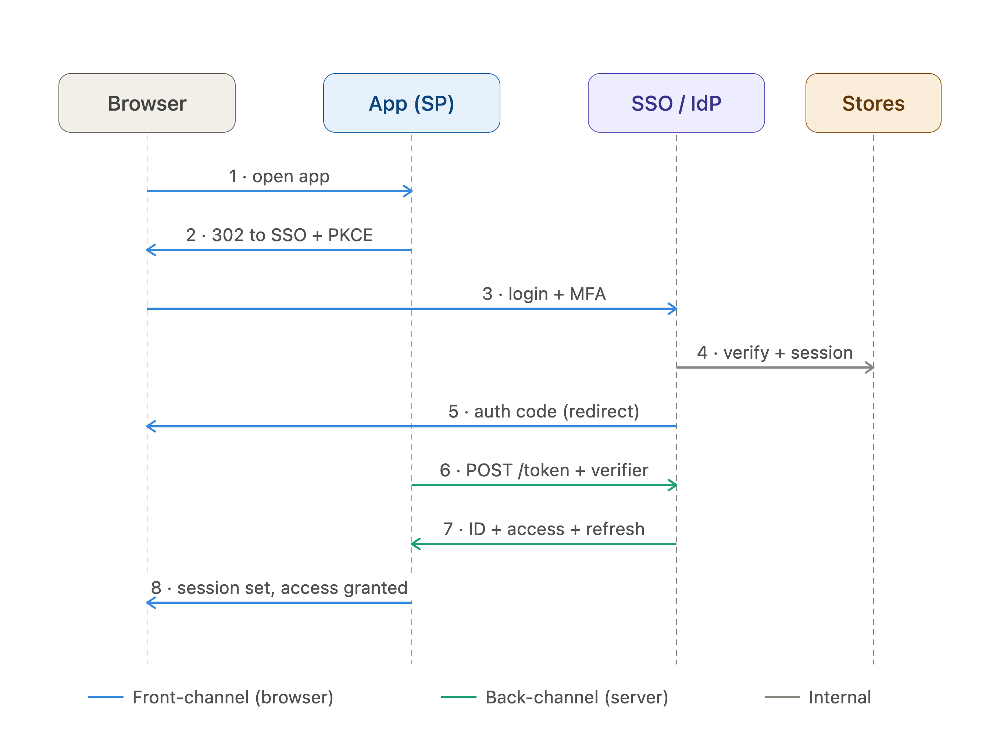
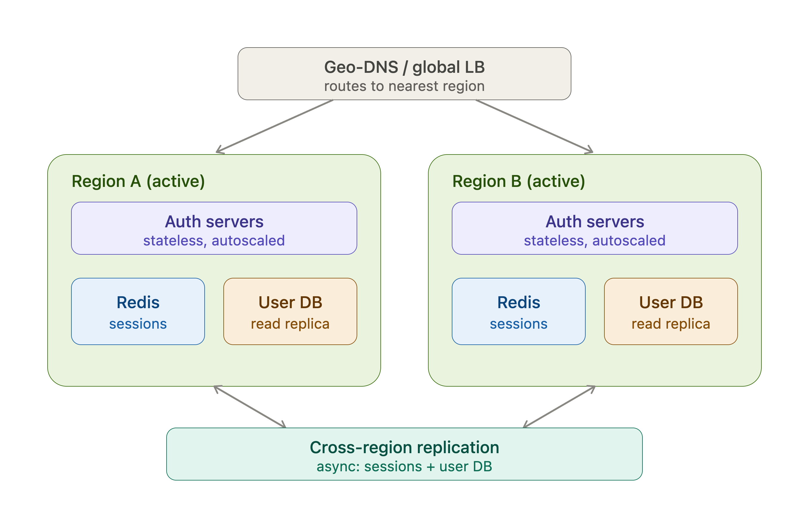

# SSO (Single Sign On) System Design

## 1. Requirements

**One login, many services — with secure token handling that scales to millions of users and third-party IdPs.**

Functional
- Authenticate once → access all connected apps without re-entering credentials.
- Single Logout (SLO): logging out of one app invalidates the shared session.
- Support multiple IdPs (Google, enterprise SAML, internal user store) and multiple relying parties (service providers).

Non-functional
- Security: strong auth (MFA), signed tokens, replay/CSRF protection.
- Availability: SSO is on the critical path — if it's down, everything's down. Target 99.99%.
- Latency: token validation must be near-instant (local signature check, no DB hit).
- Scale: back-of-envelope — 100M users, 20M DAU, peak ~10–50k login QPS, far higher token-validation QPS handled at the service edge.

## 2. Protocols

**OIDC as the default, SAML for enterprise interop, OAuth2 underneath for delegated authz.**

- OpenID Connect (OIDC): auth layer on OAuth 2.0 — issues an ID token (JWT). Primary for web/mobile/SPAs.
- OAuth 2.0: authorization/delegated access (access + refresh tokens). Not authentication by itself.
- SAML 2.0: XML-based, legacy but mandatory for B2B/enterprise SSO.
- Core flow: Authorization Code + PKCE for all public clients (SPAs, mobile). Never implicit flow.

## 3. Security

**Short-lived signed tokens, asymmetric keys with rotation, and defense against interception/replay/XSS.**

- Tokens: ID token (JWT), short-lived access token (5–15 min), rotating refresh token.
- Signing: RS256/asymmetric. Public keys served via JWKS endpoint so services verify locally; rotate keys with `kid`.
- PKCE (code interception), `state` (CSRF), `nonce` (replay).
- Cookies: `HttpOnly`, `Secure`, `SameSite`. Prefer HttpOnly cookies or a backend-for-frontend over storing tokens in `localStorage` (XSS risk).
- TLS everywhere; MFA; rate-limiting + brute-force/credential-stuffing protection.
- Revocation: keep a revocation list / short TTL in Redis so logout and compromised tokens take effect fast.

## 4. Monitoring & Logging

**Audit everything, detect auth anomalies, alert on failure spikes.**

- Audit logs: who authenticated, when, from where, which client (compliance/SOC2/GDPR-friendly, immutable store).
- Metrics: login success/failure rate, token issuance p99, refresh rate, JWKS fetch latency.
- Anomaly detection: impossible travel, spike in failed logins (attack signal), token reuse.
- Distributed tracing across SP ↔ IdP; ship security events to a SIEM; alert on failure-rate thresholds.

## 5. Scalability & Resilience

**Stateless validation at the edge, distributed session store, multi-region active-active.**

- Stateless JWT verification: services validate signatures locally via cached JWKS — no per-request call to the auth server.
- Session store: Redis (distributed, TTL-based) for the central SSO session and revocation list.
- Auth servers horizontally scaled behind a load balancer / API gateway; user store is a replicated DB.
- Multi-region active-active with geo-routing; replicate keys and sessions; graceful degradation.
- Key trade-off to name in the interview: stateless JWTs are fast but hard to revoke instantly → mitigate with short TTLs + a Redis revocation list.

## 6. Diagram & Walkthrough



Here's the whiteboard — the OIDC Authorization Code + PKCE flow across the four actors:Flow walkthrough (what to say while pointing at each arrow):

1. User hits App A → no session, so App A starts an authorization request.
2. App A returns a 302 redirecting the browser to the SSO `/authorize` endpoint, carrying `client_id`, `redirect_uri`, `state`, `nonce`, and a PKCE challenge.
3. Browser lands on SSO's login page → user authenticates, MFA challenge.
4. SSO verifies credentials against the user store and creates a central SSO session in Redis (sets its own SSO cookie).
5. SSO redirects back to App A's `redirect_uri` with a short-lived authorization code.
6. App A's backend calls SSO's `/token` endpoint (back-channel, server-to-server) with the code plus the PKCE verifier.
7. SSO returns the ID token (JWT), access token, and refresh token; App A validates the JWT signature against cached JWKS.
8. App A establishes its local session — user is in.

## 'Single' in SSO ?
The "single" in SSO: when the same user opens App B, the redirect to `/authorize` hits SSO's still-valid session cookie, so steps 3–4 are skipped and a code is issued immediately — no second login. That's the whole point, and a good line to land in the interview.


## Follow Up Questions:

Two classic follow-ups. Here's how to answer each cleanly.

## Revoking a stateless JWT

**The tension: JWTs are validated locally by signature, so nothing calls the IdP per request — a token stays valid until it expires. You bound that with short TTLs and punch through it with a denylist only for the "kill it now" cases.**

- Short TTL as the default bound: access tokens live 5–15 min, so a leaked token self-expires fast. The long-lived, rotating refresh token does the renewal — revoke *that* and the session dies within one TTL.
- Redis denylist for instant revocation: on logout or breach, write the token's `jti` (or session id) to Redis with `TTL = remaining token lifetime`. It auto-expires, so the list only ever holds *revoked* tokens — it stays tiny.
- Check the denylist only at the API gateway, not every service — one fast Redis lookup on the edge, and pure stateless validation continues downstream.
- Token-version / `min_valid_iat` trick for mass revocation: store one integer per user in cache; bump it on password change or "log out everywhere," and reject any token with an older `iat`. One cached value invalidates every outstanding token for that user — cheaper than denylisting each one.
- Refresh-token rotation + reuse detection: each refresh issues a new refresh token and invalidates the old; if an old one is replayed, you've caught theft and can revoke the whole chain.

The line to land: *pure stateless is fast but can't revoke instantly; a denylist reintroduces state on the hot path. So use short TTL as the standing bound, and a gateway-checked Redis denylist keyed on `jti` only for logout and compromise.*

## Keeping the IdP off the critical path



**One useful property first: because services validate JWTs locally against cached JWKS, existing sessions keep working even if the IdP is completely down — only new logins and refreshes fail. From there it's standard active-active.**

How each layer avoids being the SPOF:

- Auth tier: stateless, autoscaled behind the LB across multiple AZs, no sticky sessions (session lives in Redis) — any node can serve any request, dead nodes just drain.
- Routing: geo-DNS / anycast sends users to the nearest healthy region; on region failure, health checks drain it and re-route.
- Session store: Redis replicated cross-region (or a globally distributed store — DynamoDB global tables / Cosmos). Login is read-heavy (verify creds), so replicas absorb it locally.
- User store: replicated DB, reads served from the local replica, writes to the primary region (or multi-master if you accept the conflict handling).
- JWKS: public keys, trivially replicated — serve them from a CDN edge so resource servers can always fetch keys to validate tokens even if a whole region is down. Rotate keys with an overlap window: publish the new `kid` before signing with it.
- Signing keys: private keys in per-region HSM/KMS; publish all active public keys in the shared JWKS.
- Graceful degradation: if the session store is briefly unreachable, fall back to accepting valid JWTs (stateless path) and degrade only the new-login / revocation features rather than failing entirely.

Trade-off to name: active-active buys zero-failover-lag availability but forces you to handle replication lag and write conflicts — a session created in Region A may not be in Region B for a few ms, which you paper over with sticky-region routing or a token any region can validate. Active-passive is simpler but wastes standby capacity and eats failover time. For auth, active-active is usually worth it.

## TOTP — Time-based One-Time Password

Most MFA apps use **TOTP — Time-based One-Time Password**.

The reason the code expires quickly **but still matches** is that **both your phone and the server independently generate the same code using the same secret and the current time**.

## 1. During MFA setup

When you scan a QR code, it contains a secret like:

```text
JBSWY3DPEHPK3PXP
```

That secret is stored in:

```text
Your Authenticator App
        AND
Authentication Server
```

The secret is never sent every time you log in.

---

## 2. Both use the current time

Suppose the current Unix time is:

```text
1723973400
```

TOTP divides time into fixed windows, usually **30 seconds**:

```text
Time Step = floor(current_time / 30)
```

For example:

```text
Current time: 10:00:00
          |
          v
Window: 1234567
```

Both your phone and server calculate the same time window.

Then they do something conceptually like:

```text
Secret + Time Window
        |
        v
     HMAC Hash
        |
        v
  Extract 6 digits
        |
        v
      483921
```

Your phone:

```text
Secret: ABC
Time window: 1234567

↓ same algorithm

483921
```

Server:

```text
Secret: ABC
Time window: 1234567

↓ same algorithm

483921
```

So they independently arrive at the same code.

## 3. Why does it expire after 30 seconds?

At:

```text
10:00:00 → Time Window 100
```

Both generate:

```text
483921
```

At:

```text
10:00:30 → Time Window 101
```

Both generate a completely different code:

```text
817452
```

So:

```text
Time                  Code
--------------------------------
10:00:00–10:00:29     483921
10:00:30–10:00:59     817452
10:01:00–10:01:29     234901
```

## 4. What if you enter it right at expiry?

Servers usually allow a small time tolerance.

For example, when you submit:

```text
483921
```

The server may check:

```text
Previous 30-second window
Current 30-second window
Next 30-second window
```

Conceptually:

```text
Expected codes:

Window 99  → 123456
Window 100 → 483921
Window 101 → 817452
```

This handles small clock differences between your phone and the server.

So even if your code expires on the phone **just as you submit it**, the server may still accept it if it falls within the allowed tolerance.

## Simplified algorithm

Conceptually:

```javascript
const timeStep = Math.floor(Date.now() / 1000 / 30);

const hash = HMAC_SHA1(secret, timeStep);

const otp = extract6Digits(hash);
```

The server runs essentially the same calculation:

```javascript
const currentStep = Math.floor(Date.now() / 1000 / 30);

for (const step of [
  currentStep - 1,
  currentStep,
  currentStep + 1
]) {
    const expectedCode = generateTOTP(secret, step);

    if (userEnteredCode === expectedCode) {
        return true;
    }
}
```

The important point is:

> **The server does not need your phone to send it the generated code beforehand. Both sides already know the secret and independently calculate what the valid code should be.**

That's also why **time synchronization matters**. If your phone's clock is several minutes wrong, your authenticator codes may fail because your phone and the server are calculating different time windows.

